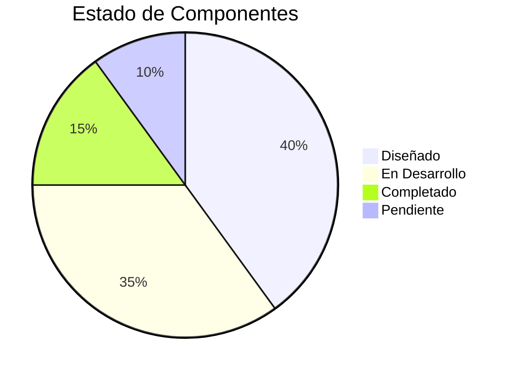

# 🚀 LLM Gateway IA - Documentación Completa

> Sistema de enrutamiento inteligente para APIs de modelos de lenguaje que optimiza costos y rendimiento mediante clasificación automática de complejidad.

## 📁 Estructura del Proyecto

```
gateway_IA/
├── 📋 README.md                    # Este archivo
├── 🏗️ arquitectura/               # Diseño y arquitectura del sistema
│   ├── overview.md                # Visión general
│   ├── backend-architecture.md    # Arquitectura del backend
│   ├── frontend-architecture.md   # Arquitectura del frontend
│   ├── data-architecture.md       # Modelo de datos
│   └── deployment-architecture.md # Infraestructura
│
├── 🔙 backend/                    # Todo sobre el backend
│   ├── overview.md               # Resumen del backend
│   ├── api-routes.md             # Definición de rutas
│   ├── services/                 # Servicios core
│   │   ├── classifier.md         # Clasificador de requests
│   │   ├── router.md             # Motor de enrutamiento
│   │   ├── cache.md              # Sistema de caché
│   │   ├── providers.md          # Adaptadores de proveedores
│   │   └── registry-scraper.md   # Actualización de modelos
│   ├── security.md               # Seguridad y encriptación
│   └── database.md               # Modelo de base de datos
│
├── 🎨 frontend/                   # Todo sobre el frontend
│   ├── overview.md               # Resumen del frontend
│   ├── components/               # Componentes UI
│   │   ├── layout.md             # Layout y navegación
│   │   ├── dashboard.md          # Dashboard components
│   │   └── forms.md              # Formularios
│   ├── state-management.md       # Gestión de estado
│   └── api-client.md             # Cliente API
│
├── 📖 documentacion/              # Documentación técnica
│   ├── api-reference.md          # Referencia completa de API
│   ├── setup-guide.md            # Guía de instalación
│   ├── configuration.md          # Configuración
│   └── troubleshooting.md        # Resolución de problemas
│
├── 📄 documentacion_no_tecnica/   # Docs para stakeholders
│   ├── vision-producto.md        # Visión del producto
│   ├── modelo-negocio.md         # Modelo de negocio
│   ├── user-stories.md           # Historias de usuario
│   └── faq.md                    # Preguntas frecuentes
│
├── ✅ tareas/                     # Gestión de tareas
│   ├── backlog.md                # Backlog completo
│   ├── sprint-actual.md          # Sprint en curso
│   └── completadas.md            # Tareas completadas
│
├── 🗺️ roadmap/                    # Planificación
│   ├── roadmap-general.md        # Roadmap completo
│   ├── fase-1-mvp.md             # Fase 1: MVP
│   ├── fase-2-features.md        # Fase 2: Features
│   └── fase-3-scale.md           # Fase 3: Escalabilidad
│
└── 🧪 tests/                      # Testing
    ├── strategy.md               # Estrategia de testing
    ├── backend-tests.md          # Tests del backend
    ├── frontend-tests.md         # Tests del frontend
    └── e2e-tests.md              # Tests end-to-end
```

## 🎯 Quick Links

| Categoría | Documento Principal |
|-----------|------------------------|
| **📚 NAVEGACIÓN** | [[INDICE-GENERAL\|Índice General Completo]] |
| **🚀 INICIO RÁPIDO** | [[RESUMEN-EJECUTIVO-ACTUALIZADO\|Resumen Ejecutivo (Actualizado)]] |
| [[RESUMEN-INTEGRAL\|📄 Resumen Integral]] | Visión completa del proyecto |
| [[ROADMAP-50-CHECKPOINTS\|✅ Roadmap]] | 50 checkpoints de implementación |
| [[GUIA-TECNICA-IMPLEMENTACION\|📘 Guía Técnica]] | Detalles de implementación |
| [[arquitectura/overview\|🏗️ Arquitectura]] | Visión técnica completa |
| [[backend/overview\|🔙 Backend]] | FastAPI, servicios, DB |
| [[backend/services/registry-scraper\|🔄 Registry Scraper]] | Sistema de actualización 🆕 |
| [[frontend/overview\|🎨 Frontend]] | Next.js, componentes, estado |

## 📊 Estado del Proyecto



## 🔗 Enlaces Externos

- [GitHub Repository](#)
- [API Documentation](#)
- [Model Registry](https://github.com/your-repo/registry.json)

---

*Última actualización: 2026-01-14*
*Sistema actualizado con Registry Scraper integrado en backend*
