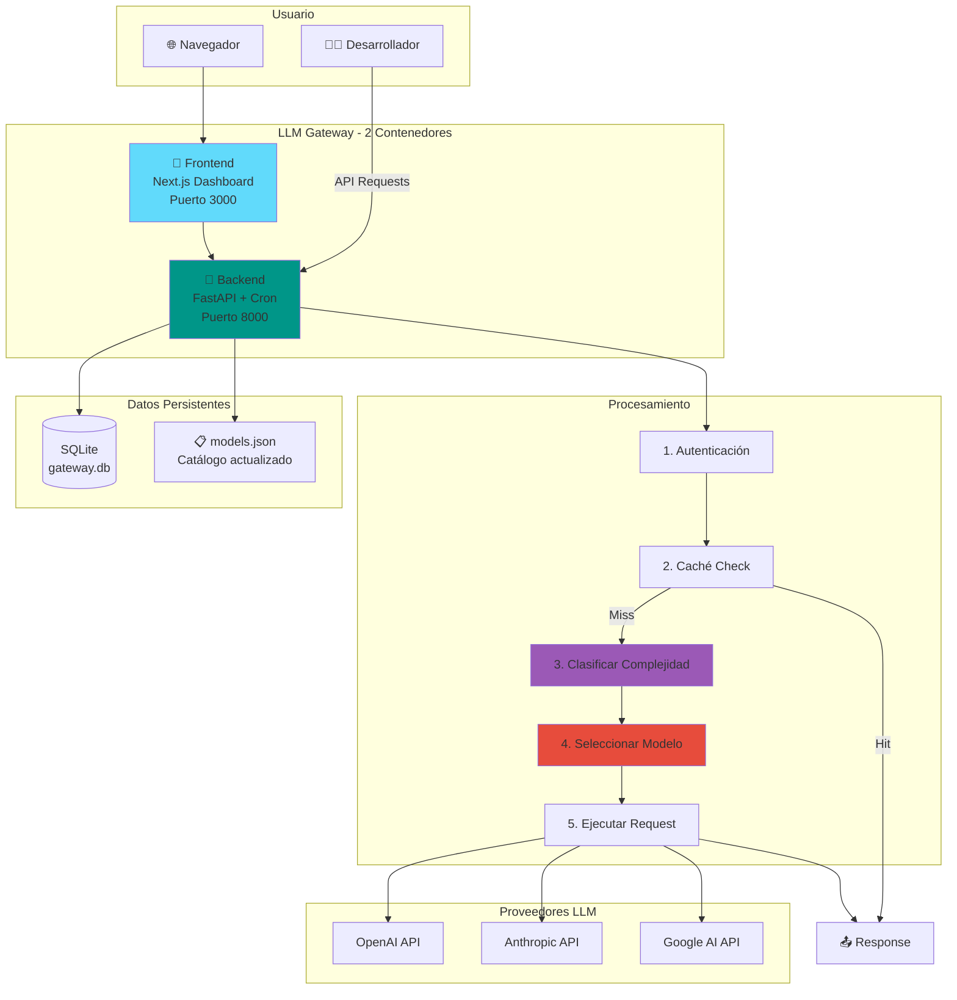
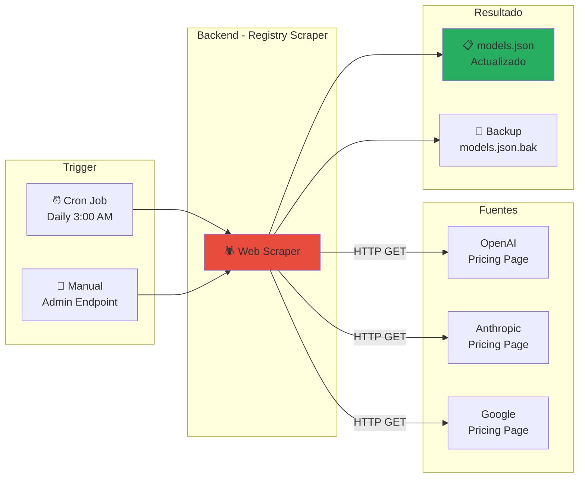

# 📊 LLM Gateway - Resumen Ejecutivo Actualizado

> Documento ejecutivo simplificado que explica el sistema completo de forma clara y concisa.

## 🎯 ¿Qué es el LLM Gateway?

**Sistema inteligente de enrutamiento de APIs LLM** que:
- **Unifica** múltiples proveedores (OpenAI, Anthropic, Google) en una sola API
- **Optimiza** costos seleccionando automáticamente el modelo más eficiente
- **Visualiza** uso, costos y métricas en tiempo real mediante dashboard web

## 🏗️ Arquitectura Simplificada



## 🔄 Sistema de Actualización Integrado

### Cómo se Mantiene Actualizado el Catálogo de Modelos



**Ventajas de este enfoque:**
- ✅ **Simple:** No requiere contenedor separado
- ✅ **Actualizado:** Scraping directo de fuentes oficiales
- ✅ **Flexible:** Update manual disponible vía endpoint
- ✅ **Automático:** Cron job diario sin intervención

## 🔑 Componentes Principales

### 1. Frontend Dashboard (Next.js)
```
📊 Métricas en tiempo real
├── Total Cost (24h)
├── Total Requests
├── Avg Latency
└── Cache Hit Rate

📈 Gráficos
├── Cost Breakdown (7 días)
└── Model Distribution (pie chart)

🔑 Gestión
├── Gateway Keys
├── Provider Keys
└── Model Catalog
```

### 2. Backend API (FastAPI)

**Pipeline de Procesamiento:**
```
Request → Auth → Cache → Classify → Route → Execute → Response
```

**Servicios Core:**
- **Auth Service:** JWT + Gateway Keys
- **Classifier:** Analiza complejidad (simple/moderate/complex/expert)
- **Router:** Selecciona mejor modelo (costo/calidad/velocidad)
- **Cache Manager:** LRU cache con TTL de 1h
- **Provider Manager:** Adaptadores para OpenAI/Anthropic/Google
- **Registry Scraper:** 🆕 Actualiza catálogo automáticamente

### 3. Base de Datos (SQLite)

**Tablas:**
```sql
users               -- Cuentas de usuario
gateway_keys        -- Keys del gateway
provider_keys       -- API keys encriptadas
request_logs        -- Historial completo
registry_changelog  -- 🆕 Log de cambios en registry
```

## 💰 Ejemplo de Ahorro de Costos

### Sin Gateway:
```
10,000 requests/mes con GPT-4
10,000 × 200 tokens × $30/1M = $60/mes
```

### Con Gateway (Smart Routing):
```
8,000 requests simples → GPT-4o-mini
  8,000 × 200 × $0.60/1M = $0.96

2,000 requests complejos → GPT-4o
  2,000 × 200 × $5/1M = $2.00

Total: $2.96/mes + 25% cache = $2.22/mes
```

**Ahorro: 96% ($57.78/mes = $693/año)**

## 🚀 Despliegue

### Configuración Docker Compose

```yaml
# 2 servicios únicamente
services:
  frontend:
    build: ./frontend
    ports: ["3000:3000"]
    
  backend:
    build: ./backend
    ports: ["8000:8000"]
    command: sh -c "cron && uvicorn app.main:app"
    # Incluye cron job interno
    
volumes:
  - ./data  # SQLite + models.json

networks:
  - gateway-network
```

**Un solo comando:**
```bash
docker-compose up -d
```

## 📊 Decisiones de Arquitectura

| Decisión | Razón | Trade-off |
|----------|-------|-----------|
| **SQLite** | Simplicidad, zero-config | Limitado para escala extrema |
| **Registry Scraping** | Datos actualizados directo de fuente | Requiere mantenimiento si sitios cambian |
| **Cron en Backend** | Arquitectura más simple (2 contenedores) | Cron debe configurarse en Dockerfile |
| **LRU Cache en Memoria** | Latencia ultra-baja (<10ms) | No persistente entre reinicios |
| **JSON Registry** | Fácil de actualizar sin redeploy | No permite queries SQL complejas |

## 🎯 Roadmap de Implementación

```
Fase 1: Backend Core (5-7 días)
  ✅ Auth + JWT
  ✅ Classifier + Router
  ✅ Provider adapters
  ✅ Gateway endpoint

Fase 2: Features (3-4 días)
  ✅ Cache Manager
  ✅ Analytics
  ✅ Rate limiting

Fase 3: Frontend (4-5 días)
  ✅ Dashboard
  ✅ Charts
  ✅ Key management

Fase 4: Registry Updates (2-3 días)  ← 🆕 Actualizado
  ✅ Scrapers por proveedor
  ✅ Admin endpoint
  ✅ Cron job interno
  ✅ Changelog system

Fase 5: Testing + Prod (2-3 días)
  ✅ Unit tests
  ✅ Docker production
  ✅ Documentación
```

**Total: 16-22 días**

## 🔗 Documentos Detallados

Para profundizar en temas específicos:

- [[arquitectura/overview|🏗️ Arquitectura Completa]]
- [[backend/overview|🔧 Backend Detallado]]
- [[backend/services/registry-scraper|🔄 Registry Scraper]]
- [[ROADMAP-50-CHECKPOINTS|✅ Roadmap de 50 Checkpoints]]
- [[GUIA-TECNICA-IMPLEMENTACION|📘 Guía Técnica Completa]]

---

## 📈 Métricas de Éxito

| Métrica | Objetivo |
|---------|----------|
| Ahorro de costos | 40-70% |
| Cache hit rate | >15% |
| Latencia agregada | <200ms |
| Uptime | >99.5% |

---

*Última actualización: 2026-01-14*
*Documento simplificado para entendimiento rápido del proyecto completo*
