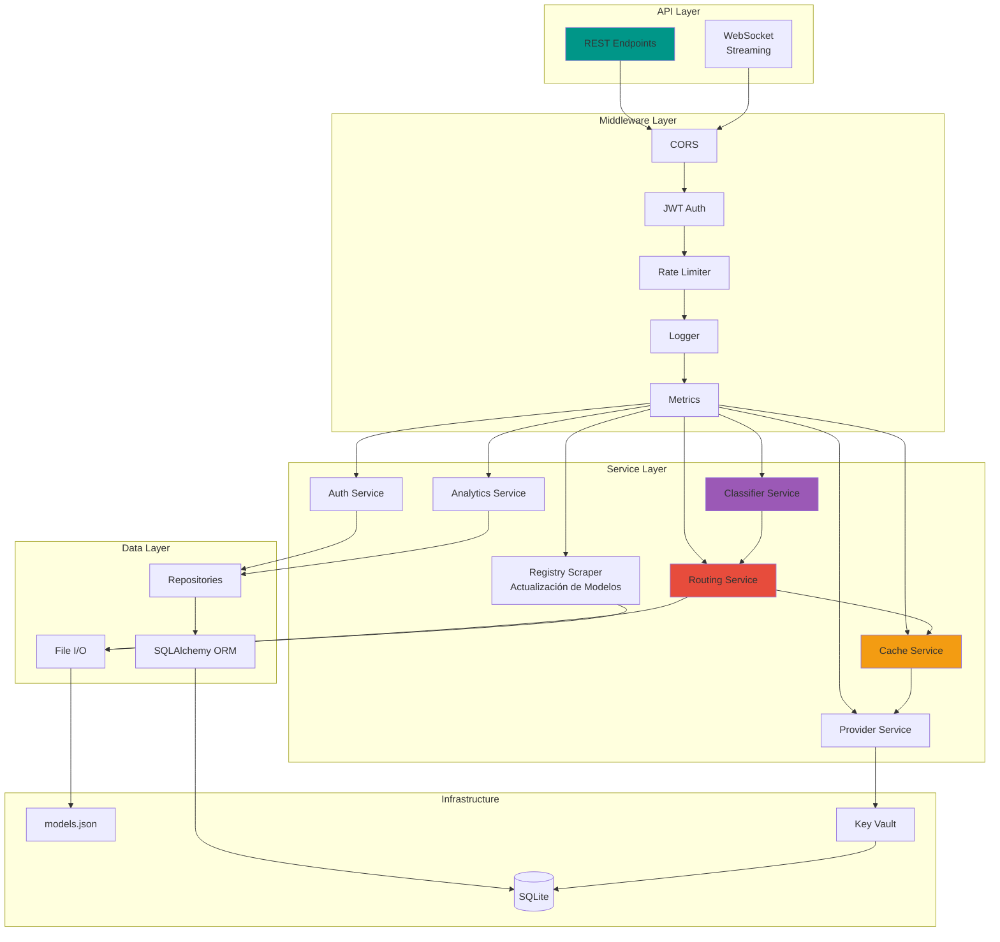
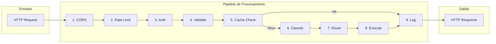
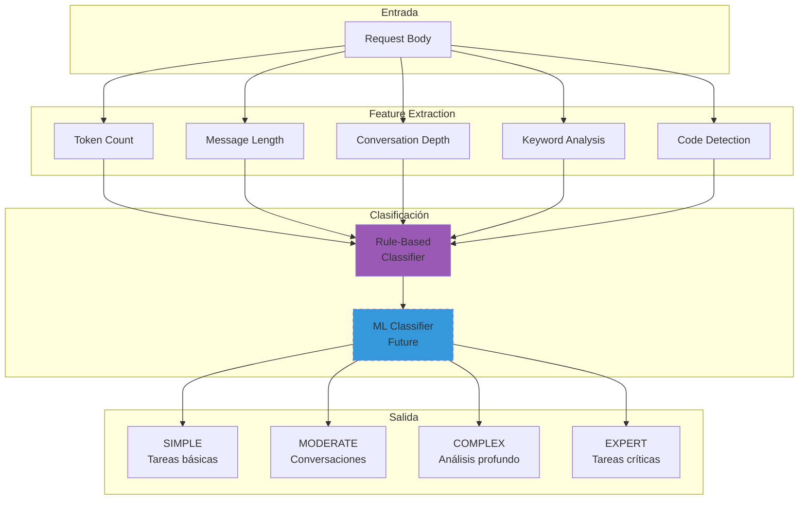
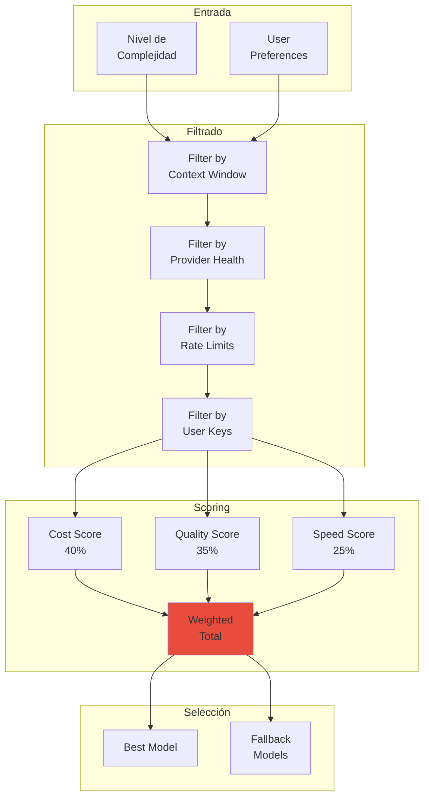
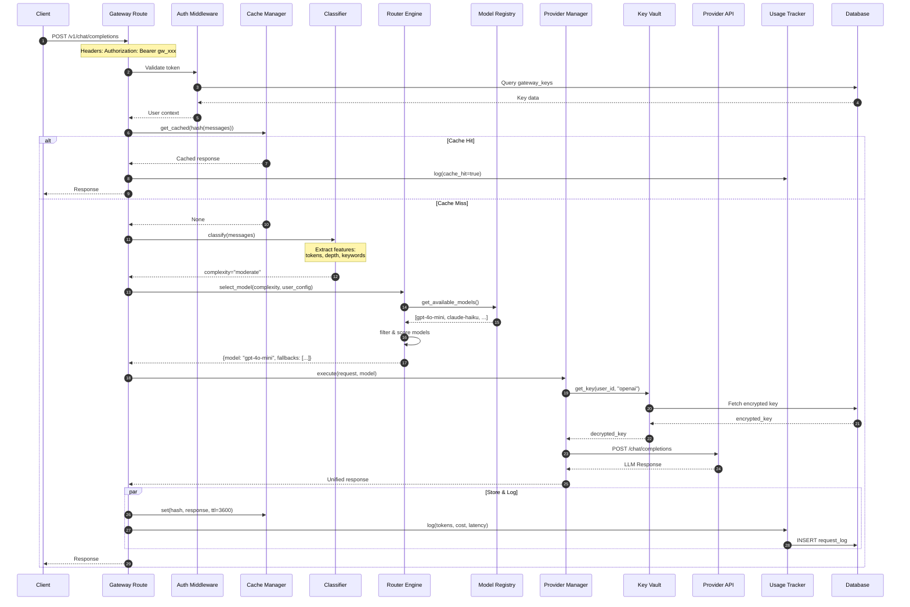
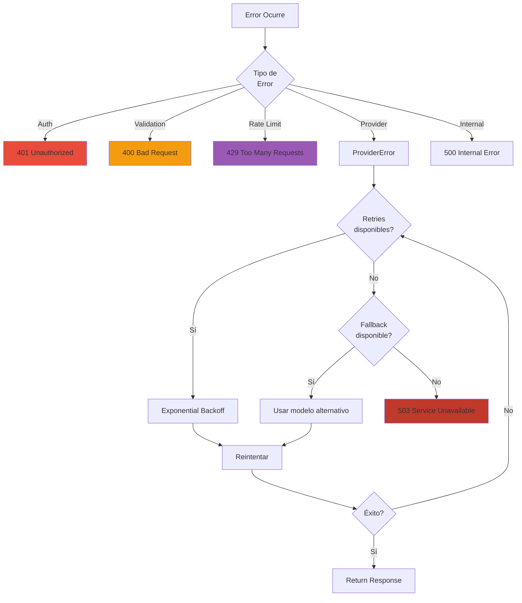
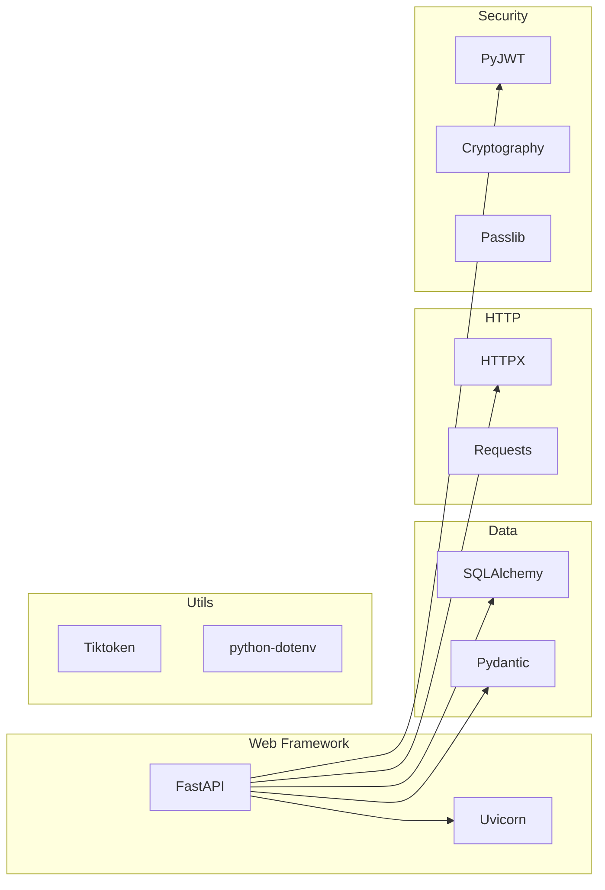

# 🔧 Arquitectura Backend - FastAPI

> El backend es el corazón del sistema, responsable del procesamiento inteligente de requests, enrutamiento optimizado y gestión de proveedores LLM.

## Visión General del Backend



## Estructura de Directorios

```
backend/
├── app/
│   ├── __init__.py
│   ├── main.py                 # Entry point FastAPI
│   ├── config.py               # Configuración y settings
│   │
│   ├── api/                    # Capa de API
│   │   ├── __init__.py
│   │   ├── deps.py             # Dependencias compartidas
│   │   ├── middleware/         # Middlewares
│   │   │   ├── auth.py
│   │   │   ├── rate_limit.py
│   │   │   └── logging.py
│   │   └── routes/             # Endpoints
│   │       ├── auth.py         # /api/auth/*
│   │       ├── keys.py         # /api/keys/*
│   │       ├── analytics.py    # /api/analytics/*
│   │       ├── models.py       # /api/models/*
│   │       ├── admin.py        # /api/admin/* (update registry)
│   │       └── gateway.py      # /v1/chat/*
│   │
│   ├── core/                   # Lógica de negocio
│   │   ├── __init__.py
│   │   ├── classifier/         # Clasificación de requests
│   │   │   ├── base.py
│   │   │   ├── rules.py
│   │   │   └── ml.py
│   │   ├── router/             # Selección de modelos
│   │   │   ├── engine.py
│   │   │   ├── strategies.py
│   │   │   └── scorer.py
│   │   ├── cache/              # Sistema de caché
│   │   │   ├── manager.py
│   │   │   └── semantic.py
│   │   └── providers/          # Adaptadores de proveedores
│   │       ├── base.py
│   │       ├── openai.py
│   │       ├── anthropic.py
│   │       └── google.py
│   │
│   ├── models/                 # Modelos de datos
│   │   ├── __init__.py
│   │   ├── database.py         # Modelos SQLAlchemy
│   │   └── schemas.py          # Pydantic schemas
│   │
│   ├── services/               # Servicios de aplicación
│   │   ├── __init__.py
│   │   ├── auth_service.py
│   │   ├── key_service.py
│   │   ├── analytics_service.py
│   │   ├── model_registry.py
│   │   └── registry_scraper.py  # Scraping de precios y modelos
│   │
│   └── utils/                  # Utilidades
│       ├── __init__.py
│       ├── crypto.py           # Encriptación
│       ├── tokens.py           # Conteo de tokens
│       └── cost.py             # Cálculo de costos
│
├── tests/                      # Tests
├── alembic/                    # Migraciones DB
├── requirements.txt
└── Dockerfile
```

## Componentes Principales

### 1. Request Pipeline



### 2. Sistema de Clasificación



### 3. Motor de Enrutamiento



## Flujo de Datos Detallado

### Request de Chat Completion



## Configuración y Settings

```python
# config.py (representación conceptual)
class Settings:
    # Server
    HOST: str = "0.0.0.0"
    PORT: int = 8000
    DEBUG: bool = False
    
    # Database
    DATABASE_URL: str = "sqlite:///./data/gateway.db"
    
    # Security
    SECRET_KEY: str  # Para JWT
    ENCRYPTION_KEY: str  # Para API keys
    JWT_EXPIRATION: int = 86400  # 24 hours
    
    # Cache
    CACHE_MAX_SIZE: int = 1000
    CACHE_TTL: int = 3600
    
    # Rate Limiting
    RATE_LIMIT_PER_MINUTE: int = 60
    
    # Providers
    PROVIDERS_CONFIG: dict = {
        "openai": {"base_url": "https://api.openai.com/v1"},
        "anthropic": {"base_url": "https://api.anthropic.com"},
        "google": {"base_url": "https://generativelanguage.googleapis.com"}
    }
```

## Manejo de Errores



## Dependencias Principales



## Documentos Relacionados

- [[../backend/api-routes|Definición de Rutas API]]
- [[../backend/services/classifier|Servicio de Clasificación]]
- [[../backend/services/router|Motor de Enrutamiento]]
- [[../backend/security|Seguridad]]
- [[../backend/database|Base de Datos]]

---

*Ver también: [[overview|Arquitectura General]] | [[frontend-architecture|Arquitectura Frontend]]*
