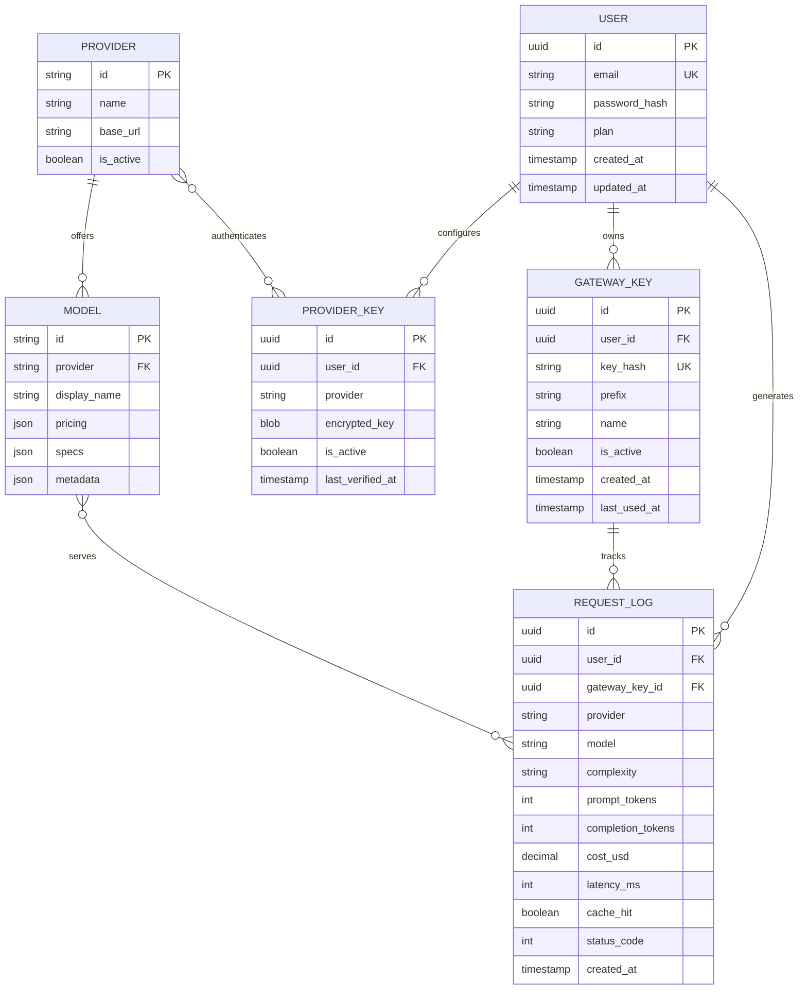
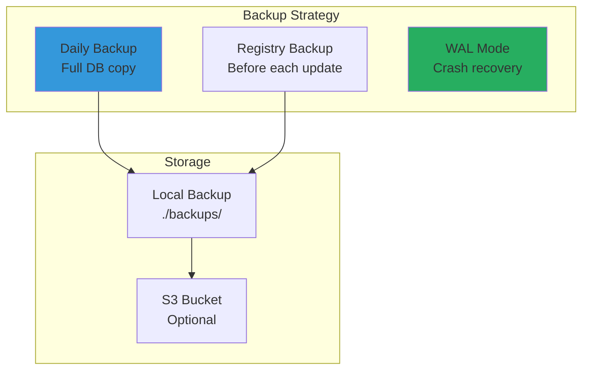

# 💾 Arquitectura de Datos

> Diseño del modelo de datos, relaciones y estrategias de persistencia del sistema.

## Modelo Conceptual



## Arquitectura de Almacenamiento

```mermaid
graph TB
    subgraph "Persistent Storage"
        subgraph "SQLite Database"
            Users[(users)]
            GKeys[(gateway_keys)]
            PKeys[(provider_keys)]
            Logs[(request_logs)]
        end
        
        subgraph "File System"
            Registry[models.json<br/>Model Catalog]
            Backup[models.json.bak<br/>Backup]
            Config[.env<br/>Configuration]
        end
    end
    
    subgraph "Ephemeral Storage"
        Cache[LRU Cache<br/>In-Memory]
        Session[JWT Sessions<br/>Stateless]
    end
    
    subgraph "External"
        GitHub[GitHub Registry<br/>Source of Truth]
    end
    
    GitHub -->|Daily Sync| Registry
    Registry -->|Backup| Backup
    
    style Users fill:#003b57
    style Registry fill:#f39c12
    style Cache fill:#27ae60
```



## Esquema de Base de Datos

### Tabla: users
```sql
CREATE TABLE users (
    id TEXT PRIMARY KEY DEFAULT (lower(hex(randomblob(16)))),
    email TEXT UNIQUE NOT NULL,
    password_hash TEXT NOT NULL,
    plan TEXT DEFAULT 'free' CHECK (plan IN ('free', 'pro', 'enterprise')),
    created_at TIMESTAMP DEFAULT CURRENT_TIMESTAMP,
    updated_at TIMESTAMP DEFAULT CURRENT_TIMESTAMP
);

CREATE INDEX idx_users_email ON users(email);
```

### Tabla: gateway_keys
```sql
CREATE TABLE gateway_keys (
    id TEXT PRIMARY KEY DEFAULT (lower(hex(randomblob(16)))),
    user_id TEXT NOT NULL REFERENCES users(id) ON DELETE CASCADE,
    key_hash TEXT UNIQUE NOT NULL,
    prefix TEXT NOT NULL,  -- e.g., "gw_abc123..."
    name TEXT,
    is_active BOOLEAN DEFAULT TRUE,
    created_at TIMESTAMP DEFAULT CURRENT_TIMESTAMP,
    last_used_at TIMESTAMP
);

CREATE INDEX idx_gateway_keys_user ON gateway_keys(user_id);
CREATE INDEX idx_gateway_keys_hash ON gateway_keys(key_hash);
CREATE INDEX idx_gateway_keys_prefix ON gateway_keys(prefix);
```

### Tabla: provider_keys
```sql
CREATE TABLE provider_keys (
    id TEXT PRIMARY KEY DEFAULT (lower(hex(randomblob(16)))),
    user_id TEXT NOT NULL REFERENCES users(id) ON DELETE CASCADE,
    provider TEXT NOT NULL CHECK (provider IN ('openai', 'anthropic', 'google', 'groq')),
    encrypted_key BLOB NOT NULL,
    is_active BOOLEAN DEFAULT TRUE,
    last_verified_at TIMESTAMP,
    created_at TIMESTAMP DEFAULT CURRENT_TIMESTAMP,
    UNIQUE(user_id, provider)
);

CREATE INDEX idx_provider_keys_user ON provider_keys(user_id);
```

### Tabla: request_logs
```sql
CREATE TABLE request_logs (
    id TEXT PRIMARY KEY DEFAULT (lower(hex(randomblob(16)))),
    user_id TEXT NOT NULL REFERENCES users(id) ON DELETE CASCADE,
    gateway_key_id TEXT REFERENCES gateway_keys(id) ON DELETE SET NULL,
    endpoint TEXT NOT NULL,
    provider TEXT NOT NULL,
    model TEXT NOT NULL,
    complexity TEXT CHECK (complexity IN ('simple', 'moderate', 'complex', 'expert')),
    prompt_tokens INTEGER DEFAULT 0,
    completion_tokens INTEGER DEFAULT 0,
    total_tokens INTEGER GENERATED ALWAYS AS (prompt_tokens + completion_tokens) STORED,
    cost_usd DECIMAL(10, 6) DEFAULT 0,
    latency_ms INTEGER DEFAULT 0,
    cache_hit BOOLEAN DEFAULT FALSE,
    status_code INTEGER DEFAULT 200,
    error_message TEXT,
    created_at TIMESTAMP DEFAULT CURRENT_TIMESTAMP
);

CREATE INDEX idx_logs_user ON request_logs(user_id);
CREATE INDEX idx_logs_created ON request_logs(created_at);
CREATE INDEX idx_logs_user_created ON request_logs(user_id, created_at);
CREATE INDEX idx_logs_model ON request_logs(model);
```

## Estructura del Model Registry (JSON)

```json
{
  "version": "1.0.0",
  "updated_at": "2026-01-11T00:00:00Z",
  "providers": {
    "openai": {
      "id": "openai",
      "name": "OpenAI",
      "base_url": "https://api.openai.com/v1",
      "status": "active"
    }
  },
  "models": [
    {
      "id": "gpt-4o",
      "provider": "openai",
      "model_name": "gpt-4o",
      "display_name": "GPT-4o",
      "pricing": {
        "input_per_1m": 2.50,
        "output_per_1m": 10.00,
        "currency": "USD"
      },
      "specs": {
        "context_window": 128000,
        "max_output": 16384,
        "supports_vision": true,
        "supports_function_calling": true,
        "supports_streaming": true
      },
      "performance": {
        "speed_tier": "fast",
        "quality_tier": "premium"
      },
      "metadata": {
        "release_date": "2024-05-13",
        "recommended_for": ["general", "coding", "analysis"]
      }
    }
  ]
}
```

## Flujo de Datos

### Write Path

```mermaid
graph LR
    subgraph "Application"
        API[API Handler]
        Service[Service Layer]
        Repo[Repository]
    end
    
    subgraph "Database"
        ORM[SQLAlchemy ORM]
        Connection[Connection Pool]
        SQLite[(SQLite)]
    end
    
    API --> Service
    Service --> Repo
    Repo --> ORM
    ORM --> Connection
    Connection --> SQLite
    
    style SQLite fill:#003b57
```


### Read Path (Analytics)

```mermaid
graph LR
    subgraph "Query"
        UI[Dashboard UI]
        Hook[React Query]
        APIClient[API Client]
    end
    
    subgraph "Backend"
        Endpoint[Analytics Endpoint]
        Service[Analytics Service]
        Query[SQL Query Builder]
    end
    
    subgraph "Database"
        SQLite[(SQLite)]
    end
    
    UI --> Hook
    Hook --> APIClient
    APIClient --> Endpoint
    Endpoint --> Service
    Service --> Query
    Query --> SQLite
    
    SQLite -->|Aggregated Data| Service
    Service -->|JSON Response| Endpoint
    
    style SQLite fill:#003b57
```


## Estrategias de Query

### Métricas del Dashboard
```sql
-- Total cost last 24h
SELECT 
    SUM(cost_usd) as total_cost,
    COUNT(*) as total_requests,
    AVG(latency_ms) as avg_latency,
    SUM(CASE WHEN cache_hit THEN 1 ELSE 0 END) * 100.0 / COUNT(*) as cache_rate
FROM request_logs
WHERE user_id = ?
  AND created_at >= datetime('now', '-24 hours');

-- Cost breakdown by day
SELECT 
    date(created_at) as day,
    SUM(cost_usd) as daily_cost,
    COUNT(*) as requests
FROM request_logs
WHERE user_id = ?
  AND created_at >= datetime('now', '-7 days')
GROUP BY date(created_at)
ORDER BY day;

-- Model distribution
SELECT 
    model,
    COUNT(*) as usage_count,
    SUM(cost_usd) as total_cost
FROM request_logs
WHERE user_id = ?
  AND created_at >= datetime('now', '-24 hours')
GROUP BY model
ORDER BY usage_count DESC;
```

## Migraciones


## Backup y Recovery



## Documentos Relacionados

- [[../backend/database|Base de Datos Backend]]
- [[deployment-architecture|Arquitectura de Deployment]]

---

*Ver también: [[overview|Arquitectura General]]*
