# 🚢 Arquitectura de Deployment

> Estrategia de despliegue, infraestructura y operaciones del sistema.

## Vista de Deployment


## Docker Compose Configuration


## Configuración de Servicios

### Frontend Container
```yaml
frontend:
  build:
    context: ./frontend
    dockerfile: Dockerfile
  ports:
    - "3000:3000"
  environment:
    - NEXT_PUBLIC_API_URL=http://backend:8000
  depends_on:
    - backend
  networks:
    - gateway-network
  restart: unless-stopped
```

### Backend Container
```yaml
backend:
  build:
    context: ./backend
    dockerfile: Dockerfile
  ports:
    - "8000:8000"
  environment:
    - DATABASE_URL=sqlite:///./data/gateway.db
    - SECRET_KEY=${SECRET_KEY}
    - ENCRYPTION_KEY=${ENCRYPTION_KEY}
    - ADMIN_API_KEY=${ADMIN_API_KEY}  # Para cron job
  volumes:
    - ./data:/app/data
  networks:
    - gateway-network
  restart: unless-stopped
  command: sh -c "cron && uvicorn app.main:app --host 0.0.0.0 --port 8000"
```

**Nota:** El backend ahora incluye:
- Servicio web FastAPI (puerto 8000)
- Cron job interno que ejecuta registry scraping diariamente
- Endpoint manual `/api/admin/update-registry` para updates on-demand

## Ciclo de Deployment

```mermaid
graph TB
    subgraph "Development"
        Dev[👨‍💻 Developer]
        LocalTest[Local Testing<br/>docker-compose up]
    end
    
    subgraph "CI/CD Pipeline"
        Push[Git Push]
        Actions[GitHub Actions]
        Build[Build Images]
        Test[Run Tests]
        Security[Security Scan]
        Push2Reg[Push to Registry]
    end
    
    subgraph "Deployment"
        Pull[Pull Images]
        Deploy[docker-compose up -d]
        Migrate[Run Migrations]
        Health[Health Check]
    end
    
    subgraph "Production"
        Server[Production Server]
    end
    
    Dev --> LocalTest
    LocalTest --> Push
    Push --> Actions
    Actions --> Build --> Test --> Security --> Push2Reg
    Push2Reg --> Pull
    Pull --> Deploy --> Migrate --> Health
    Health --> Server
    
    style Actions fill:#2088FF
    style Server fill:#27ae60
```



## Estrategia de Scaling

### Horizontal Scaling (Futuro)


## Monitoreo y Observabilidad


## Health Checks

```mermaid
graph LR
    subgraph "Endpoints"
        Health[/health<br/>Basic check]
        Ready[/ready<br/>Dependencies]
        Live[/live<br/>Liveness probe]
    end
    
    subgraph "Checks"
        DB[Database<br/>Connection]
        Registry[Registry<br/>Loaded]
        Providers[Providers<br/>Reachable]
    end
    
    Ready --> DB & Registry
    Live --> DB
    
    style Health fill:#27ae60
    style Ready fill:#3498db
```

## Backup y Disaster Recovery


## Configuración de Seguridad

| Aspecto | Configuración |
|---------|---------------|
| SSL/TLS | Let's Encrypt, auto-renew |
| Firewall | Solo puertos 80, 443 |
| Rate Limiting | 100 req/min por IP |
| Secrets | Environment variables |
| Headers | CORS, CSP, HSTS |

## Comandos de Deployment

```bash
# Build and start
docker-compose up -d --build

# View logs
docker-compose logs -f

# Restart service
docker-compose restart backend

# Update images
docker-compose pull && docker-compose up -d

# Backup database
docker-compose exec backend cp /app/data/gateway.db /app/data/backups/

# Run migrations
docker-compose exec backend alembic upgrade head
```

## Documentos Relacionados

- [[overview|Arquitectura General]]
- [[../documentacion/setup-guide|Guía de Setup]]
- [[../documentacion/configuration|Configuración]]

---

*Ver también: [[../roadmap/fase-3-scale|Fase 3: Escalabilidad]]*
