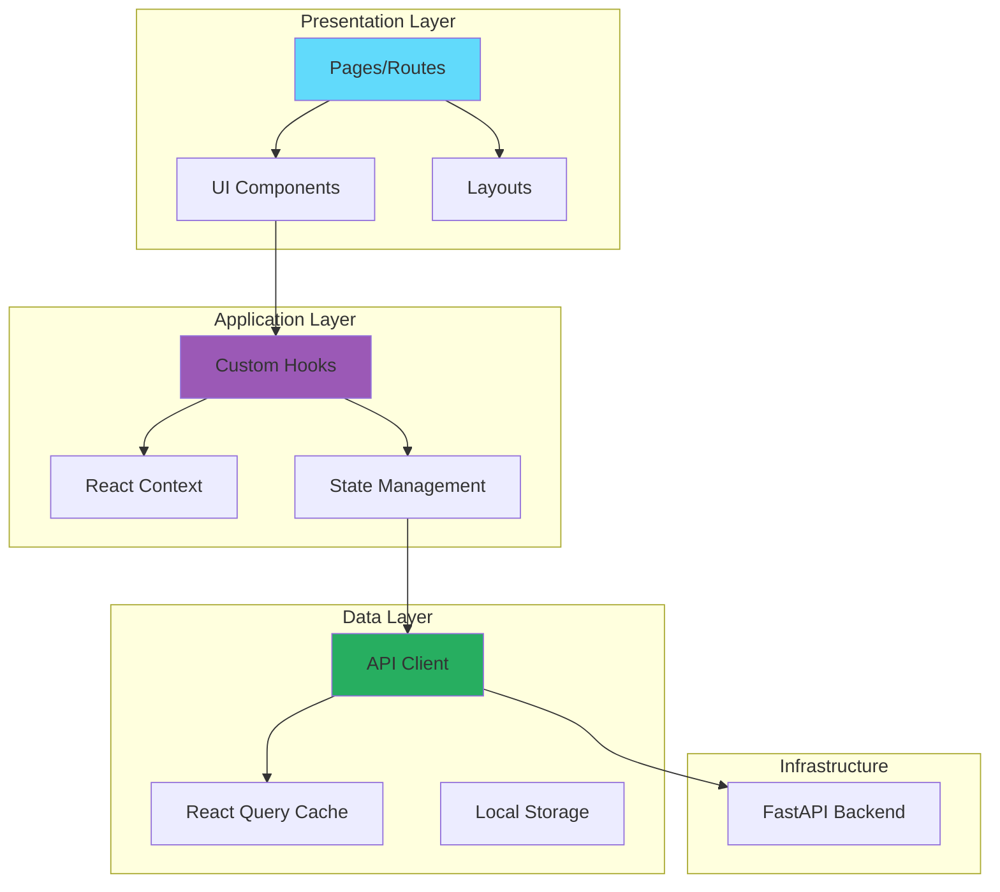
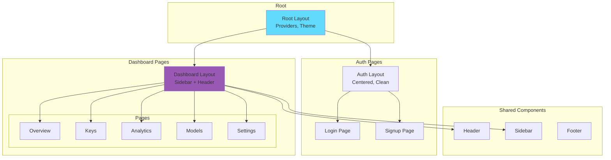
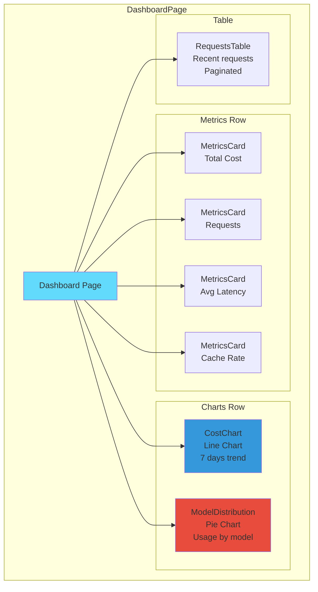
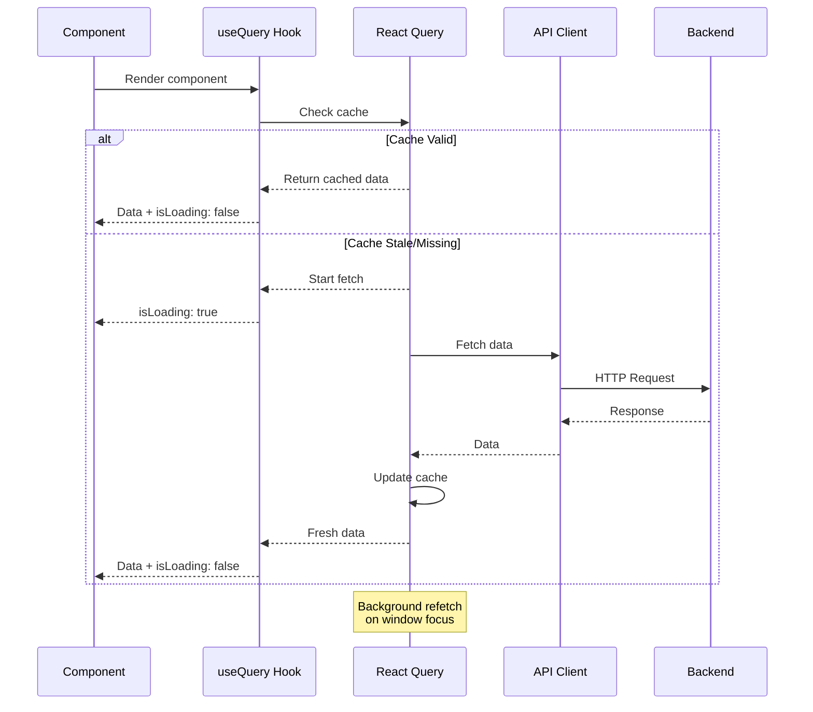
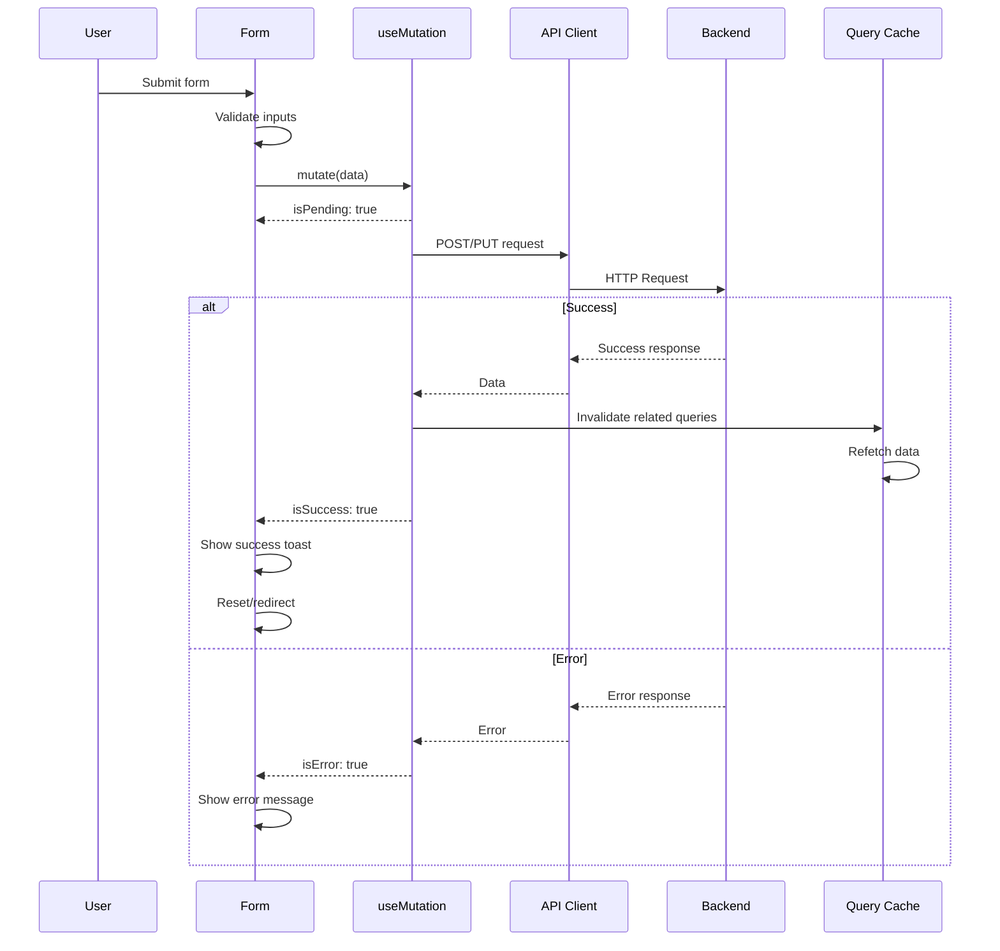
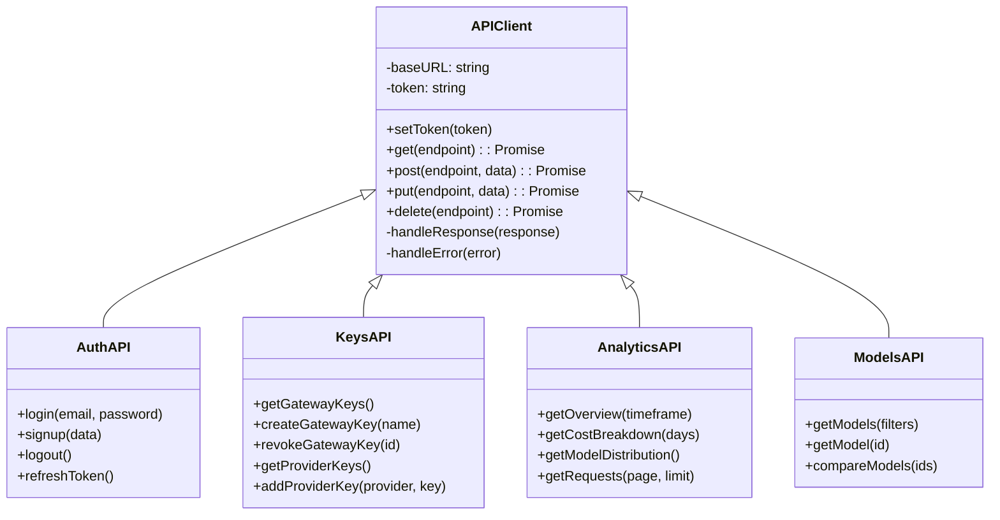
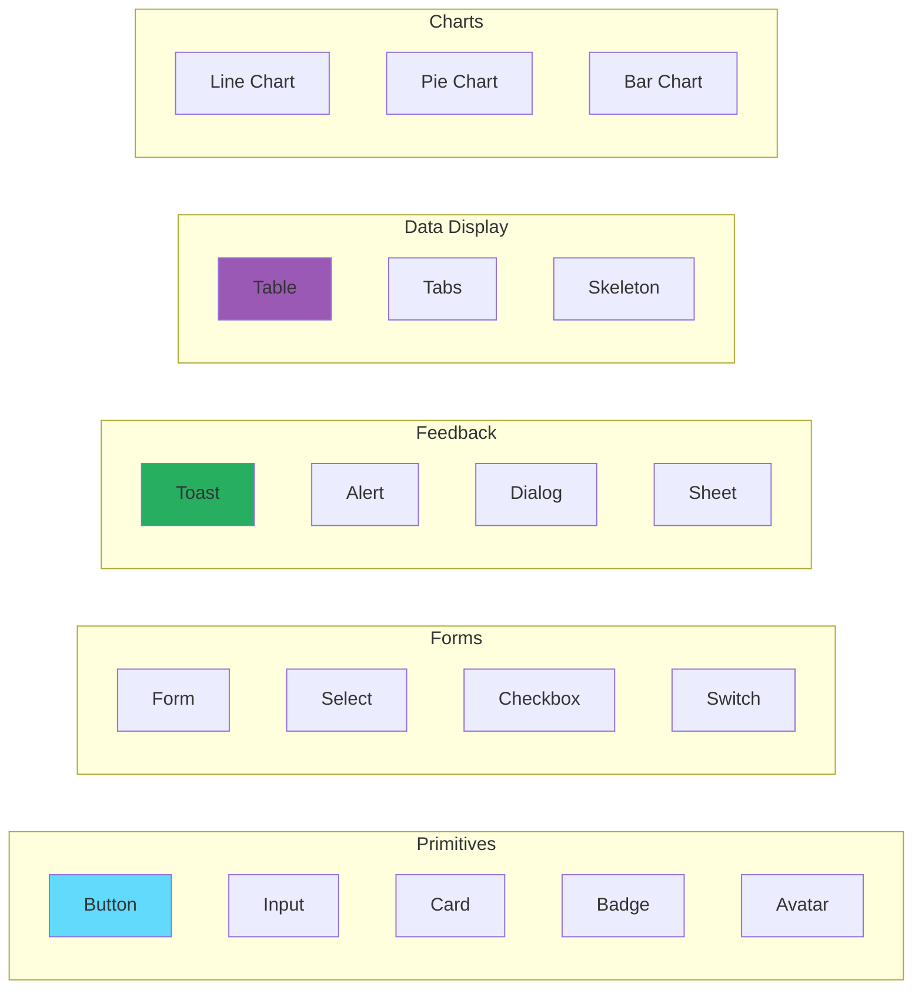
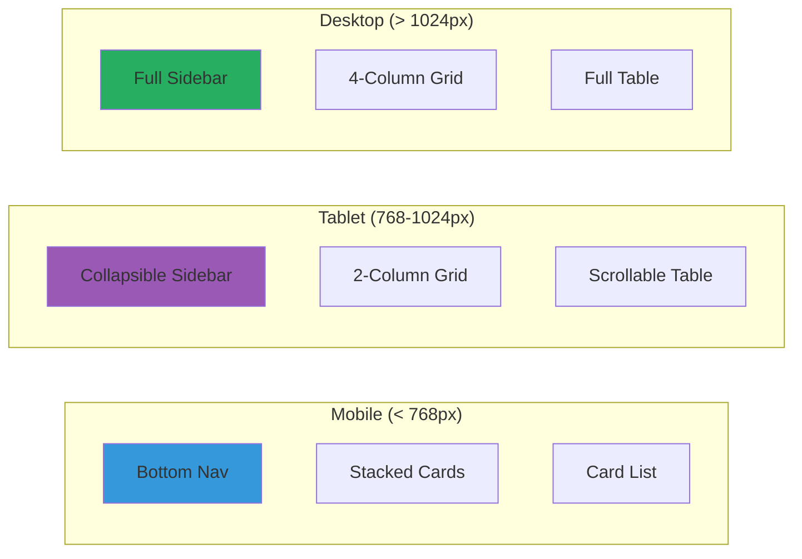

# 🎨 Arquitectura Frontend - Next.js

> El frontend proporciona una experiencia de usuario intuitiva para gestionar el gateway, visualizar analytics y administrar claves API.

## Visión General del Frontend



## Estructura de Directorios (App Router)

```
frontend/
├── app/                        # Next.js App Router
│   ├── layout.tsx              # Root layout
│   ├── page.tsx                # Landing page (/)
│   ├── globals.css             # Global styles
│   │
│   ├── (auth)/                 # Auth group
│   │   ├── login/
│   │   │   └── page.tsx
│   │   ├── signup/
│   │   │   └── page.tsx
│   │   └── layout.tsx          # Auth layout
│   │
│   ├── (dashboard)/            # Dashboard group
│   │   ├── dashboard/
│   │   │   └── page.tsx        # Main dashboard
│   │   ├── keys/
│   │   │   └── page.tsx        # Key management
│   │   ├── analytics/
│   │   │   └── page.tsx        # Analytics
│   │   ├── models/
│   │   │   └── page.tsx        # Model catalog
│   │   ├── settings/
│   │   │   └── page.tsx        # Settings
│   │   └── layout.tsx          # Dashboard layout
│   │
│   └── api/                    # API routes (optional)
│
├── components/                 # React Components
│   ├── ui/                     # Shadcn UI components
│   │   ├── button.tsx
│   │   ├── card.tsx
│   │   ├── input.tsx
│   │   └── ...
│   │
│   ├── layout/                 # Layout components
│   │   ├── Header.tsx
│   │   ├── Sidebar.tsx
│   │   └── Footer.tsx
│   │
│   ├── dashboard/              # Dashboard components
│   │   ├── MetricsCard.tsx
│   │   ├── CostChart.tsx
│   │   ├── ModelDistribution.tsx
│   │   └── RequestsTable.tsx
│   │
│   ├── keys/                   # Key management
│   │   ├── KeyList.tsx
│   │   ├── KeyCreator.tsx
│   │   └── ProviderKeyForm.tsx
│   │
│   └── models/                 # Model components
│       ├── ModelCard.tsx
│       ├── ModelFilter.tsx
│       └── ModelCompare.tsx
│
├── lib/                        # Utilities
│   ├── api.ts                  # API client
│   ├── auth.ts                 # Auth utilities
│   ├── utils.ts                # Helper functions
│   └── constants.ts            # Constants
│
├── hooks/                      # Custom hooks
│   ├── useAuth.ts
│   ├── useMetrics.ts
│   ├── useKeys.ts
│   └── useModels.ts
│
├── types/                      # TypeScript types
│   ├── api.ts
│   ├── models.ts
│   └── user.ts
│
├── public/                     # Static assets
├── tailwind.config.ts
├── next.config.js
└── package.json
```

## Arquitectura de Componentes



## Árbol de Componentes del Dashboard



## Gestión de Estado

```mermaid
graph TB
    subgraph "Global State"
        AuthContext[Auth Context<br/>User, Token]
        ThemeContext[Theme Context<br/>Dark/Light]
    end
    
    subgraph "Server State - React Query"
        MetricsQuery[useMetrics()<br/>Dashboard data]
        KeysQuery[useKeys()<br/>API keys]
        ModelsQuery[useModels()<br/>Model catalog]
        AnalyticsQuery[useAnalytics()<br/>Charts data]
    end
    
    subgraph "Local State"
        FormState[Form State<br/>useState]
        UIState[UI State<br/>Modals, Filters]
    end
    
    Components[Components] --> AuthContext & ThemeContext
    Components --> MetricsQuery & KeysQuery & ModelsQuery & AnalyticsQuery
    Components --> FormState & UIState
    
    style AuthContext fill:#e74c3c
    style MetricsQuery fill:#3498db
```

## Flujo de Datos

### Data Fetching Pattern



### Mutation Pattern (Creating/Updating)



## Diseño de API Client



## Componentes UI (Shadcn)



## Routing y Navigation

```mermaid
graph TB
    subgraph "Public Routes"
        Landing[/ Landing]
        Login[/auth/login]
        Signup[/auth/signup]
    end
    
    subgraph "Protected Routes"
        Dashboard[/dashboard]
        Keys[/dashboard/keys]
        Analytics[/dashboard/analytics]
        Models[/dashboard/models]
        Settings[/dashboard/settings]
    end
    
    subgraph "Middleware"
        AuthGuard{Auth Guard}
    end
    
    Landing --> Login
    Login -->|Success| AuthGuard
    Signup -->|Success| AuthGuard
    
    AuthGuard -->|Has Token| Dashboard
    AuthGuard -->|No Token| Login
    
    Dashboard --> Keys & Analytics & Models & Settings
    
    style AuthGuard fill:#e74c3c
    style Dashboard fill:#27ae60
```

## Responsive Design



## Performance Optimizations

| Técnica | Implementación |
|---------|----------------|
| Code Splitting | Dynamic imports por ruta |
| Image Optimization | next/image component |
| Caching | React Query con staleTime |
| Memoization | useMemo, useCallback |
| Lazy Loading | Suspense boundaries |
| Prefetching | Link prefetch |

## Documentos Relacionados

- [[../frontend/overview|Frontend Overview]]
- [[../frontend/components/dashboard|Dashboard Components]]
- [[../frontend/state-management|State Management]]
- [[../frontend/api-client|API Client]]

---

*Ver también: [[overview|Arquitectura General]] | [[backend-architecture|Arquitectura Backend]]*
