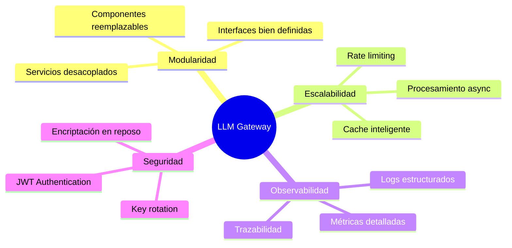
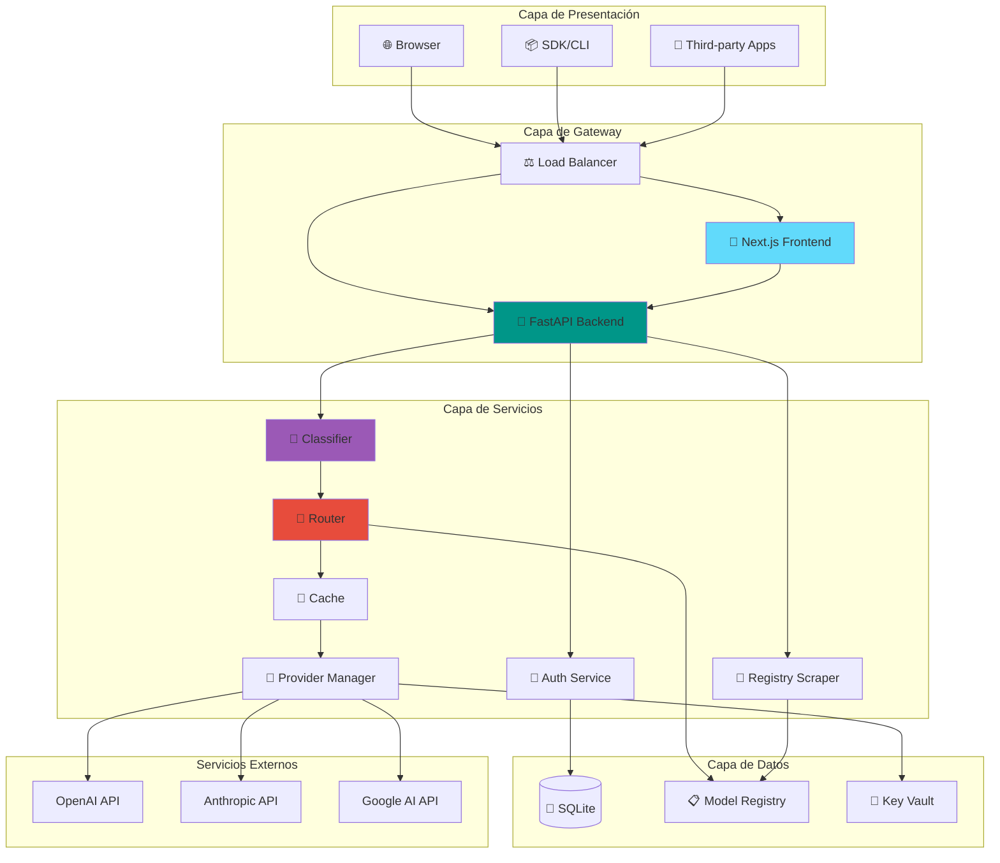
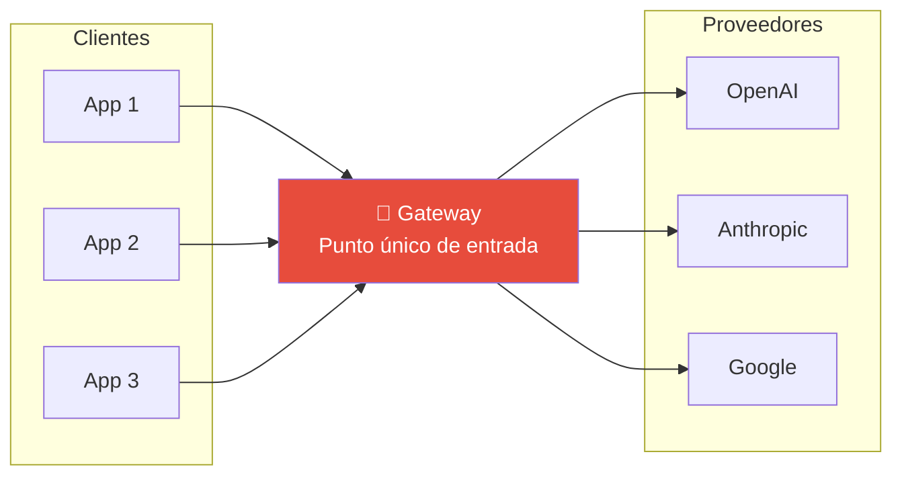
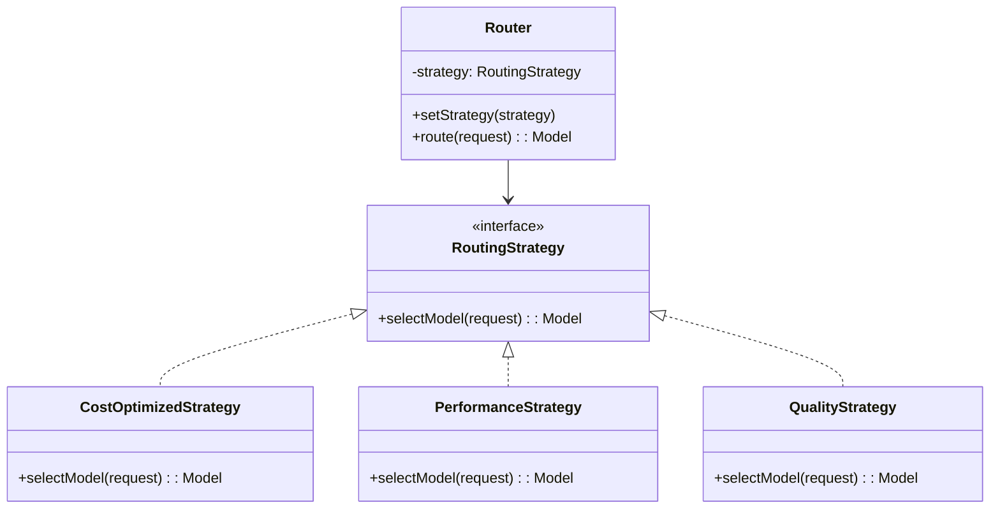
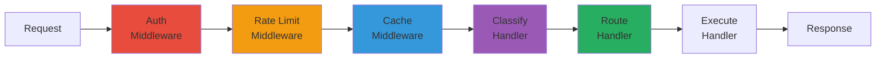
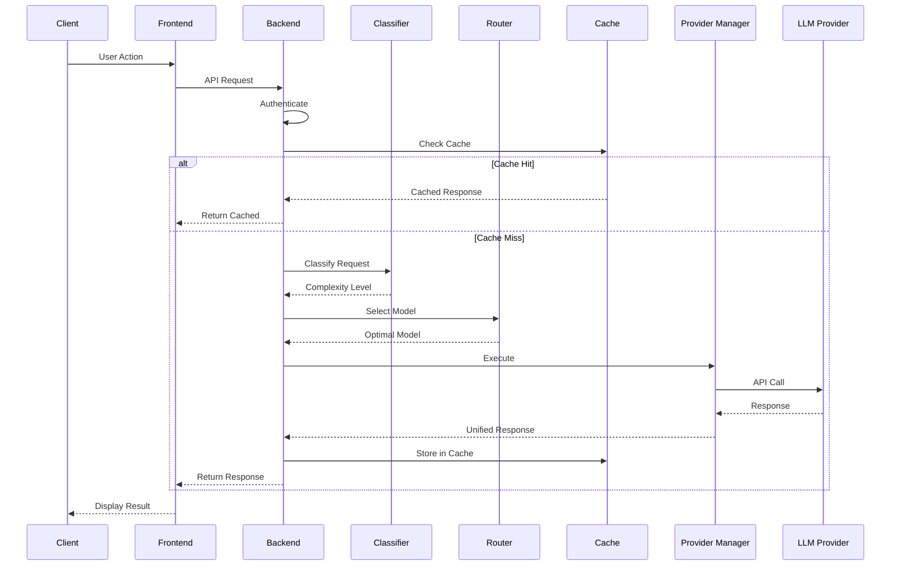

# 🏗️ Arquitectura General - LLM Gateway

> Visión holística del sistema y cómo los componentes interactúan para proporcionar enrutamiento inteligente de LLMs.

## Filosofía de Diseño

El LLM Gateway sigue principios de arquitectura orientada a servicios con un enfoque en:

## Vista de Alto Nivel

## Patrones Arquitectónicos Aplicados

### 1. Gateway Pattern

**Beneficios:**
- Abstracción de complejidad de múltiples proveedores
- API unificada para todos los clientes
- Centralización de cross-cutting concerns

### 2. Strategy Pattern (Router)

### 3. Chain of Responsibility (Request Pipeline)

## Comunicación Entre Componentes

## Decisiones Arquitectónicas (ADRs)

### ADR-001: SQLite como Base de Datos Principal
**Contexto:** Necesitamos persistencia para usuarios, keys y logs.
**Decisión:** SQLite por simplicidad y portabilidad.
**Consecuencias:** 
- ✅ Zero-config, embebida
- ✅ Backup simple (copiar archivo)
- ⚠️ Limitaciones de concurrencia para escala extrema

### ADR-002: Scraping Directo vs GitHub Registry
**Contexto:** El catálogo de modelos cambia frecuentemente (precios, nuevos modelos).
**Decisión:** Implementar scrapers dentro del backend que consultan páginas oficiales de pricing, con cron job para ejecución automática.
**Consecuencias:**
- ✅ Datos siempre actualizados desde fuente oficial
- ✅ Sin dependencia de repos externos
- ✅ Control total sobre frecuencia de actualización
- ⚠️ Requiere mantenimiento si sitios cambian estructura
- ⚠️ Necesita fallback si scraping falla

### ADR-003: JSON para Model Registry Storage
**Contexto:** Necesitamos almacenar el catálogo actualizado de modelos.
**Decisión:** Archivo JSON versionado con backup automático.
**Consecuencias:**
- ✅ Actualizaciones sin redeploy
- ✅ Backup simple (models.json.bak)
- ✅ Fácil de parsear y validar
- ⚠️ No tiene queries complejas (pero no las necesitamos)

### ADR-004: Cron Job Dentro del Backend Container
**Contexto:** Registry updates deben ejecutarse automáticamente diariamente.
**Decisión:** Cron job dentro del contenedor backend (no contenedor separado).
**Consecuencias:**
- ✅ Arquitectura más simple (un contenedor menos)
- ✅ Endpoint manual disponible para updates on-demand
- ✅ Logs centralizados con el resto del backend
- ⚠️ Cron debe configurarse correctamente en Dockerfile

### ADR-005: Monorepo con Docker Compose
**Contexto:** Frontend y Backend son componentes separados.
**Decisión:** Monorepo con 2 servicios dockerizados (frontend + backend).
**Consecuencias:**
- ✅ Deploy unificado
- ✅ Desarrollo local simplificado
- ✅ Configuración centralizada
- ⚠️ Builds pueden ser largos

## Métricas de Arquitectura

| Métrica | Objetivo | Actual |
|---------|----------|--------|
| Latencia P99 | < 2000ms | TBD |
| Cache Hit Rate | > 30% | TBD |
| Disponibilidad | 99.9% | TBD |
| Tiempo de Recovery | < 5min | TBD |

## Documentos Relacionados

- [[backend-architecture|Arquitectura Backend]]
- [[frontend-architecture|Arquitectura Frontend]]
- [[data-architecture|Arquitectura de Datos]]
- [[deployment-architecture|Arquitectura de Deployment]]

---

*Ver también: [[../backend/overview|Backend Overview]] | [[../frontend/overview|Frontend Overview]]*
