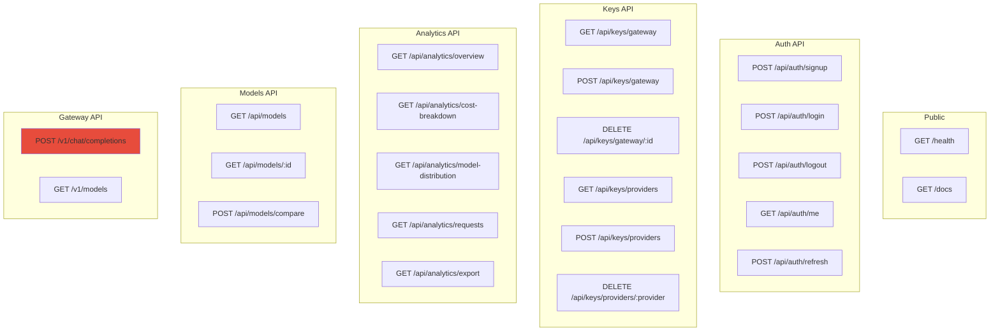
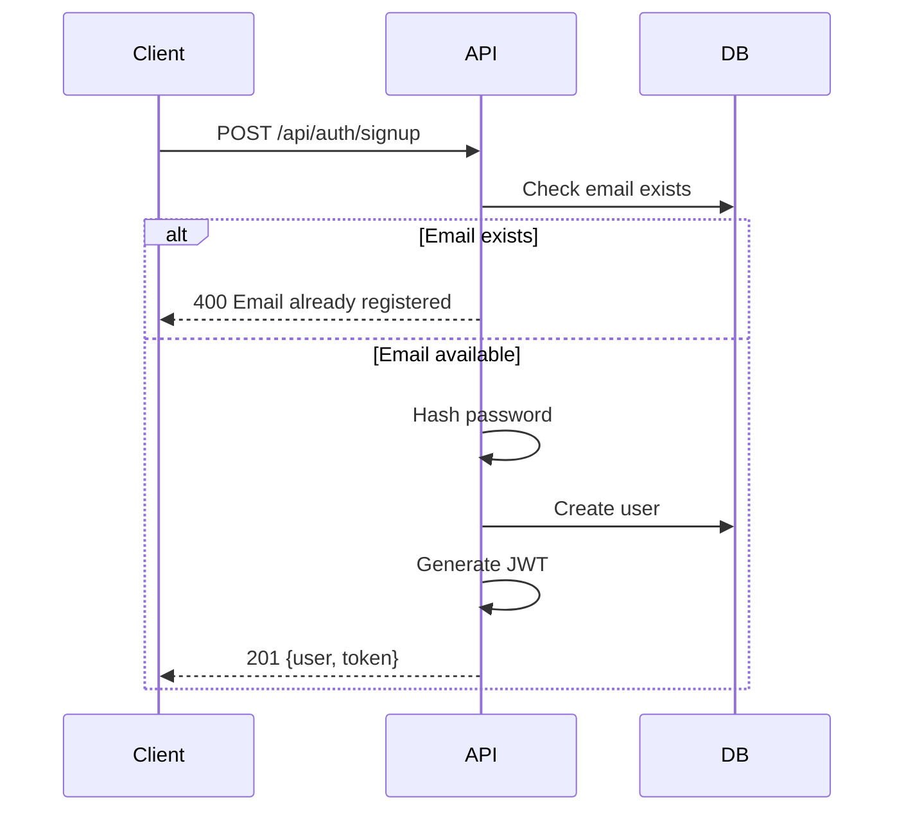
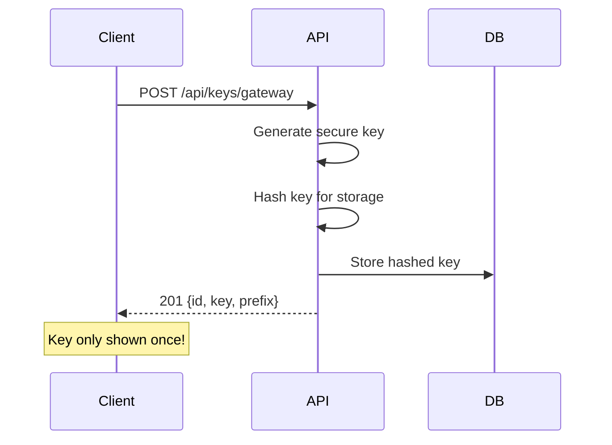
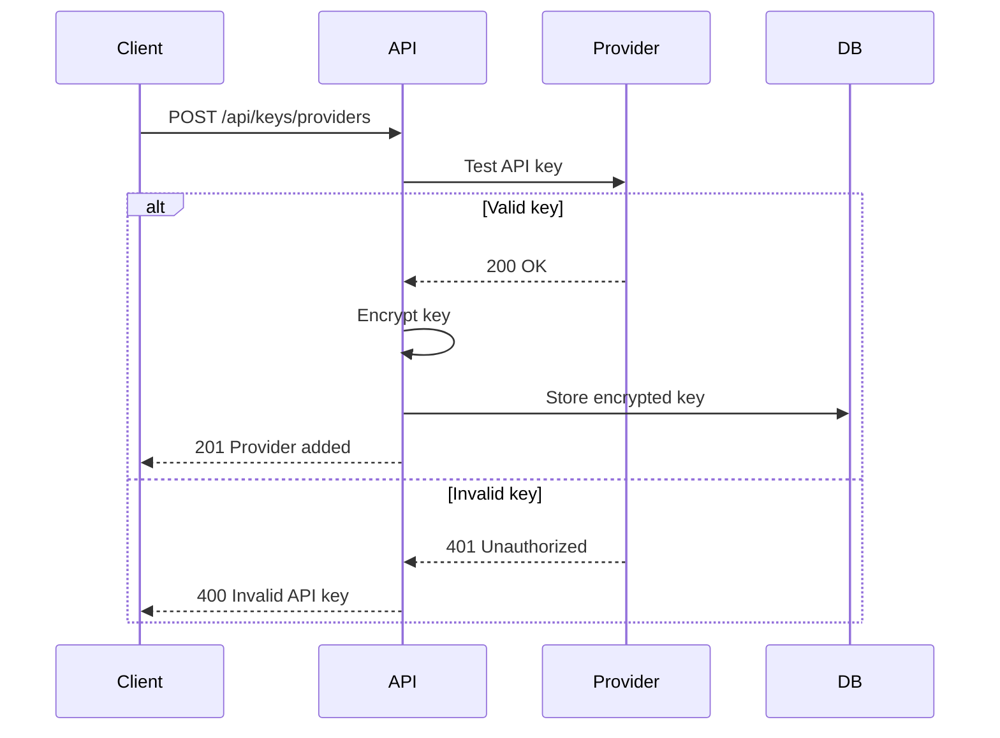
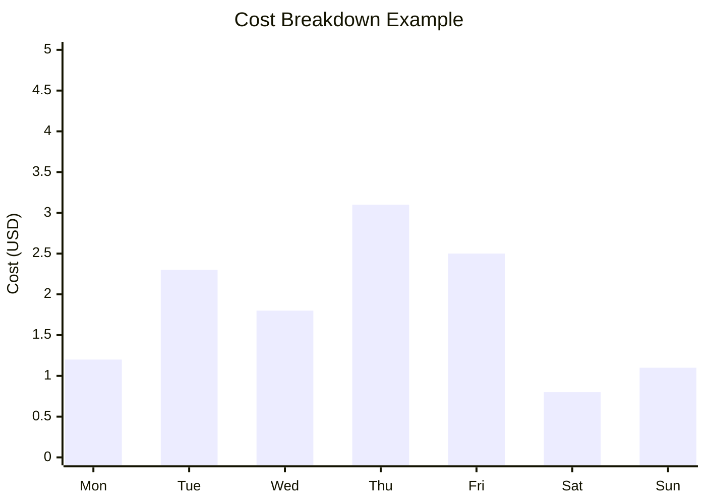
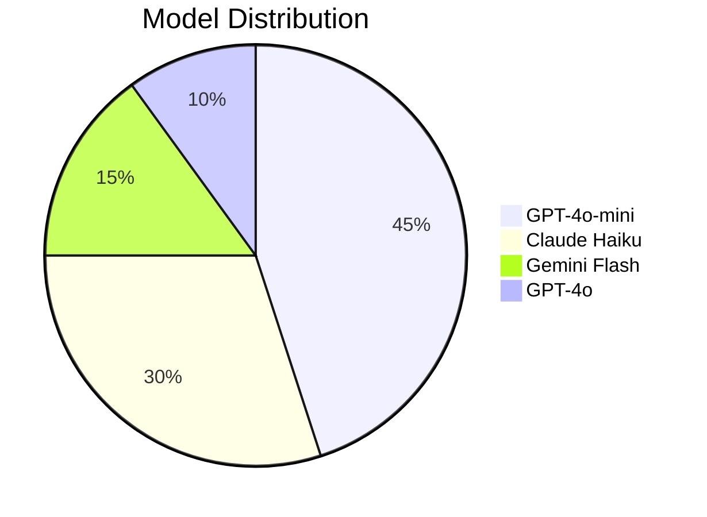
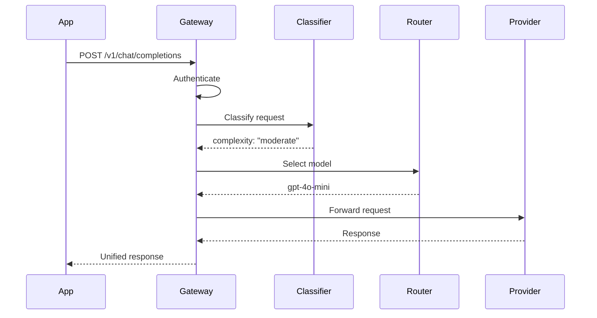

# 🛣️ API Routes

> Definición completa de todos los endpoints del backend.

## Resumen de Endpoints



---

## Auth API

### POST /api/auth/signup
Crear nueva cuenta de usuario.

```yaml
Request:
  Body:
    email: string (required, valid email)
    password: string (required, min 8 chars)
    
Response 201:
  user:
    id: string
    email: string
    plan: string
    created_at: string
  token: string
  
Response 400:
  error: "Email already registered"
```



### POST /api/auth/login
Autenticación de usuario.

```yaml
Request:
  Body:
    email: string (required)
    password: string (required)
    
Response 200:
  user:
    id: string
    email: string
    plan: string
  token: string
  
Response 401:
  error: "Invalid credentials"
```

### GET /api/auth/me
Obtener usuario actual.

```yaml
Headers:
  Authorization: Bearer <token>
  
Response 200:
  id: string
  email: string
  plan: string
  created_at: string
  provider_keys: [string]  # Lista de providers configurados
```

---

## Keys API

### GET /api/keys/gateway
Listar gateway keys del usuario.

```yaml
Headers:
  Authorization: Bearer <token>
  
Response 200:
  keys:
    - id: string
      prefix: string  # e.g., "gw_abc12..."
      name: string
      created_at: string
      last_used_at: string | null
      is_active: boolean
```

### POST /api/keys/gateway
Crear nueva gateway key.

```yaml
Headers:
  Authorization: Bearer <token>
  
Request:
  Body:
    name: string (optional)
    
Response 201:
  id: string
  key: string  # Full key, only shown once!
  prefix: string
  name: string
  created_at: string
```



### DELETE /api/keys/gateway/:id
Revocar gateway key.

```yaml
Headers:
  Authorization: Bearer <token>
  
Response 200:
  message: "Key revoked successfully"
  
Response 404:
  error: "Key not found"
```

### GET /api/keys/providers
Listar provider keys configuradas.

```yaml
Headers:
  Authorization: Bearer <token>
  
Response 200:
  providers:
    - provider: string
      is_active: boolean
      last_verified_at: string
```

### POST /api/keys/providers
Agregar provider key.

```yaml
Headers:
  Authorization: Bearer <token>
  
Request:
  Body:
    provider: string  # "openai" | "anthropic" | "google"
    api_key: string
    
Response 201:
  provider: string
  verified: boolean
  message: string
```



---

## Analytics API

### GET /api/analytics/overview
Métricas generales del dashboard.

```yaml
Headers:
  Authorization: Bearer <token>
  
Query Parameters:
  timeframe: string  # "24h" | "7d" | "30d" (default: "24h")
  
Response 200:
  total_cost: number
  total_requests: number
  avg_latency_ms: number
  cache_hit_rate: number
  tokens_used:
    input: number
    output: number
  cost_change_percent: number  # vs previous period
```

### GET /api/analytics/cost-breakdown
Desglose de costos por día.

```yaml
Headers:
  Authorization: Bearer <token>
  
Query Parameters:
  days: number  # 7 | 14 | 30 (default: 7)
  
Response 200:
  data:
    - date: string
      cost: number
      requests: number
```



### GET /api/analytics/model-distribution
Distribución de uso por modelo.

```yaml
Headers:
  Authorization: Bearer <token>
  
Query Parameters:
  timeframe: string  # "24h" | "7d" | "30d"
  
Response 200:
  data:
    - model: string
      requests: number
      percentage: number
      cost: number
```



### GET /api/analytics/requests
Lista de requests recientes.

```yaml
Headers:
  Authorization: Bearer <token>
  
Query Parameters:
  page: number (default: 1)
  limit: number (default: 20, max: 100)
  model: string (optional, filter)
  
Response 200:
  data:
    - id: string
      model: string
      provider: string
      complexity: string
      tokens: number
      cost: number
      latency_ms: number
      cache_hit: boolean
      created_at: string
  pagination:
    page: number
    limit: number
    total: number
    pages: number
```

---

## Models API

### GET /api/models
Listar modelos disponibles.

```yaml
Query Parameters:
  provider: string (optional)
  supports_vision: boolean (optional)
  min_context: number (optional)
  
Response 200:
  models:
    - id: string
      provider: string
      display_name: string
      pricing:
        input_per_1m: number
        output_per_1m: number
      specs:
        context_window: number
        max_output: number
        supports_vision: boolean
        supports_streaming: boolean
      performance:
        speed_tier: string
        quality_tier: string
```

### GET /api/models/:id
Obtener detalles de un modelo.

```yaml
Response 200:
  id: string
  provider: string
  display_name: string
  pricing: object
  specs: object
  performance: object
  metadata:
    release_date: string
    recommended_for: [string]
```

### POST /api/models/compare
Comparar múltiples modelos.

```yaml
Request:
  Body:
    model_ids: [string]  # max 4
    
Response 200:
  comparison:
    - id: string
      display_name: string
      input_cost: number
      output_cost: number
      context_window: number
      speed_tier: string
      quality_tier: string
```

---

## Gateway API

### POST /v1/chat/completions
**Endpoint principal del gateway.** Compatible con formato OpenAI.

```yaml
Headers:
  Authorization: Bearer gw_xxx  # Gateway key
  Content-Type: application/json
  
Request:
  Body:
    model: string (optional)  # Override auto-routing
    messages:
      - role: string
        content: string
    temperature: number (optional)
    max_tokens: number (optional)
    stream: boolean (optional)
    
Response 200:
  id: string
  object: "chat.completion"
  created: number
  model: string
  choices:
    - index: number
      message:
        role: "assistant"
        content: string
      finish_reason: string
  usage:
    prompt_tokens: number
    completion_tokens: number
    total_tokens: number
  gateway_metadata:
    routed_to: string
    complexity: string
    cost_usd: number
    latency_ms: number
    cache_hit: boolean
```



### GET /v1/models
Listar modelos disponibles (formato OpenAI compatible).

```yaml
Headers:
  Authorization: Bearer gw_xxx
  
Response 200:
  object: "list"
  data:
    - id: string
      object: "model"
      created: number
      owned_by: string
```

---

## Error Responses

Todas las respuestas de error siguen este formato:

```yaml
Response 4xx/5xx:
  error:
    code: string
    message: string
    details: object (optional)
```

| Code | Descripción |
|------|-------------|
| 400 | Bad Request - Input inválido |
| 401 | Unauthorized - Token inválido/expirado |
| 403 | Forbidden - Sin permisos |
| 404 | Not Found - Recurso no existe |
| 429 | Too Many Requests - Rate limit |
| 500 | Internal Error - Error del servidor |
| 503 | Service Unavailable - Provider no disponible |

---

## Rate Limiting

```yaml
Limits:
  Per minute per API key: 60 requests
  Per minute per IP: 100 requests
  
Headers returned:
  X-RateLimit-Limit: 60
  X-RateLimit-Remaining: 45
  X-RateLimit-Reset: 1704067200
```

---

*Ver también: [[overview|Backend Overview]] | [[security|Seguridad]]*
