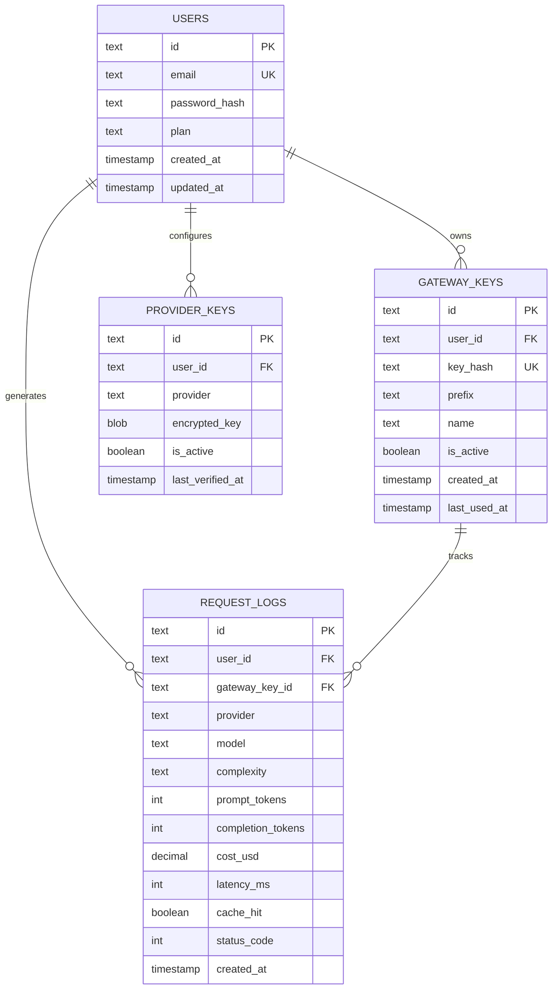

---
tags:
  - backend
  - database
  - sqlite
  - sqlalchemy
type: documentation
layer: backend
title: Base de Datos
created: '2026-01-11'
---
# 💽 Base de Datos

> Modelo de datos y operaciones de base de datos del backend.

## Modelo ER



## SQLAlchemy Models

```python
class User(Base):
    __tablename__ = "users"
    
    id = Column(String, primary_key=True, default=generate_uuid)
    email = Column(String, unique=True, nullable=False)
    password_hash = Column(String, nullable=False)
    plan = Column(String, default="free")
    created_at = Column(DateTime, default=datetime.utcnow)
    updated_at = Column(DateTime, onupdate=datetime.utcnow)
    
    gateway_keys = relationship("GatewayKey", back_populates="user")
    provider_keys = relationship("ProviderKey", back_populates="user")
    request_logs = relationship("RequestLog", back_populates="user")

class GatewayKey(Base):
    __tablename__ = "gateway_keys"
    
    id = Column(String, primary_key=True, default=generate_uuid)
    user_id = Column(String, ForeignKey("users.id"), nullable=False)
    key_hash = Column(String, unique=True, nullable=False)
    prefix = Column(String, nullable=False)
    name = Column(String)
    is_active = Column(Boolean, default=True)
    created_at = Column(DateTime, default=datetime.utcnow)
    last_used_at = Column(DateTime)
    
    user = relationship("User", back_populates="gateway_keys")
```

## Queries Comunes

### Dashboard Overview
```sql
SELECT 
    SUM(cost_usd) as total_cost,
    COUNT(*) as total_requests,
    AVG(latency_ms) as avg_latency,
    SUM(CASE WHEN cache_hit THEN 1 ELSE 0 END) * 100.0 / COUNT(*) as cache_rate
FROM request_logs
WHERE user_id = :user_id
  AND created_at >= datetime('now', '-24 hours');
```

### Cost by Day
```sql
SELECT 
    date(created_at) as day,
    SUM(cost_usd) as daily_cost,
    COUNT(*) as requests
FROM request_logs
WHERE user_id = :user_id
  AND created_at >= datetime('now', '-7 days')
GROUP BY date(created_at)
ORDER BY day;
```

### Model Distribution
```sql
SELECT 
    model,
    COUNT(*) as count,
    SUM(cost_usd) as cost
FROM request_logs
WHERE user_id = :user_id
  AND created_at >= datetime('now', '-24 hours')
GROUP BY model
ORDER BY count DESC;
```

## Índices

```sql
-- Búsquedas por usuario
CREATE INDEX idx_logs_user ON request_logs(user_id);

-- Filtros por fecha
CREATE INDEX idx_logs_created ON request_logs(created_at);

-- Combo user + fecha (más común)
CREATE INDEX idx_logs_user_created ON request_logs(user_id, created_at);

-- Búsqueda de keys por hash
CREATE INDEX idx_gateway_keys_hash ON gateway_keys(key_hash);
```

## Migraciones (Alembic)

```bash
# Crear nueva migración
alembic revision --autogenerate -m "Add new column"

# Aplicar migraciones
alembic upgrade head

# Rollback
alembic downgrade -1
```

---

*Ver también: [[security|Seguridad]] | [[../arquitectura/data-architecture|Arquitectura de Datos]]*
