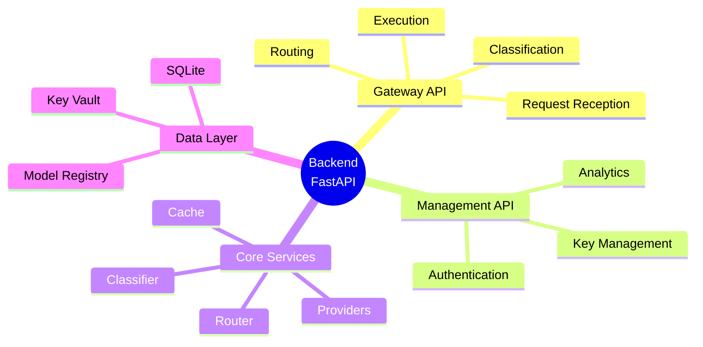
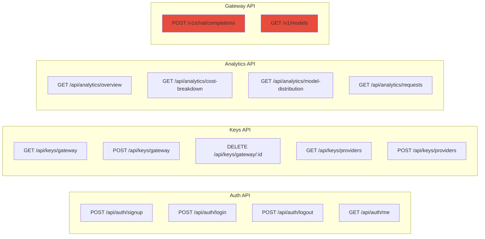
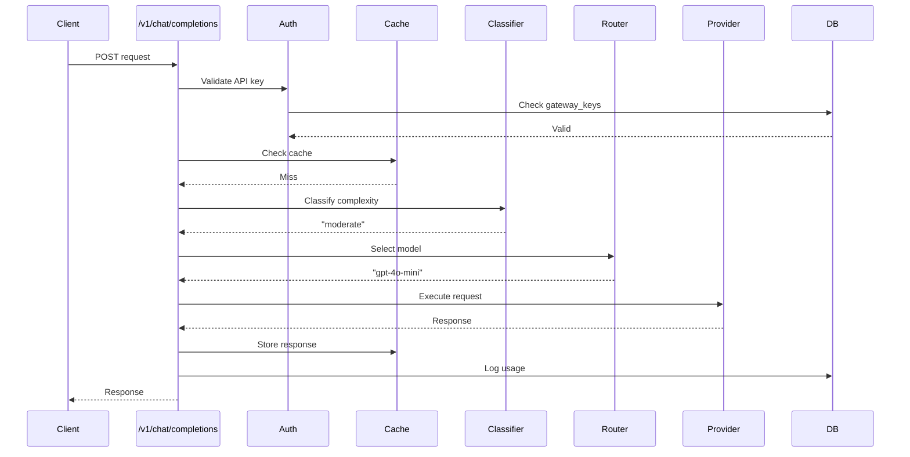
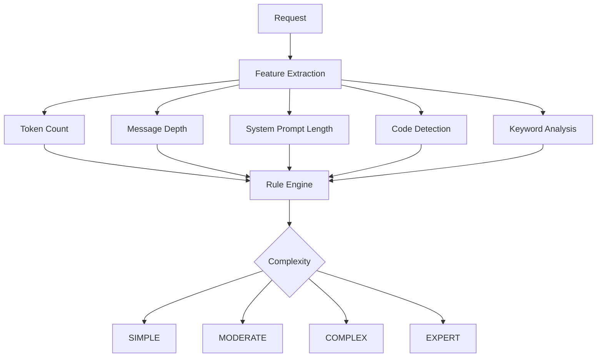
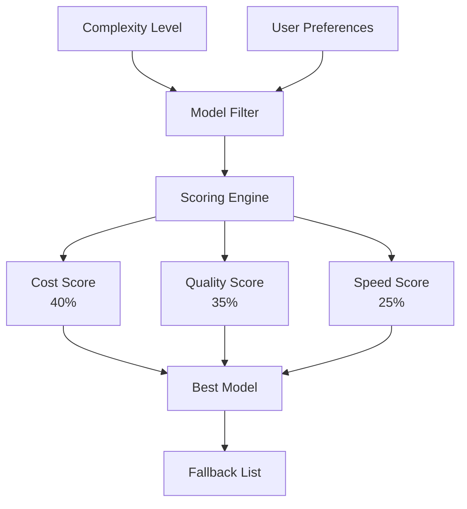
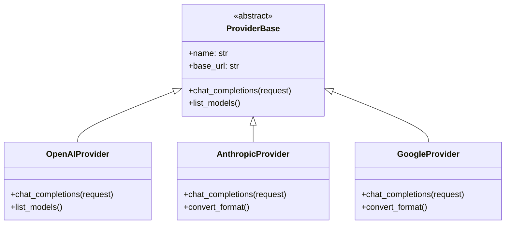
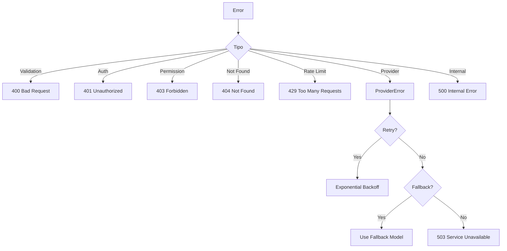

# 🔙 Backend Overview

> FastAPI backend que proporciona enrutamiento inteligente, gestión de claves y analytics para el LLM Gateway.

## Resumen Ejecutivo

El backend es responsable de:



## Stack Tecnológico

| Componente | Tecnología | Versión |
|------------|------------|---------|
| Framework | FastAPI | 0.109+ |
| Runtime | Python | 3.11+ |
| ORM | SQLAlchemy | 2.0+ |
| Validation | Pydantic | 2.0+ |
| HTTP Client | HTTPX | 0.27+ |
| Security | PyJWT, Cryptography | Latest |
| Testing | Pytest, HTTPX | Latest |

## Endpoints Principales



## Flujo de Request Principal



## Servicios Core

### 1. Request Classifier
Analiza la complejidad del request para determinar el modelo óptimo.



### 2. Routing Engine
Selecciona el modelo óptimo basado en múltiples factores.



### 3. Cache Manager
LRU cache con soporte para caché semántico.


### 4. Provider Manager
Adaptadores unificados para múltiples proveedores LLM.



## Configuración

```python
# Ejemplo de configuración
class Settings(BaseSettings):
    # Server
    HOST: str = "0.0.0.0"
    PORT: int = 8000
    DEBUG: bool = False
    
    # Database
    DATABASE_URL: str = "sqlite:///./data/gateway.db"
    
    # Security
    SECRET_KEY: str
    ENCRYPTION_KEY: str
    JWT_ALGORITHM: str = "HS256"
    JWT_EXPIRATION: int = 86400
    
    # Cache
    CACHE_MAX_SIZE: int = 1000
    CACHE_TTL: int = 3600
    
    # Rate Limiting
    RATE_LIMIT_REQUESTS: int = 60
    RATE_LIMIT_WINDOW: int = 60
    
    class Config:
        env_file = ".env"
```

## Manejo de Errores



## Métricas Expuestas

| Métrica | Tipo | Descripción |
|---------|------|-------------|
| `gateway_requests_total` | Counter | Total de requests |
| `gateway_latency_seconds` | Histogram | Latencia de requests |
| `gateway_cost_usd_total` | Counter | Costo total acumulado |
| `gateway_cache_hits_total` | Counter | Cache hits |
| `gateway_cache_misses_total` | Counter | Cache misses |
| `gateway_provider_errors_total` | Counter | Errores por provider |

## Documentos Relacionados

- [[api-routes|Definición de Rutas API]]
- [[services/classifier|Clasificador de Requests]]
- [[services/router|Motor de Enrutamiento]]
- [[services/cache|Sistema de Cache]]
- [[services/providers|Adaptadores de Proveedores]]
- [[security|Seguridad]]
- [[database|Base de Datos]]

---

*Ver también: [[../arquitectura/backend-architecture|Arquitectura Backend]]*
