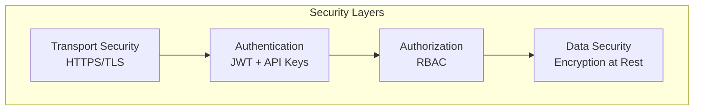
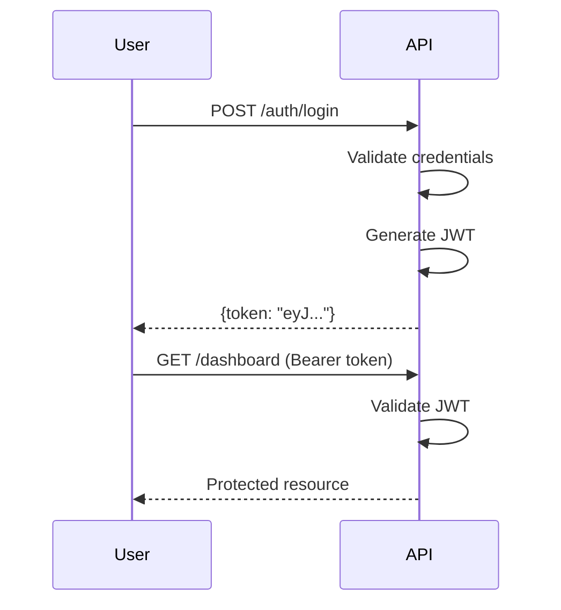
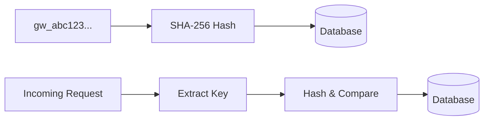
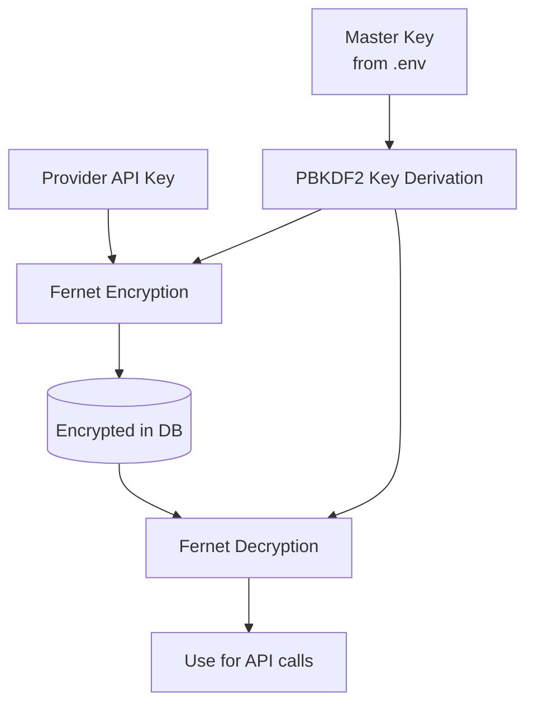
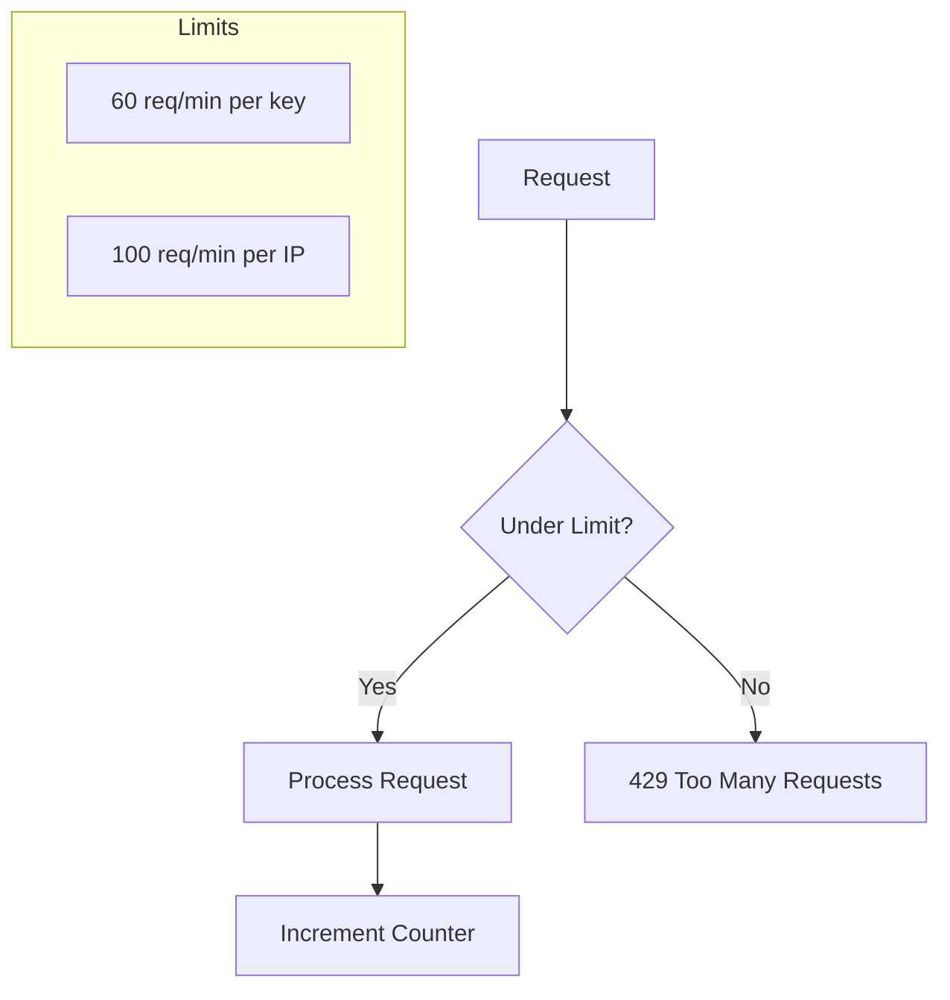

---
tags:
  - backend
  - security
  - encryption
type: documentation
layer: backend
title: Seguridad
created: '2026-01-11'
---
# 🔐 Seguridad

> Implementación de seguridad del LLM Gateway.

## Visión General



## Autenticación

### JWT para Dashboard



**JWT Structure:**
```json
{
  "sub": "user_id",
  "email": "user@example.com",
  "exp": 1704067200,
  "iat": 1704063600
}
```

### API Keys para Gateway



**Key Format**: `gw_` + 32 random alphanumeric chars
**Storage**: Solo hash SHA-256, nunca plaintext

## Encriptación de Provider Keys



### Implementation

```python
from cryptography.fernet import Fernet
from cryptography.hazmat.primitives.kdf.pbkdf2 import PBKDF2HMAC

class KeyVault:
    def __init__(self, master_password: str):
        # Derive encryption key from master password
        kdf = PBKDF2HMAC(
            algorithm=hashes.SHA256(),
            length=32,
            salt=SALT,
            iterations=100000,
        )
        key = base64.urlsafe_b64encode(kdf.derive(master_password.encode()))
        self.cipher = Fernet(key)
    
    def encrypt(self, plaintext: str) -> bytes:
        return self.cipher.encrypt(plaintext.encode())
    
    def decrypt(self, ciphertext: bytes) -> str:
        return self.cipher.decrypt(ciphertext).decode()
```

## Rate Limiting



## Security Headers

```python
# Middleware configuration
app.add_middleware(
    CORSMiddleware,
    allow_origins=["https://llm-gateway.com"],
    allow_credentials=True,
    allow_methods=["*"],
    allow_headers=["*"],
)

# Security headers
{
    "X-Content-Type-Options": "nosniff",
    "X-Frame-Options": "DENY",
    "X-XSS-Protection": "1; mode=block",
    "Strict-Transport-Security": "max-age=31536000",
    "Content-Security-Policy": "default-src 'self'"
}
```

## Best Practices

| Área | Implementación |
|------|----------------|
| Passwords | bcrypt con salt |
| Tokens | JWT con expiration corto |
| API Keys | Hash antes de almacenar |
| Provider Keys | AES-256 encryption |
| Transport | TLS 1.3 |
| Secrets | Environment variables |

---

*Ver también: [[../overview|Backend Overview]] | [[database|Database]]*
