---
tags:
  - backend
  - cache
  - service
  - performance
type: documentation
layer: backend
title: Sistema de Cache
created: '2026-01-11'
---
# 💾 Sistema de Cache

> Cache inteligente para reducir costos y latencia mediante almacenamiento de respuestas frecuentes.

## Concepto

```mermaid
graph LR
    Request[Request] --> Check{Cache Hit?}
    Check -->|Sí| Return[Retornar Cached]
    Check -->|No| Process[Procesar Request]
    Process --> Store[Guardar en Cache]
    Store --> Return
```



## Arquitectura del Cache


## Generación de Cache Key


```python
def generate_cache_key(request: ChatRequest) -> str:
    # Normalizar mensajes
    normalized = {
        "messages": [
            {"role": m.role, "content": m.content.strip().lower()}
            for m in request.messages
        ],
        "params": {
            "temperature": request.temperature or 1.0,
            "max_tokens": request.max_tokens
        }
    }
    
    # Generar hash
    content = json.dumps(normalized, sort_keys=True)
    return hashlib.sha256(content.encode()).hexdigest()[:32]
```

## Flujo de Cache


## LRU Eviction


## Configuración

```python
class CacheConfig:
    # Tamaño máximo de items
    max_size: int = 1000
    
    # TTL por defecto (segundos)
    default_ttl: int = 3600  # 1 hora
    
    # TTL por tipo de request
    ttl_by_complexity: dict = {
        "simple": 7200,     # 2 horas
        "moderate": 3600,   # 1 hora
        "complex": 1800,    # 30 min
        "expert": 900       # 15 min
    }
    
    # No cachear si response > X tokens
    max_response_tokens: int = 4000
```

## Métricas de Cache


| Métrica | Descripción |
|---------|-------------|
| `cache_hits_total` | Total de cache hits |
| `cache_misses_total` | Total de cache misses |
| `cache_hit_rate` | Porcentaje de hits |
| `cache_size` | Items actuales en cache |
| `cache_evictions_total` | Evictions realizadas |

## Semantic Cache (Futuro)

```mermaid
graph TB
    Query[Nueva Query] --> Embed[Generar Embedding]
    Embed --> Search[Buscar Similares]
    Search --> Threshold{Similarity mayor 0.95?}
    
    Threshold -->|Sí| Return[Retornar Cached]
    Threshold -->|No| Process[Procesar Normalmente]
    
    Process --> Store[Almacenar con Embedding]
```



## Interfaz

```python
class CacheManager:
    def __init__(self, config: CacheConfig):
        self.cache = LRUCache(maxsize=config.max_size)
        self.config = config
        self.stats = CacheStats()
    
    async def get(self, key: str) -> CachedResponse | None:
        if item := self.cache.get(key):
            if not self._is_expired(item):
                self.stats.record_hit()
                return item.response
            self.cache.pop(key)
        self.stats.record_miss()
        return None
    
    async def set(
        self, 
        key: str, 
        response: ChatResponse,
        complexity: str
    ) -> None:
        ttl = self.config.ttl_by_complexity.get(complexity, 3600)
        self.cache[key] = CachedItem(
            response=response,
            expires_at=time.time() + ttl
        )
```

---

*Ver también: [[router|Router]] | [[../overview|Backend Overview]]*
