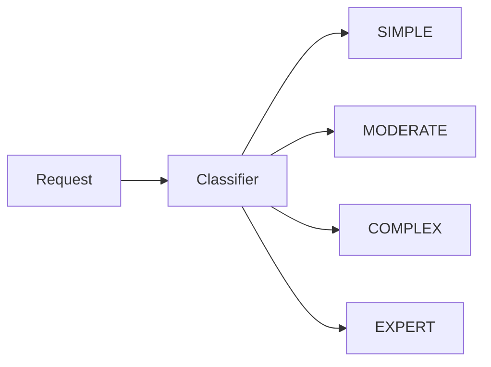
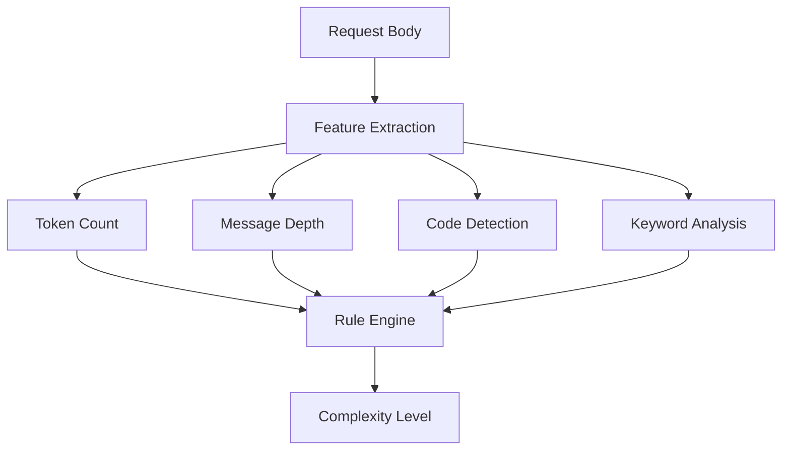
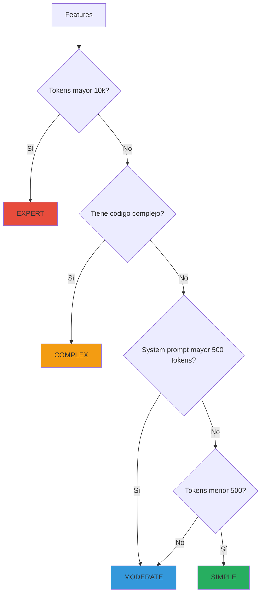
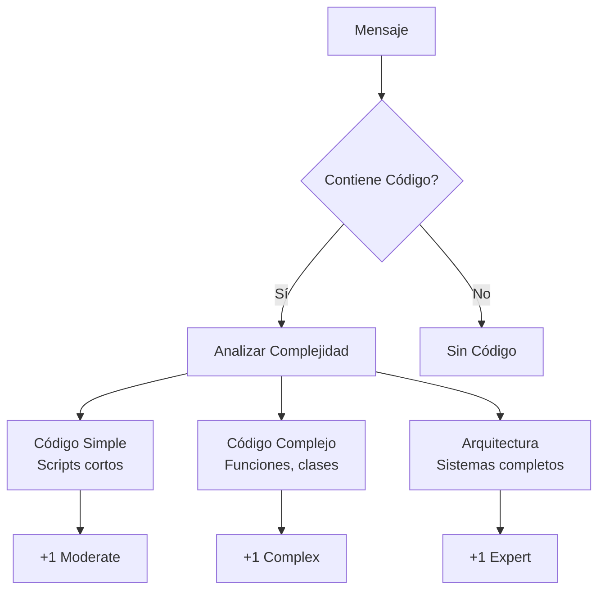
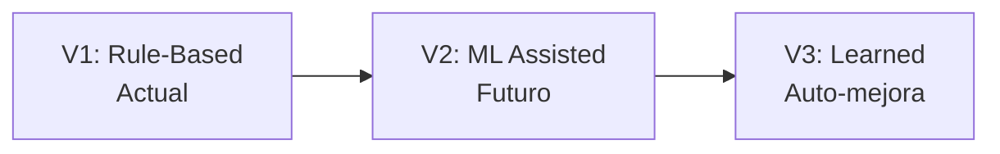

---
tags:
  - backend
  - classifier
  - service
type: documentation
layer: backend
title: Servicio de Clasificación
created: '2026-01-11'
---
# 🧠 Servicio de Clasificación

> El Classifier analiza la complejidad de cada request para determinar qué tipo de modelo es más apropiado.

## Concepto



## Niveles de Complejidad

| Nivel | Descripción | Modelos Recomendados |
|-------|-------------|---------------------|
| **SIMPLE** | Preguntas cortas, formateo | GPT-3.5, Gemini Flash |
| **MODERATE** | Conversaciones, resúmenes | GPT-4o-mini, Claude Haiku |
| **COMPLEX** | Análisis profundo, código | GPT-4o, Claude Sonnet |
| **EXPERT** | Tareas críticas | GPT-4, Claude Opus |

## Pipeline de Clasificación



## Reglas de Clasificación



## Detección de Código

El clasificador detecta la presencia y complejidad de código:



## Keywords por Nivel

### Simple
```
translate, format, list, define, hello, thanks
```

### Complex
```
analyze, compare, debug, optimize, architecture
```

### Expert
```
critical, production, compliance, security audit
```

## Interfaz

```python
class RequestClassifier:
    def classify(self, request: ChatRequest) -> ComplexityLevel:
        features = self.extract_features(request)
        return self.apply_rules(features)
    
    def extract_features(self, request: ChatRequest) -> Features:
        return Features(
            total_tokens=count_tokens(request),
            message_depth=len(request.messages),
            has_code=detect_code(request),
            keywords=extract_keywords(request)
        )
```

## Evolución Futura



---

*Ver también: [[router|Motor de Enrutamiento]] | [[../overview|Backend Overview]]*
