---
tags:
  - backend
  - providers
  - adapters
  - service
type: documentation
layer: backend
title: Adaptadores de Proveedores
created: '2026-01-11'
---
# 🔗 Adaptadores de Proveedores

> Sistema de adaptadores que unifica la comunicación con múltiples proveedores LLM bajo una interfaz común.

## Concepto


## Patrón Adapter


## Conversión de Formatos

### Request Unificado → Provider Específico

```mermaid
graph LR
    subgraph "Unified Request"
        U[OpenAI Format]
    end
    
    subgraph "OpenAI"
        O[Sin conversión]
    end
    
    subgraph "Anthropic"
        A[Convertir a Messages API]
    end
    
    subgraph "Google"
        G[Convertir a Gemini Format]
    end
    
    U --> O
    U --> A
    U --> G
```



### Ejemplo: OpenAI → Anthropic

```python
# Request OpenAI Format
{
    "model": "claude-3-sonnet",
    "messages": [
        {"role": "system", "content": "You are helpful"},
        {"role": "user", "content": "Hello"}
    ],
    "max_tokens": 1000
}

# Convertido a Anthropic Format
{
    "model": "claude-3-sonnet-20240229",
    "system": "You are helpful",
    "messages": [
        {"role": "user", "content": "Hello"}
    ],
    "max_tokens": 1000
}
```

## Provider Manager


## Manejo de Errores

```mermaid
graph TB
    Call[API Call] --> Result{Resultado}
    
    Result -->|200| Success[Procesar Response]
    Result -->|401| Invalid[Marcar Key Inválida]
    Result -->|429| RateLimit[Rate Limited]
    Result -->|500| ServerError[Server Error]
    Result -->|Timeout| TimeoutErr[Timeout]
    
    Invalid --> NotifyUser[Notificar Usuario]
    RateLimit --> Retry[Retry con Backoff]
    ServerError --> Retry
    TimeoutErr --> Retry
    
    Retry --> MaxRetries{Max Retries?}
    MaxRetries -->|No| Call
    MaxRetries -->|Sí| Fallback[Usar Fallback]
```



## Retry Logic

```python
async def execute_with_retry(
    self,
    request: ChatRequest,
    model: Model,
    max_retries: int = 3
) -> ChatResponse:
    
    for attempt in range(max_retries):
        try:
            return await self._execute(request, model)
        
        except RateLimitError:
            if attempt < max_retries - 1:
                await asyncio.sleep(2 ** attempt)  # Exponential backoff
                continue
            raise
        
        except ProviderError as e:
            if attempt < max_retries - 1:
                await asyncio.sleep(1)
                continue
            raise
```

## Configuración por Provider

```yaml
providers:
  openai:
    base_url: "https://api.openai.com/v1"
    timeout: 30
    max_retries: 3
    rate_limit_buffer: 0.1  # 10% buffer
    
  anthropic:
    base_url: "https://api.anthropic.com"
    timeout: 60
    max_retries: 3
    api_version: "2024-01-01"
    
  google:
    base_url: "https://generativelanguage.googleapis.com"
    timeout: 30
    max_retries: 2
```

## Health Monitoring


## Interfaz Unificada

```python
class ProviderManager:
    def __init__(self):
        self.adapters = {
            "openai": OpenAIAdapter(),
            "anthropic": AnthropicAdapter(),
            "google": GoogleAdapter(),
            "groq": GroqAdapter(),
        }
        self.key_vault = KeyVault()
        self.health = HealthMonitor()
    
    async def execute(
        self,
        request: ChatRequest,
        model: Model,
        user_id: str
    ) -> ChatResponse:
        
        adapter = self.adapters[model.provider]
        api_key = await self.key_vault.get_key(user_id, model.provider)
        
        return await adapter.chat_completions(
            request=request,
            api_key=api_key,
            model=model.model_name
        )
```

---

*Ver también: [[router|Router]] | [[../security|Seguridad]]*
