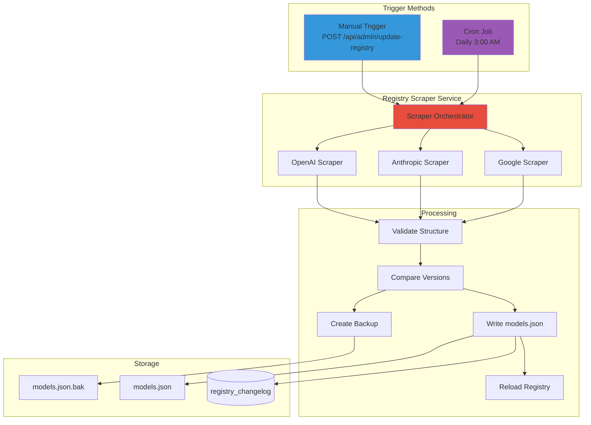
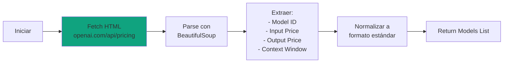
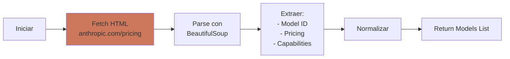
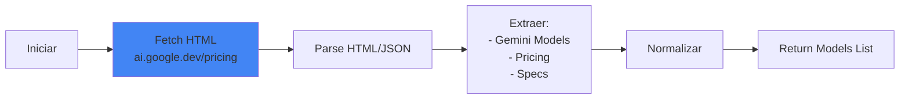
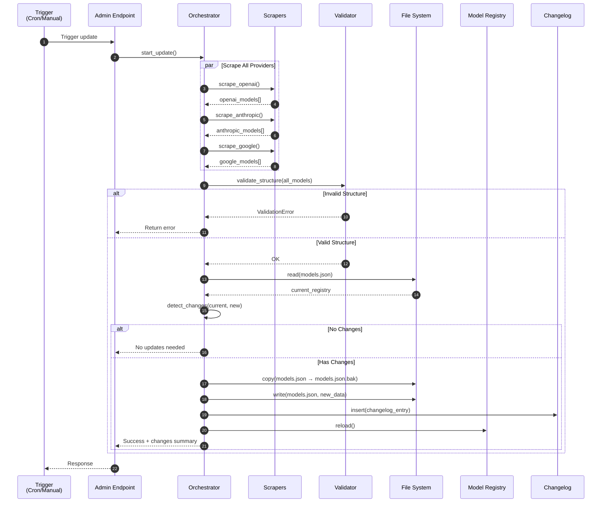
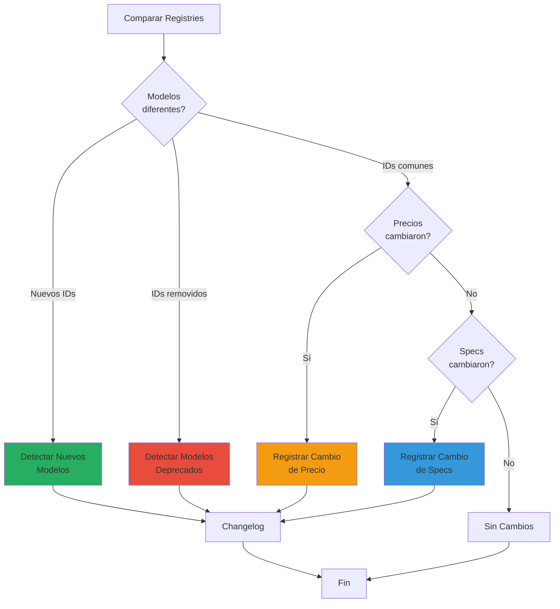
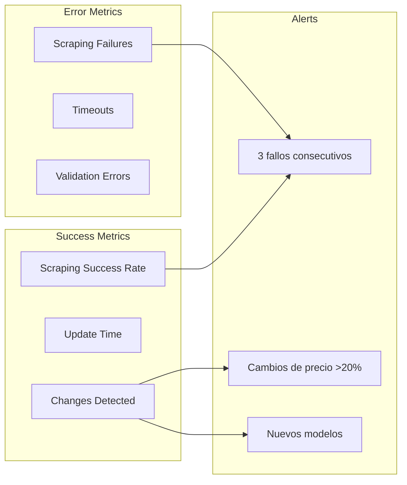
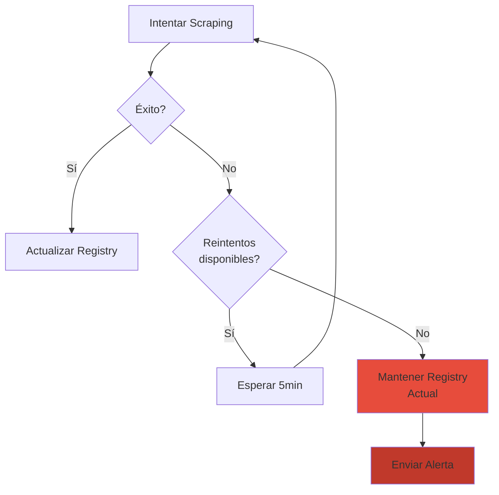

# 🔄 Registry Scraper Service

> Servicio encargado de mantener actualizado el catálogo de modelos LLM mediante scraping automatizado de páginas oficiales de pricing.

## 📋 Propósito

El Registry Scraper elimina la necesidad de un contenedor separado para actualizaciones, integrando el scraping directamente en el backend con:
- **Endpoint manual** para disparar actualizaciones on-demand
- **Cron job** dentro del contenedor backend para ejecuciones automáticas
- **Scrapers especializados** por proveedor (OpenAI, Anthropic, Google)

## 🏗️ Arquitectura



## 🔌 Scrapers por Proveedor

### OpenAI Scraper



**URL Target:** `https://openai.com/api/pricing/`

**Datos Extraídos:**
- `model_id`: "gpt-4o", "gpt-4o-mini", etc.
- `pricing.prompt`: USD por 1M tokens de entrada
- `pricing.completion`: USD por 1M tokens de salida
- `specs.context_window`: Tokens máximos
- `specs.capabilities`: ["text", "vision", "function_calling"]

### Anthropic Scraper



**URL Target:** `https://www.anthropic.com/pricing`

**Datos Extraídos:**
- `model_id`: "claude-3-5-sonnet", "claude-3-haiku", etc.
- Precios de input/output por millón de tokens
- Context window y capabilities

### Google AI Scraper



**URL Target:** `https://ai.google.dev/pricing`

**Datos Extraídos:**
- `model_id`: "gemini-2.0-flash", "gemini-1.5-pro", etc.
- Precios por millón de tokens
- Multimodal capabilities

## 🔄 Flujo de Actualización



## 🛠️ Implementación

### Endpoint Manual

```python
# Pseudocódigo conceptual
@router.post("/api/admin/update-registry")
async def update_registry(
    current_user: User = Depends(require_admin)
):
    """
    Endpoint protegido para actualización manual del registry.
    Solo accesible por usuarios con rol admin.
    """
    try:
        # 1. Ejecutar scrapers
        openai_models = await scrape_openai_models()
        anthropic_models = await scrape_anthropic_models()
        google_models = await scrape_google_models()
        
        # 2. Consolidar y validar
        all_models = openai_models + anthropic_models + google_models
        validate_registry_structure(all_models)
        
        # 3. Detectar cambios
        current_registry = load_current_registry()
        changes = detect_changes(current_registry, all_models)
        
        if not changes:
            return {"message": "No changes detected"}
        
        # 4. Backup y actualización
        backup_registry()
        write_registry(all_models)
        log_changes(changes)
        
        # 5. Reload en memoria
        model_registry.reload()
        
        return {
            "success": True,
            "version": new_version,
            "changes": changes
        }
    except Exception as e:
        logger.error(f"Registry update failed: {e}")
        rollback_registry()
        raise HTTPException(500, "Update failed")
```

### Cron Job Configuration

**Dockerfile:**
```dockerfile
# Instalar cron
RUN apt-get update && apt-get install -y cron curl

# Copiar script de actualización
COPY scripts/cron_update_registry.sh /app/scripts/
RUN chmod +x /app/scripts/cron_update_registry.sh

# Configurar crontab (3:00 AM diario)
RUN echo "0 3 * * * /app/scripts/cron_update_registry.sh >> /var/log/registry_update.log 2>&1" | crontab -

# Iniciar cron junto con uvicorn
CMD ["sh", "-c", "cron && uvicorn app.main:app --host 0.0.0.0 --port 8000"]
```

**Script: cron_update_registry.sh**
```bash
#!/bin/bash
# Script ejecutado por cron para actualizar registry

echo "[$(date)] Starting registry update..."

# Admin token desde variable de entorno
ADMIN_TOKEN=${ADMIN_API_KEY:-""}

if [ -z "$ADMIN_TOKEN" ]; then
    echo "[$(date)] ERROR: ADMIN_API_KEY not set"
    exit 1
fi

# Llamar al endpoint
RESPONSE=$(curl -s -X POST http://localhost:8000/api/admin/update-registry \
    -H "Authorization: Bearer $ADMIN_TOKEN" \
    -H "Content-Type: application/json")

echo "[$(date)] Response: $RESPONSE"
echo "[$(date)] Registry update completed"
```

## 🔍 Detección de Cambios



### Ejemplo de Changelog Entry

```json
{
  "timestamp": "2026-01-14T03:00:15Z",
  "version": "1.3.0",
  "changes": [
    {
      "type": "price_update",
      "model": "gpt-4o",
      "old_price": {"prompt": 2.50, "completion": 10.00},
      "new_price": {"prompt": 2.00, "completion": 8.00}
    },
    {
      "type": "model_added",
      "model": "gpt-4-turbo-2024-04",
      "pricing": {"prompt": 5.00, "completion": 15.00}
    },
    {
      "type": "model_deprecated",
      "model": "gpt-3.5-turbo-0301"
    }
  ]
}
```

## 📊 Monitoreo

### Métricas Importantes



### Logs Estructurados

```json
{
  "timestamp": "2026-01-14T03:00:00Z",
  "event": "registry_update",
  "status": "success",
  "duration_ms": 4532,
  "scrapers": {
    "openai": {"status": "success", "models": 12},
    "anthropic": {"status": "success", "models": 8},
    "google": {"status": "success", "models": 6}
  },
  "changes": {
    "added": 1,
    "updated": 3,
    "deprecated": 0
  }
}
```

## ⚠️ Consideraciones

### Scraping Ethics
- ✅ Respetar `robots.txt` de cada sitio
- ✅ Rate limiting entre requests (2-3s delay)
- ✅ User-Agent identificable: `LLMGateway-Scraper/1.0`
- ❌ No hacer requests excesivos

### Fallback Strategy


### Validación Estricta
Antes de actualizar, validar:
- ✅ Estructura JSON correcta
- ✅ Campos requeridos presentes
- ✅ Precios son números positivos
- ✅ Model IDs únicos
- ✅ Versión incrementada

## 🔗 Documentos Relacionados

- [[../api-routes|API Routes]] - Endpoint de admin
- [[model-registry|Model Registry]] - Servicio que consume el registry
- [[../../arquitectura/backend-architecture|Backend Architecture]]

---

*Última actualización: 2026-01-14*
