---
tags:
  - backend
  - router
  - service
type: documentation
layer: backend
title: Motor de Enrutamiento
created: '2026-01-11'
---
# 🔀 Motor de Enrutamiento

> El Router selecciona el modelo óptimo basándose en complejidad, costo, disponibilidad y preferencias del usuario.

## Concepto


## Pipeline de Selección


## Sistema de Scoring


### Cálculo de Score

```python
def calculate_score(model, complexity, user_config):
    cost_score = calculate_cost_score(model)      # 0-100
    quality_score = calculate_quality_score(model, complexity)  # 0-100
    speed_score = calculate_speed_score(model)    # 0-100
    
    # Pesos configurables por usuario
    weights = user_config.weights or DEFAULT_WEIGHTS
    
    total = (
        cost_score * weights.cost +      # 40%
        quality_score * weights.quality + # 35%
        speed_score * weights.speed       # 25%
    )
    
    return total
```

## Mapeo Complejidad → Modelos


## Estrategias de Routing


## Health Checking


## Fallback Logic

```mermaid
sequenceDiagram
    participant Router
    participant Primary as Primary Model
    participant Fallback1 as Fallback 1
    participant Fallback2 as Fallback 2
    
    Router->>Primary: Intentar
    alt Éxito
        Primary-->>Router: Response
    else Fallo
        Router->>Fallback1: Intentar
        alt Éxito
            Fallback1-->>Router: Response
        else Fallo
            Router->>Fallback2: Intentar
            Fallback2-->>Router: Response o Error
        end
    end
```



## Configuración de Usuario

```yaml
user_routing_config:
  strategy: "balanced"  # cost_optimized | quality_first | balanced
  
  weights:
    cost: 0.40
    quality: 0.35
    speed: 0.25
  
  preferences:
    preferred_provider: "openai"  # optional
    avoid_providers: []           # optional
    
  limits:
    max_cost_per_request: 0.10   # USD
    max_latency_ms: 5000
```

## Interfaz

```python
class RoutingEngine:
    def select_model(
        self,
        complexity: ComplexityLevel,
        user_config: UserRoutingConfig,
        request_context: RequestContext
    ) -> RoutingResult:
        
        # 1. Get candidate models
        candidates = self.registry.get_models_for_complexity(complexity)
        
        # 2. Apply filters
        candidates = self.filter_by_context_window(candidates, request_context)
        candidates = self.filter_by_health(candidates)
        candidates = self.filter_by_user_keys(candidates, user_config)
        
        # 3. Score and rank
        scored = [(m, self.score(m, user_config)) for m in candidates]
        ranked = sorted(scored, key=lambda x: x[1], reverse=True)
        
        # 4. Return best + fallbacks
        return RoutingResult(
            primary=ranked[0][0],
            fallbacks=[m for m, _ in ranked[1:4]]
        )
```

---

*Ver también: [[classifier|Clasificador]] | [[providers|Providers]]*
