---
tags:
  - documentacion
  - setup
  - installation
type: documentation
title: Setup Guide
created: '2026-01-11'
---
# 🛠️ Setup Guide

> Guía completa para configurar y ejecutar el LLM Gateway.

## Requisitos

### Software

| Requisito | Versión Mínima |
|-----------|----------------|
| Docker | 24.0+ |
| Docker Compose | 2.20+ |
| Node.js | 18+ (para desarrollo) |
| Python | 3.11+ (para desarrollo) |
| Git | 2.30+ |

### Hardware (Recomendado)

| Recurso | Mínimo | Recomendado |
|---------|--------|-------------|
| CPU | 2 cores | 4 cores |
| RAM | 4 GB | 8 GB |
| Storage | 10 GB | 20 GB |

## Quick Start

### 1. Clonar Repositorio

```bash
git clone https://github.com/your-org/llm-gateway.git
cd llm-gateway
```

### 2. Configurar Variables de Entorno

```bash
cp .env.example .env
```

Editar `.env`:

```env
# Security
SECRET_KEY=your-super-secret-key-here
ENCRYPTION_KEY=your-32-byte-encryption-key

# Database
DATABASE_URL=sqlite:///./data/gateway.db

# Frontend
NEXT_PUBLIC_API_URL=http://localhost:8000

# Optional: Registry
REGISTRY_URL=https://raw.githubusercontent.com/your-org/registry/main/models.json
```

### 3. Iniciar con Docker

```bash
docker-compose up -d
```

### 4. Verificar Instalación

```bash
# Health check backend
curl http://localhost:8000/health

# Health check frontend
curl http://localhost:3000
```

## Instalación Manual

### Backend

```bash
cd backend

# Crear virtual environment
python -m venv venv
source venv/bin/activate  # Linux/Mac
# venv\Scripts\activate   # Windows

# Instalar dependencias
pip install -r requirements.txt

# Ejecutar migraciones
alembic upgrade head

# Iniciar servidor
uvicorn app.main:app --reload --port 8000
```

### Frontend

```bash
cd frontend

# Instalar dependencias
npm install

# Iniciar servidor de desarrollo
npm run dev
```

## Verificación

```mermaid
graph TB
    Start[Inicio] --> Docker{Docker Running?}
    Docker -->|No| InstallDocker[Instalar Docker]
    Docker -->|Sí| Clone[Clonar Repo]
    Clone --> Env[Configurar .env]
    Env --> Up[docker-compose up]
    Up --> Health[Health Check]
    Health -->|OK| Done[Listo!]
    Health -->|Error| Logs[Ver Logs]
    Logs --> Fix[Corregir]
    Fix --> Up
```



## Post-Instalación

### 1. Crear Usuario Admin

```bash
docker-compose exec backend python scripts/create_admin.py
```

### 2. Agregar Provider Keys

1. Acceder a `http://localhost:3000`
2. Iniciar sesión
3. Ir a Dashboard > Settings > Provider Keys
4. Agregar keys de OpenAI, Anthropic, etc.

### 3. Generar Gateway Key

```bash
curl -X POST http://localhost:8000/api/keys/gateway \
  -H "Authorization: Bearer <your_jwt>" \
  -d '{"name": "My First Key"}'
```

## Troubleshooting

### Error: Port already in use

```bash
# Ver qué usa el puerto
lsof -i :8000
# o en Windows
netstat -ano | findstr :8000

# Matar proceso o cambiar puerto en docker-compose.yml
```

### Error: Database locked

```bash
# Reiniciar contenedor
docker-compose restart backend
```

### Error: Permission denied

```bash
# Linux: ajustar permisos
sudo chown -R $USER:$USER ./data
chmod 755 ./data
```

---

*Ver también: [[configuration|Configuration]] | [[troubleshooting|Troubleshooting]]*
