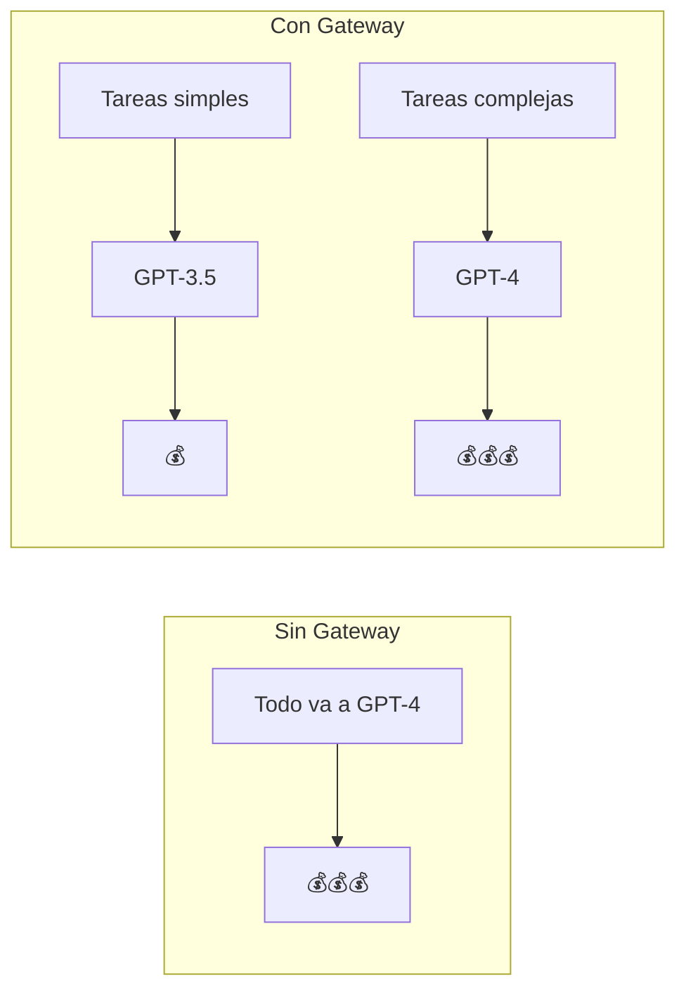

---
tags:
  - faq
  - help
  - support
type: business
title: FAQ
created: '2026-01-11'
---
# ❓ FAQ - Preguntas Frecuentes

> Respuestas a las preguntas más comunes sobre el LLM Gateway.

## General

### ¿Qué es el LLM Gateway?
Es una plataforma que se sitúa entre tu aplicación y los proveedores de LLM (OpenAI, Anthropic, etc.). Analiza cada request y automáticamente selecciona el modelo más adecuado para optimizar costos sin sacrificar calidad.

### ¿Cómo ahorra dinero?


El gateway detecta que muchas tareas no necesitan el modelo más caro y las enruta a modelos más económicos.

### ¿Cuánto puedo ahorrar?
En promedio, los usuarios reportan entre **30-50% de ahorro** en costos de LLM. El ahorro exacto depende de tu mix de uso.

---

## Técnico

### ¿Cómo integro el gateway?
Es tan simple como cambiar la URL base de tu cliente OpenAI:

```python
# Antes
client = OpenAI(api_key="sk-...")

# Después
client = OpenAI(
    api_key="gw-your-gateway-key",
    base_url="https://api.llm-gateway.com/v1"
)
```

### ¿Es compatible con mi código existente?
Sí. La API es 100% compatible con el formato de OpenAI. No necesitas cambiar nada más que la URL base y la API key.

### ¿Qué providers soportan?
Actualmente:
- ✅ OpenAI (GPT-4, GPT-3.5, etc.)
- ✅ Anthropic (Claude 3)
- 🔜 Google (Gemini)
- 🔜 Groq
- 🔜 Local models (Ollama)

### ¿Puedo forzar un modelo específico?
Sí. Si pasas el parámetro `model` en tu request, el gateway respetará tu elección y no hará auto-routing.

### ¿Soporta streaming?
Sí, en el tier Pro y Enterprise.

---

## Seguridad

### ¿Qué pasa con mis API keys de providers?
Tus API keys se almacenan encriptadas usando AES-256. Nunca almacenamos las keys en texto plano y nunca las vemos.

### ¿Mis datos pasan por sus servidores?
Sí, pero:
- No almacenamos el contenido de los requests/responses
- Solo guardamos metadata para analytics (tokens, costos, latencia)
- Puedes self-hostear si prefieres control total

### ¿Son SOC2 compliant?
Estamos en proceso de certificación. Para Enterprise, contacta a sales para discutir requerimientos específicos.

---

## Billing

### ¿Cómo funciona el pricing?
El gateway NO cobra por uso de tokens. Solo cobramos una suscripción mensual basada en features y límites de requests.

Tus costos de LLM siguen yendo directamente a los providers (OpenAI, Anthropic, etc.) usando TUS API keys.

### ¿Hay free tier?
Sí. El free tier incluye:
- 10,000 requests/mes
- 2 gateway keys
- 2 providers
- 7 días de analytics

### ¿Puedo cancelar en cualquier momento?
Sí, sin penalidad ni preguntas.

---

## Troubleshooting

### Mi request falla con 401
Verifica que:
1. Tu gateway key es correcta
2. El formato es `Authorization: Bearer gw_xxxxx`
3. La key no ha sido revocada

### La latencia es alta
Posibles causas:
1. El modelo seleccionado tiene alta latencia inherente
2. Rate limiting del provider
3. Considera habilitar cache para requests repetitivos

### No veo analytics
- Los analytics pueden tomar hasta 1 minuto en actualizarse
- Verifica que tus requests están usando una gateway key válida
- El free tier solo retiene 7 días de datos

---

## Contacto

### ¿Cómo consigo ayuda?
- **Free**: Community Discord
- **Pro**: Email support (respuesta <24h)
- **Enterprise**: Slack dedicado + Account manager

### ¿Puedo solicitar features?
¡Absolutamente! Envía tus ideas a feedback@llm-gateway.com o vota por features existentes en nuestro roadmap público.

---

*Ver también: [[vision-producto|Visión del Producto]] | [[../documentacion/troubleshooting|Troubleshooting Técnico]]*
