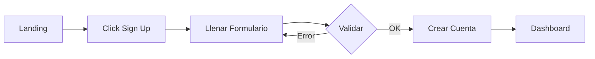
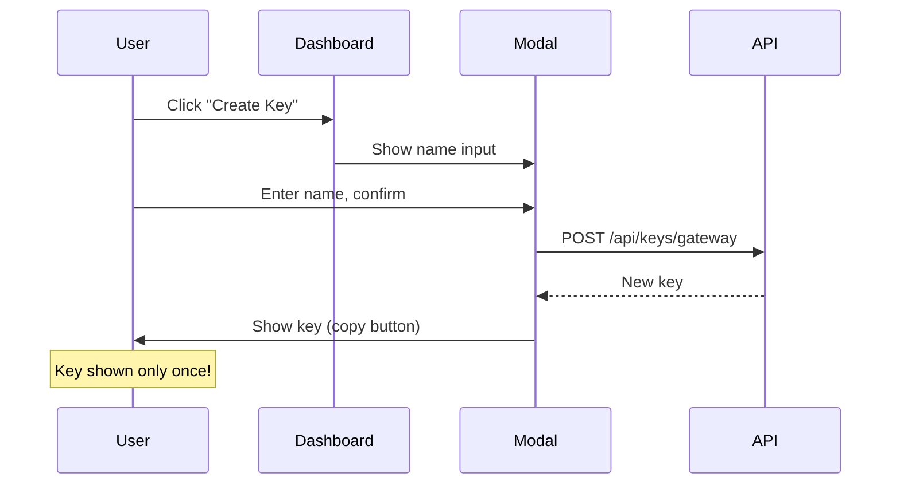
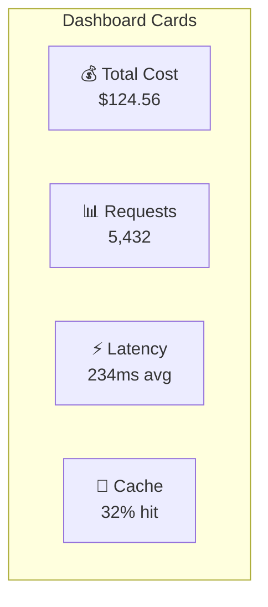
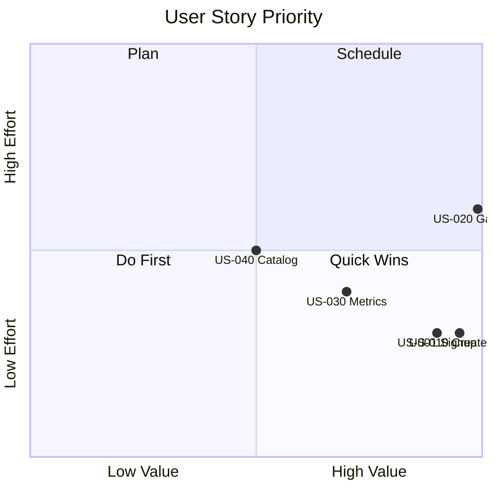

---
tags:
  - user-stories
  - requirements
  - product
type: business
title: User Stories
created: '2026-01-11'
---
# 👤 User Stories

> Historias de usuario que definen las funcionalidades desde la perspectiva del usuario.

## Epic: Autenticación

### US-001: Registro de Usuario
**Como** nuevo usuario  
**Quiero** crear una cuenta con mi email  
**Para** acceder al gateway y dashboard

**Criterios de Aceptación:**
- [ ] Formulario con email y contraseña
- [ ] Validación de email único
- [ ] Contraseña mínimo 8 caracteres
- [ ] Confirmación de cuenta (opcional)

### US-002: Login
**Como** usuario registrado  
**Quiero** iniciar sesión  
**Para** acceder a mi dashboard

**Criterios de Aceptación:**
- [ ] Login con email/password
- [ ] Mensaje de error claro si falla
- [ ] Opción "Recordarme"
- [ ] Redirect a dashboard al éxito

---

## Epic: API Keys

### US-010: Crear Gateway Key
**Como** developer  
**Quiero** crear una API key del gateway  
**Para** usarla en mis aplicaciones

**Criterios de Aceptación:**
- [ ] Botón "Create New Key"
- [ ] Modal para nombrar la key
- [ ] Mostrar key completa UNA sola vez
- [ ] Copiar al clipboard
- [ ] Aviso de que no se puede recuperar

### US-011: Agregar Provider Key
**Como** developer  
**Quiero** agregar mi API key de OpenAI/Anthropic  
**Para** que el gateway pueda hacer requests en mi nombre

**Criterios de Aceptación:**
- [ ] Selector de provider
- [ ] Input para API key
- [ ] Validación de key con provider
- [ ] Encriptación segura
- [ ] Mostrar estado de verificación

---

## Epic: Gateway Usage

### US-020: Hacer Request al Gateway
**Como** developer  
**Quiero** hacer un request al gateway  
**Para** obtener una respuesta de un LLM

**Criterios de Aceptación:**
- [ ] Endpoint compatible con OpenAI
- [ ] Autenticación por gateway key
- [ ] Response incluye metadata del gateway
- [ ] Logging automático del uso

### US-021: Auto-Routing
**Como** developer  
**Quiero** que el gateway seleccione el modelo automáticamente  
**Para** optimizar costo sin esfuerzo

**Criterios de Aceptación:**
- [ ] Clasificación automática de complejidad
- [ ] Selección basada en reglas
- [ ] Response indica modelo usado
- [ ] Fallback si modelo primario falla

---

## Epic: Dashboard

### US-030: Ver Métricas Generales
**Como** usuario  
**Quiero** ver un resumen de mi uso  
**Para** entender mis costos y patrones

**Criterios de Aceptación:**
- [ ] Total cost (24h/7d/30d)
- [ ] Total requests
- [ ] Average latency
- [ ] Cache hit rate

### US-031: Ver Gráfico de Costos
**Como** usuario  
**Quiero** ver la tendencia de costos  
**Para** identificar patrones y anomalías

**Criterios de Aceptación:**
- [ ] Line chart últimos 7 días
- [ ] Hover muestra detalles
- [ ] Selector de timeframe

### US-032: Ver Distribución de Modelos
**Como** usuario  
**Quiero** ver qué modelos estoy usando  
**Para** entender mi mix de uso

**Criterios de Aceptación:**
- [ ] Pie chart de uso por modelo
- [ ] Porcentajes y counts
- [ ] Leyenda interactiva

---

## Epic: Model Catalog

### US-040: Explorar Modelos
**Como** usuario  
**Quiero** ver todos los modelos disponibles  
**Para** entender mis opciones

**Criterios de Aceptación:**
- [ ] Lista de modelos con detalles
- [ ] Filtros por provider, features
- [ ] Pricing visible
- [ ] Specs (context window, etc)

### US-041: Comparar Modelos
**Como** usuario  
**Quiero** comparar modelos lado a lado  
**Para** tomar decisiones informadas

**Criterios de Aceptación:**
- [ ] Seleccionar hasta 4 modelos
- [ ] Tabla comparativa
- [ ] Highlights de diferencias

---

## Priorización

---

*Ver también: [[vision-producto|Visión del Producto]] | [[../tareas/backlog|Backlog]]*
