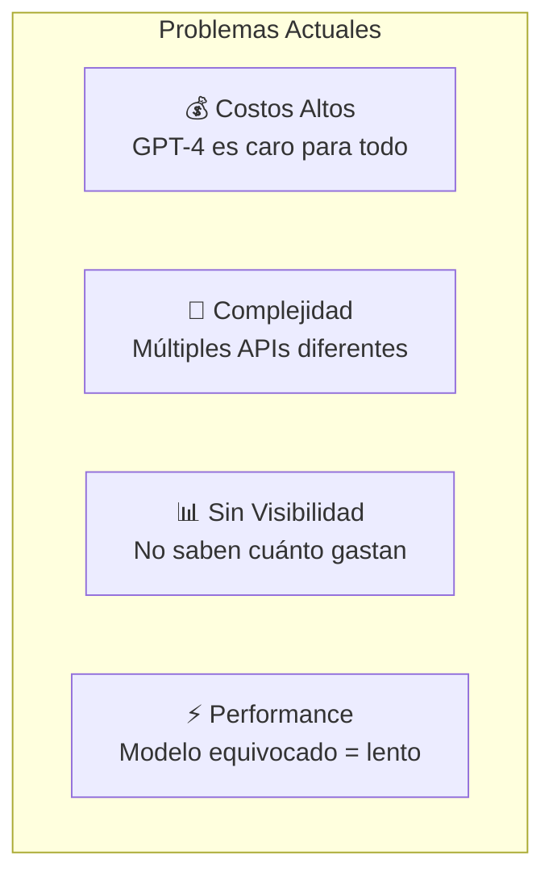
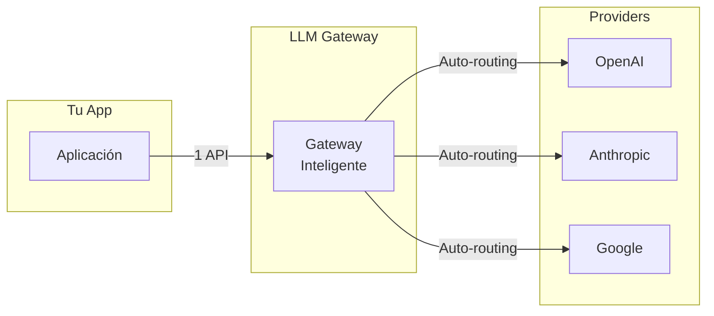
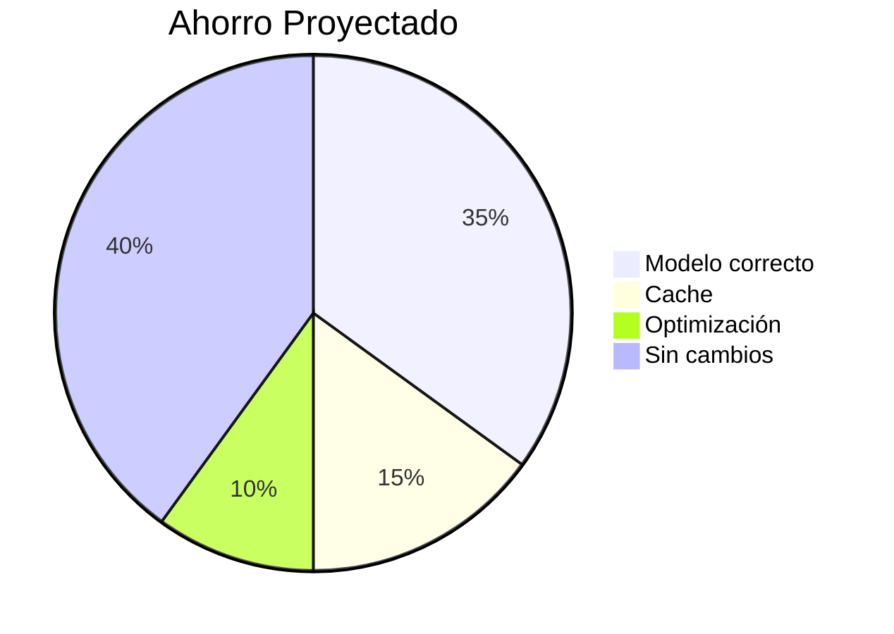
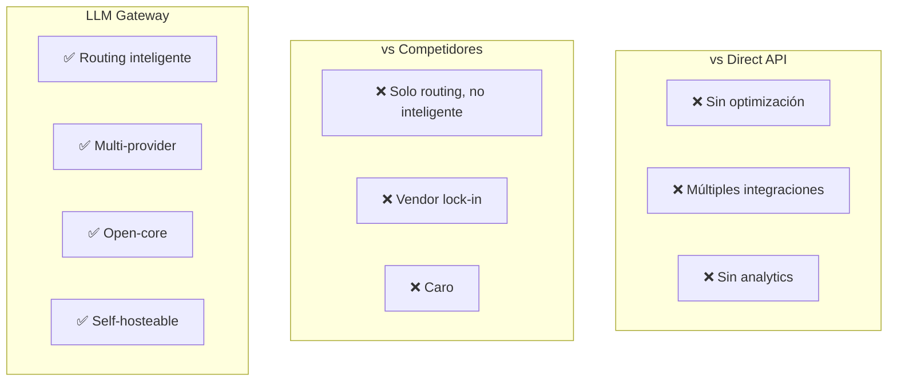
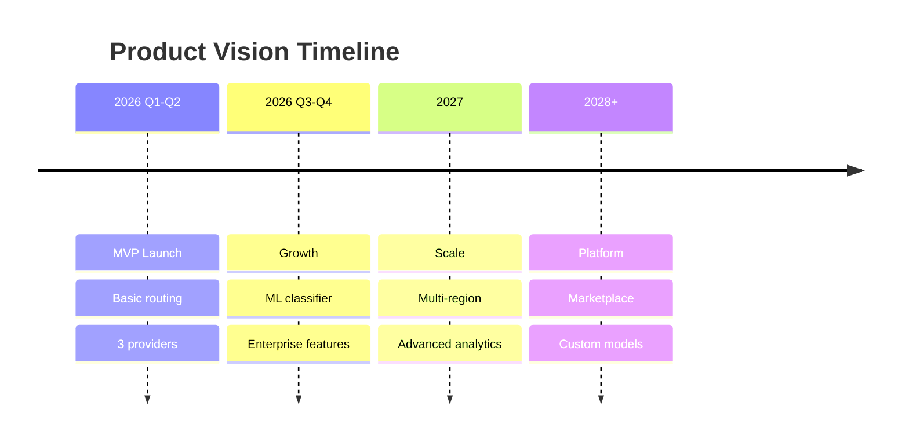

---
tags:
  - producto
  - vision
  - strategy
type: business
title: Visión del Producto
created: '2026-01-11'
---
# 🎯 Visión del Producto

> Documento que describe la visión, propuesta de valor y posicionamiento del LLM Gateway.

## Resumen Ejecutivo

**LLM Gateway** es una plataforma de enrutamiento inteligente que optimiza automáticamente el uso de modelos de lenguaje (LLMs) para reducir costos sin sacrificar calidad.

## Problema

### El Dolor del Developer

Los developers que usan LLMs enfrentan:

1. **Costos descontrolados**: Usan GPT-4 para tareas simples que GPT-3.5 haría igual de bien
2. **APIs fragmentadas**: Cada provider tiene su formato diferente
3. **Sin analytics**: No saben cuánto gastan ni en qué
4. **Decisiones manuales**: Eligen el modelo "a ojo"

## Solución

**El gateway analiza cada request y automáticamente:**
- Selecciona el modelo óptimo (costo vs calidad)
- Unifica todas las APIs bajo una interfaz
- Proporciona analytics detallados
- Cachea respuestas repetidas

## Propuesta de Valor

### Para Developers

| Sin Gateway | Con Gateway |
|-------------|-------------|
| Integrar múltiples SDKs | Una sola API |
| Elegir modelo manualmente | Auto-selección inteligente |
| Pagar de más | Ahorro automático 30-50% |
| Sin visibilidad | Dashboard completo |

### Para Empresas

## Target Users

### Primary: Developers de AI/ML

- Construyen productos con LLMs
- Pain: Costos y complejidad de múltiples providers
- Gain: Ahorro de tiempo y dinero

### Secondary: Tech Leads / Engineering Managers

- Responsables de costos de infraestructura
- Pain: Sin visibilidad de gastos en AI
- Gain: Control y predictibilidad

### Tertiary: Startups de AI

- Budget limitado, necesitan escalar
- Pain: Cada centavo cuenta
- Gain: Hacer más con menos

## Diferenciadores

## Métricas de Éxito

| Métrica | Target Year 1 |
|---------|---------------|
| Usuarios registrados | 1,000 |
| Requests procesados | 10M |
| Ahorro generado | $100K total |
| NPS | >50 |

## Visión a Largo Plazo

---

*Ver también: [[modelo-negocio|Modelo de Negocio]] | [[user-stories|User Stories]]*
