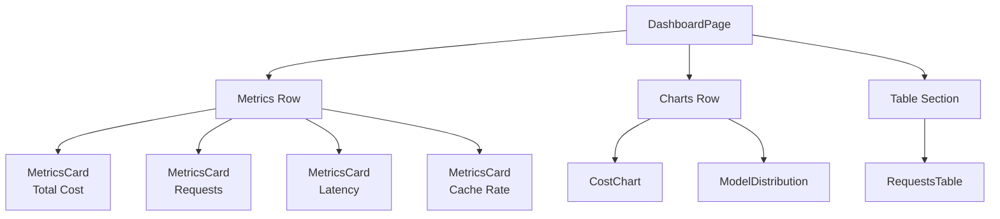
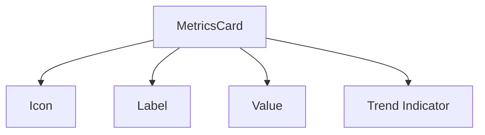
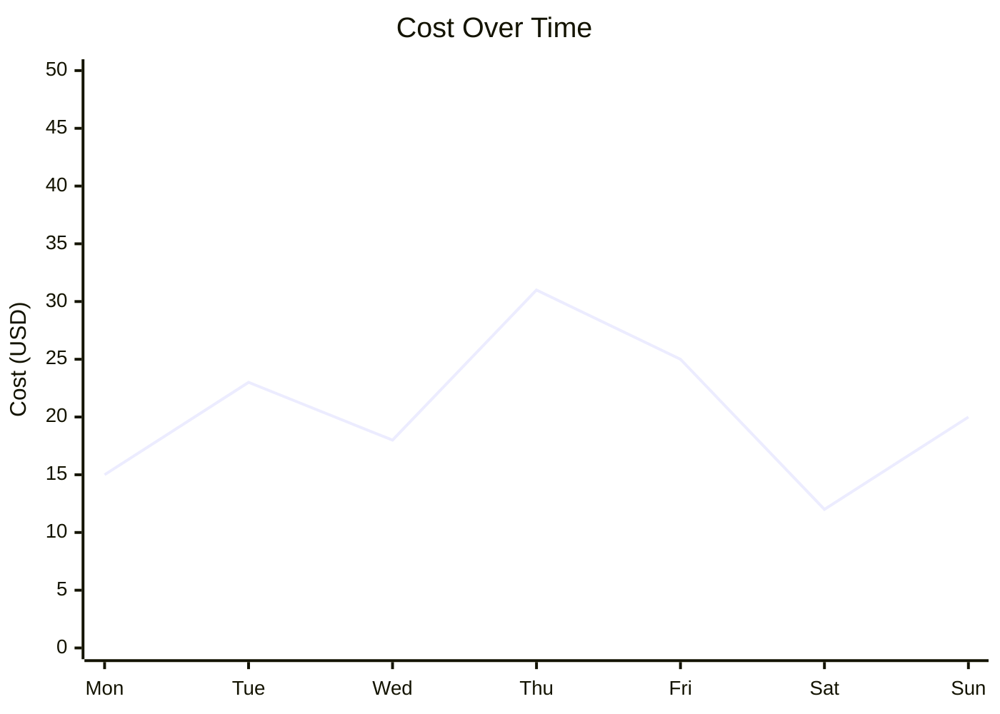
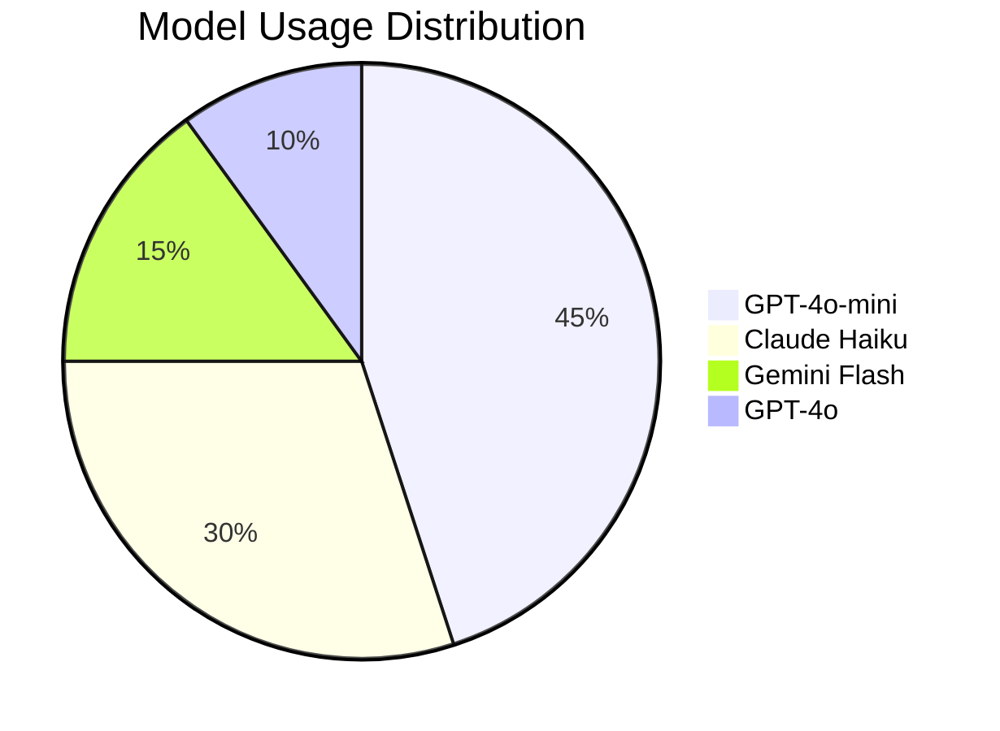
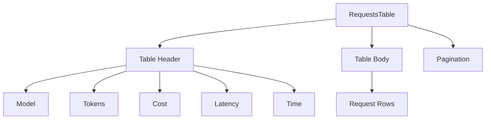
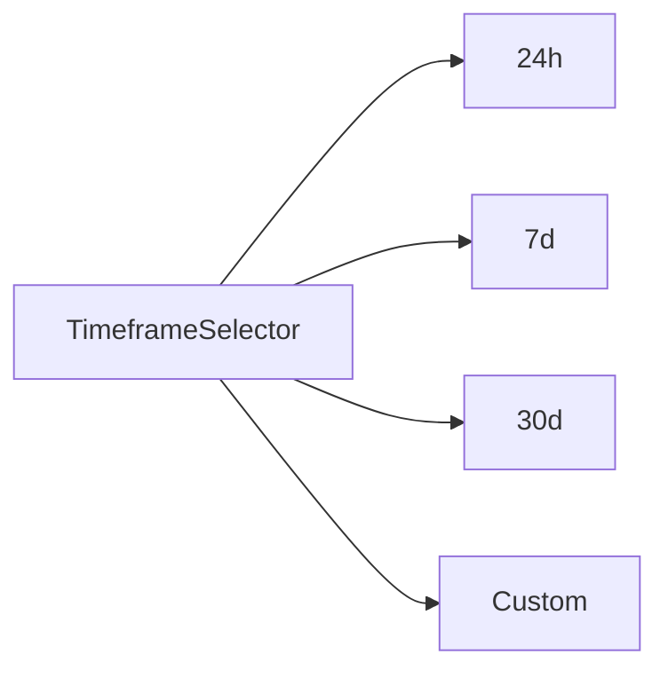

---
tags:
  - frontend
  - components
  - dashboard
  - charts
type: documentation
layer: frontend
title: Dashboard Components
created: '2026-01-11'
---
# 📊 Dashboard Components

> Componentes de visualización de métricas, gráficos y tablas del dashboard.

## Vista General



## MetricsCard

Tarjeta de métrica individual con indicador de tendencia.



### Props

| Prop | Type | Description |
|------|------|-------------|
| `title` | string | Título de la métrica |
| `value` | string/number | Valor principal |
| `icon` | LucideIcon | Icono a mostrar |
| `trend` | number | Cambio % vs periodo anterior |
| `trendLabel` | string | Label del trend |

### Ejemplo

```tsx
<MetricsCard
  title="Total Cost"
  value="$124.56"
  icon={DollarSign}
  trend={12.5}
  trendLabel="vs last 24h"
/>
```

## CostChart

Gráfico de líneas mostrando costo a lo largo del tiempo.



### Props

| Prop | Type | Description |
|------|------|-------------|
| `data` | array | Datos del gráfico |
| `timeframe` | string | Periodo de tiempo |
| `onTimeframeChange` | function | Handler de cambio |

### Data Structure

```typescript
interface CostDataPoint {
  date: string;
  cost: number;
  requests: number;
}

const data: CostDataPoint[] = [
  { date: "2026-01-05", cost: 15.23, requests: 1234 },
  { date: "2026-01-06", cost: 23.45, requests: 1567 },
  // ...
];
```

## ModelDistribution

Pie chart mostrando distribución de uso por modelo.



### Props

| Prop | Type | Description |
|------|------|-------------|
| `data` | array | Datos de distribución |
| `showLegend` | boolean | Mostrar leyenda |
| `showLabels` | boolean | Mostrar etiquetas |

## RequestsTable

Tabla paginada de requests recientes.



### Columns

| Column | Type | Description |
|--------|------|-------------|
| Model | Badge | Nombre del modelo usado |
| Provider | Text | Proveedor LLM |
| Tokens | Number | Input + Output tokens |
| Cost | Currency | Costo en USD |
| Latency | Number | Tiempo en ms |
| Cache | Badge | Hit/Miss indicator |
| Time | Relative | Tiempo relativo |

### Props

```typescript
interface RequestsTableProps {
  data: Request[];
  isLoading: boolean;
  pagination: {
    page: number;
    limit: number;
    total: number;
  };
  onPageChange: (page: number) => void;
  onRowClick?: (request: Request) => void;
}
```

## TimeframeSelector

Selector de periodo de tiempo para filtrar datos.



### Props

| Prop | Type | Description |
|------|------|-------------|
| `value` | string | Valor seleccionado |
| `onChange` | function | Handler de cambio |
| `options` | array | Opciones disponibles |

## Dashboard Page Composition

```tsx
export default function DashboardPage() {
  const { data: metrics, isLoading } = useMetrics("24h");
  const { data: costData } = useCostBreakdown(7);
  const { data: modelData } = useModelDistribution();
  const { data: requests, pagination } = useRequests();

  return (
    <div className="space-y-6">
      {/* Metrics Row */}
      <div className="grid grid-cols-4 gap-4">
        <MetricsCard
          title="Total Cost"
          value={formatCurrency(metrics.totalCost)}
          trend={metrics.costChange}
        />
        <MetricsCard
          title="Requests"
          value={metrics.totalRequests}
          trend={metrics.requestsChange}
        />
        {/* ... more cards */}
      </div>

      {/* Charts Row */}
      <div className="grid grid-cols-2 gap-4">
        <Card>
          <CostChart data={costData} />
        </Card>
        <Card>
          <ModelDistribution data={modelData} />
        </Card>
      </div>

      {/* Table */}
      <Card>
        <RequestsTable 
          data={requests} 
          pagination={pagination}
        />
      </Card>
    </div>
  );
}
```

---

*Ver también: [[layout|Layout Components]] | [[../state-management|State Management]]*
