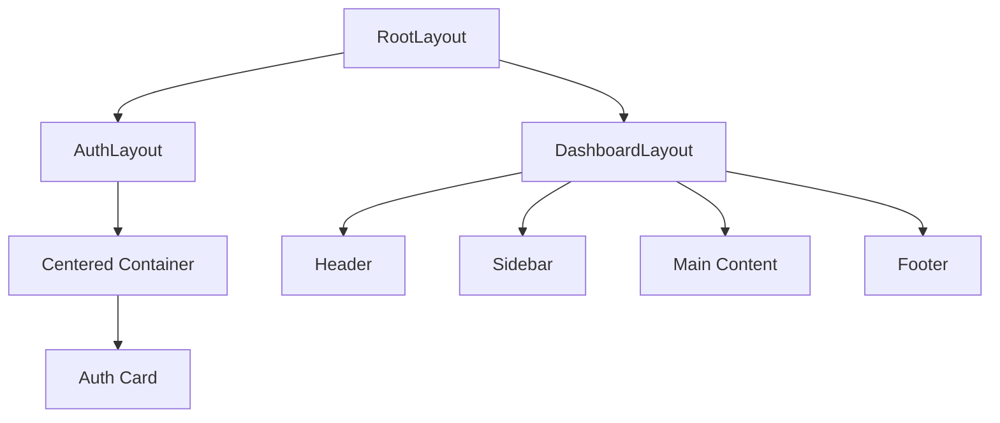
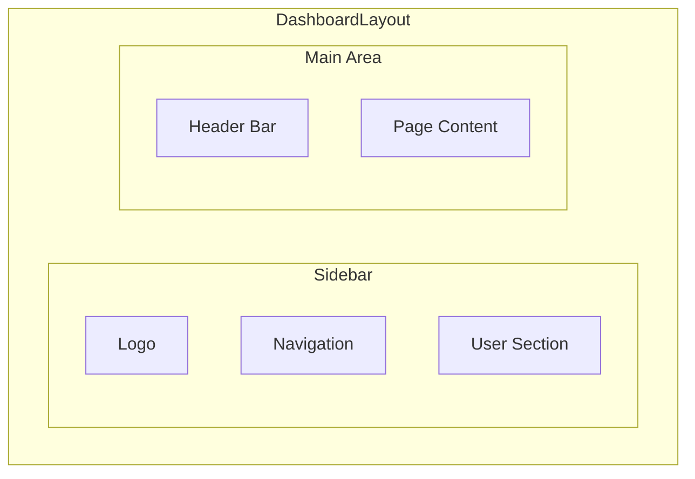
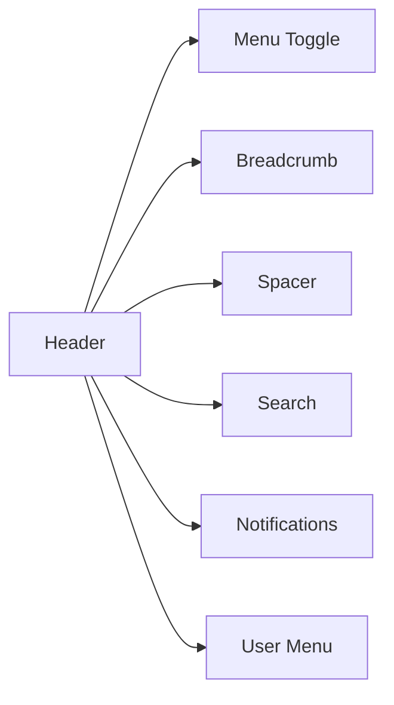
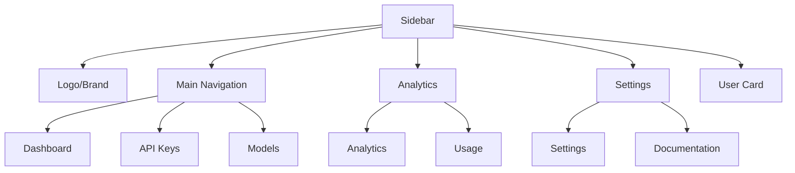
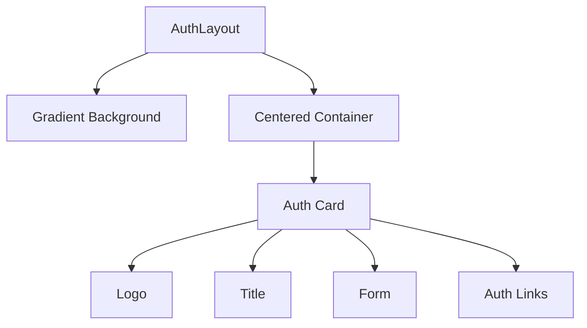
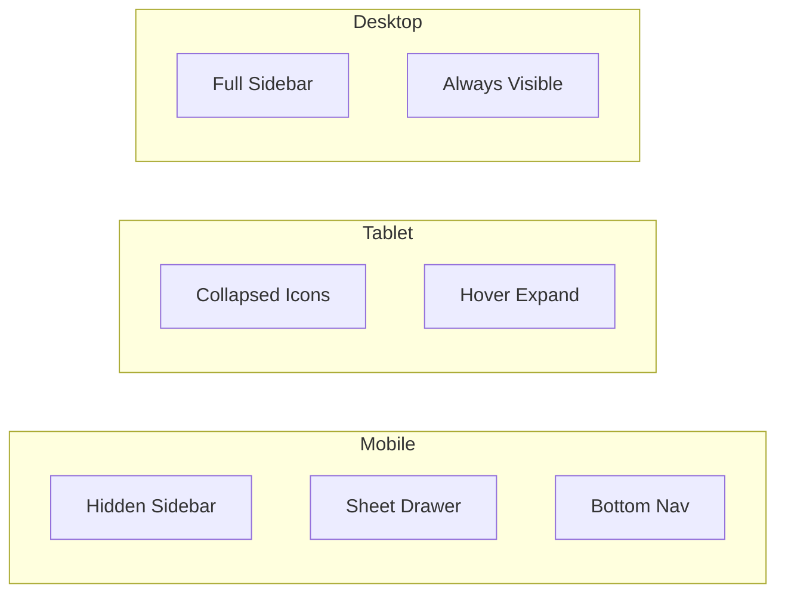

---
tags:
  - frontend
  - components
  - layout
type: documentation
layer: frontend
title: Layout Components
created: '2026-01-11'
---
# 🧱 Layout Components

> Componentes de estructura que definen el layout base de la aplicación.

## Estructura de Layouts



## RootLayout

Wrapper principal que provee providers globales.

```tsx
// app/layout.tsx
export default function RootLayout({ children }) {
  return (
    <html>
      <body>
        <Providers>
          {children}
        </Providers>
      </body>
    </html>
  );
}
```

## DashboardLayout



## Header Component



### Props

| Prop | Type | Description |
|------|------|-------------|
| `title` | string | Título de la página |
| `breadcrumb` | array | Items del breadcrumb |
| `actions` | ReactNode | Acciones adicionales |

## Sidebar Component



### Navigation Items

```typescript
const navItems = [
  {
    title: "Dashboard",
    icon: LayoutDashboard,
    href: "/dashboard",
  },
  {
    title: "API Keys",
    icon: Key,
    href: "/dashboard/keys",
  },
  {
    title: "Models",
    icon: Cpu,
    href: "/dashboard/models",
  },
  {
    title: "Analytics",
    icon: BarChart3,
    href: "/dashboard/analytics",
  },
  {
    title: "Settings",
    icon: Settings,
    href: "/dashboard/settings",
  },
];
```

## AuthLayout



## Responsive Behavior



## Implementación

```tsx
// components/layout/DashboardLayout.tsx
export function DashboardLayout({ children }) {
  const [sidebarOpen, setSidebarOpen] = useState(true);
  
  return (
    <div className="flex h-screen">
      {/* Sidebar */}
      <Sidebar 
        open={sidebarOpen} 
        onToggle={() => setSidebarOpen(!sidebarOpen)} 
      />
      
      {/* Main content */}
      <div className="flex-1 flex flex-col overflow-hidden">
        <Header onMenuClick={() => setSidebarOpen(!sidebarOpen)} />
        
        <main className="flex-1 overflow-auto p-6">
          {children}
        </main>
      </div>
    </div>
  );
}
```

---

*Ver también: [[dashboard|Dashboard Components]] | [[../overview|Frontend Overview]]*
