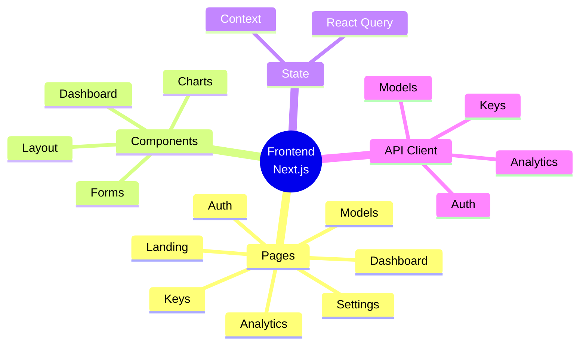
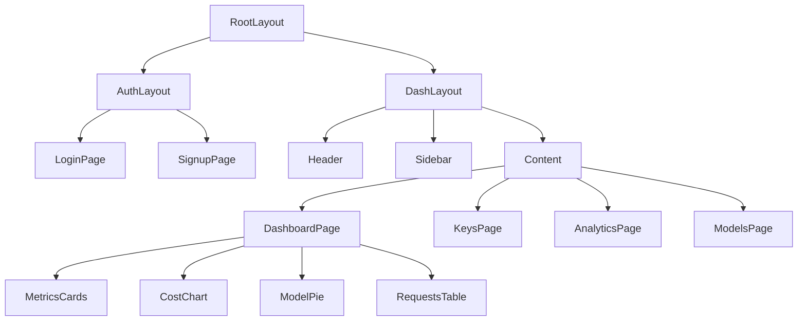
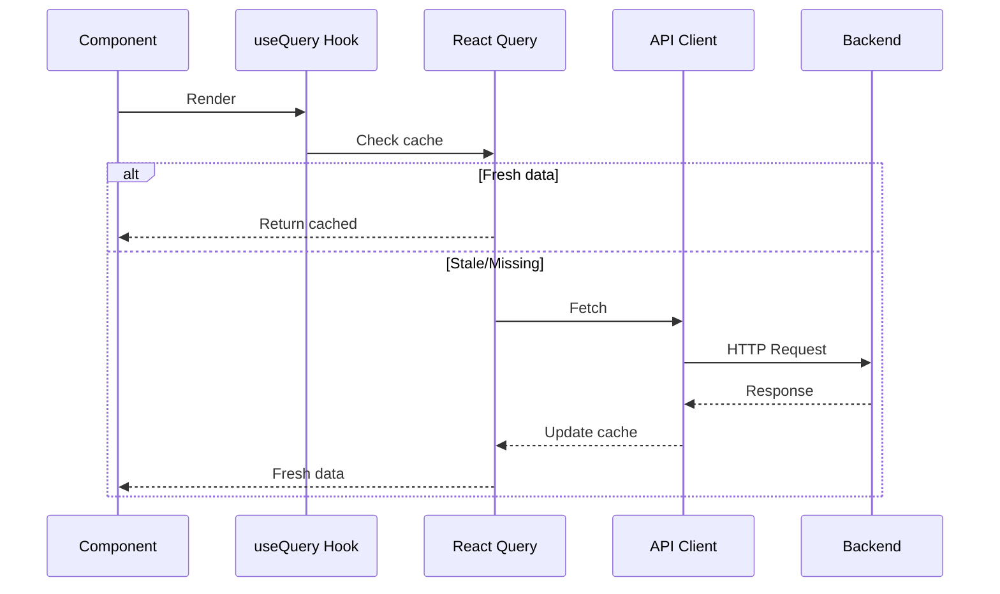
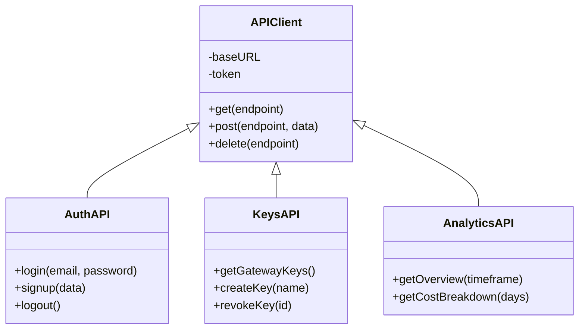
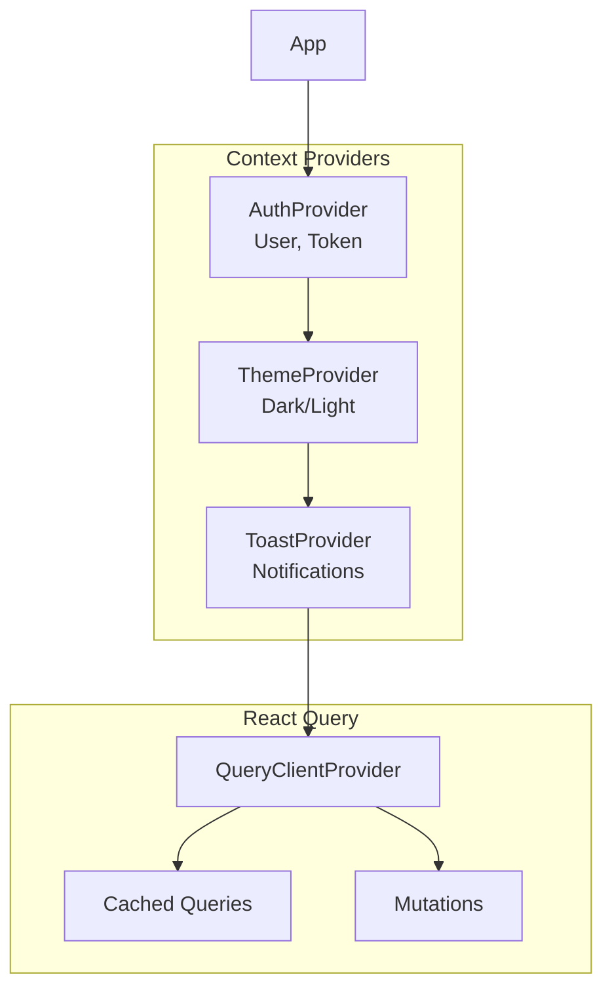

---
tags:
  - frontend
  - nextjs
  - overview
type: documentation
layer: frontend
title: Frontend Overview
created: '2026-01-11'
---
# 🎨 Frontend Overview

> Aplicación Next.js que proporciona el dashboard de gestión, analytics y configuración del gateway.

## Resumen



## Stack Tecnológico

| Componente | Tecnología |
|------------|------------|
| Framework | Next.js 14 (App Router) |
| UI Library | React 18 |
| Styling | Tailwind CSS |
| Components | Shadcn/ui |
| State | React Query |
| Charts | Recharts |
| Forms | React Hook Form |
| Validation | Zod |

## Estructura de Rutas

```mermaid
graph TB
    subgraph "Public"
        Landing[/ Landing]
        Login[/auth/login]
        Signup[/auth/signup]
    end
    
    subgraph "Protected"
        Dashboard[/dashboard]
        Keys[/dashboard/keys]
        Analytics[/dashboard/analytics]
        Models[/dashboard/models]
        Settings[/dashboard/settings]
    end
    
    Landing --> Login
    Login --> Dashboard
    Dashboard --> Keys & Analytics & Models & Settings
    
    style Dashboard fill:#61dafb
```

## Árbol de Componentes



## Flujo de Datos



## Componentes Principales

### Layout Components
- **Header**: Navegación superior, user menu
- **Sidebar**: Navegación lateral
- **Footer**: Links, copyright

### Dashboard Components
- **MetricsCard**: KPIs principales
- **CostChart**: Gráfico de costos
- **ModelDistribution**: Pie chart de uso
- **RequestsTable**: Lista de requests

### Key Components
- **KeyList**: Lista de gateway keys
- **KeyCreator**: Modal crear key
- **ProviderKeyForm**: Agregar provider keys

### Model Components
- **ModelCard**: Card de modelo
- **ModelFilter**: Filtros de búsqueda
- **ModelCompare**: Comparador

## API Client



## Custom Hooks

```typescript
// useAuth - Autenticación
const { user, login, logout, isLoading } = useAuth();

// useMetrics - Dashboard metrics
const { data, isLoading, error } = useMetrics(timeframe);

// useKeys - Gateway keys
const { keys, create, revoke } = useKeys();

// useModels - Model catalog
const { models, filters, setFilters } = useModels();
```

## Estado Global



## Responsive Design

| Breakpoint | Layout |
|------------|--------|
| Mobile (< 768px) | Stacked, bottom nav |
| Tablet (768-1024px) | Collapsible sidebar |
| Desktop (> 1024px) | Full sidebar |

## Documentos Relacionados

- [[components/layout|Layout Components]]
- [[components/dashboard|Dashboard Components]]
- [[state-management|State Management]]
- [[api-client|API Client]]

---

*Ver también: [[../arquitectura/frontend-architecture|Arquitectura Frontend]]*
