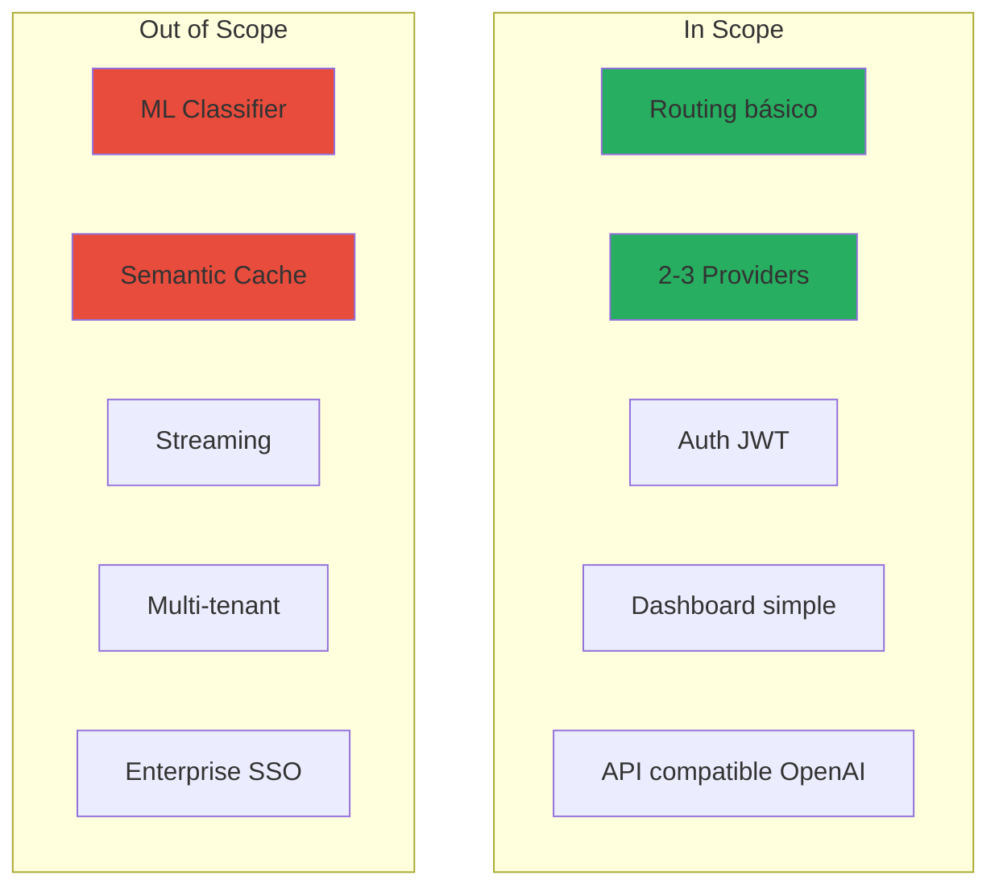
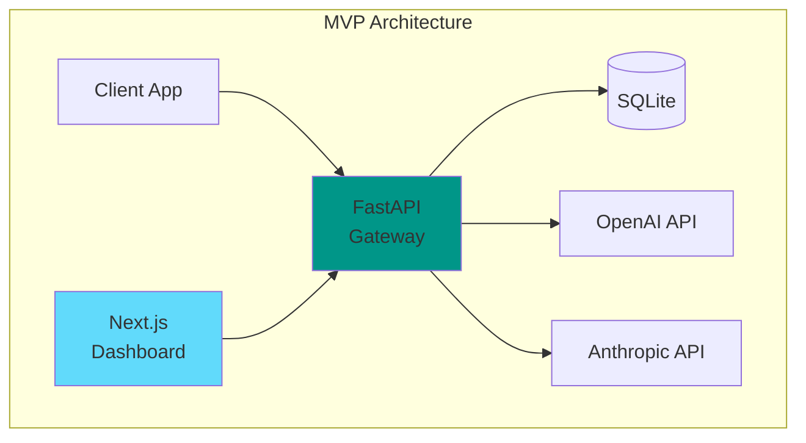
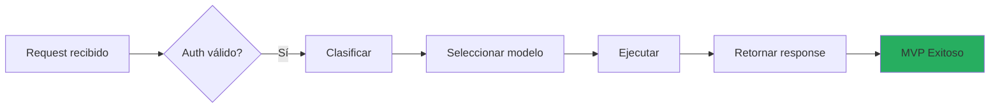
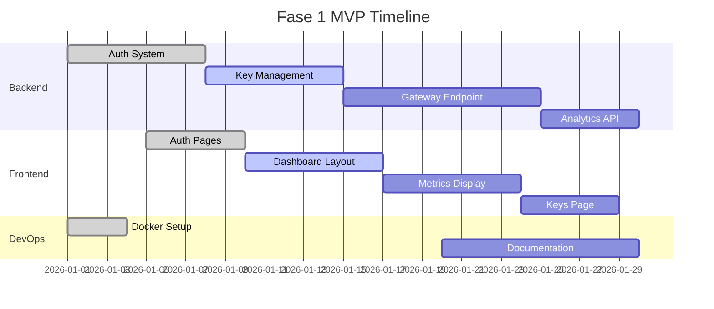

---
tags:
  - roadmap
  - mvp
  - fase-1
type: roadmap
phase: 1
title: 'Fase 1: MVP'
created: '2026-01-11'
---
# 🎯 Fase 1: MVP

> Implementación del Producto Mínimo Viable que demuestre el valor del gateway.

## Objetivos

1. **Funcionalidad básica de gateway** - Recibir requests y enrutarlos
2. **Clasificación simple** - Determinar complejidad con reglas
3. **Dashboard básico** - Visualizar uso y costos
4. **Documentación** - Para demostrar a stakeholders

## Alcance MVP

## Entregables

### Backend

| Entregable | Estado | Descripción |
|------------|--------|-------------|
| FastAPI setup | ✅ | Estructura base |
| Auth endpoints | ✅ | Login/Signup/Logout |
| Keys endpoints | 🔄 | Gateway + Provider keys |
| Gateway endpoint | 🔄 | /v1/chat/completions |
| Analytics endpoints | ⏳ | Overview + breakdown |
| SQLite schema | ✅ | Tablas base |
| Rule classifier | 🔄 | Clasificación básica |
| Simple router | 🔄 | Selección por reglas |

### Frontend

| Entregable | Estado | Descripción |
|------------|--------|-------------|
| Next.js setup | ✅ | Estructura base |
| Auth pages | ✅ | Login + Signup |
| Dashboard layout | 🔄 | Sidebar + Header |
| Metrics cards | ⏳ | KPIs principales |
| Cost chart | ⏳ | Line chart 7 días |
| Keys management | ⏳ | CRUD gateway keys |

### DevOps

| Entregable | Estado | Descripción |
|------------|--------|-------------|
| Docker setup | ✅ | Dockerfiles |
| Docker Compose | ✅ | Orquestación local |
| .env template | ✅ | Variables de entorno |
| README | 🔄 | Documentación básica |

## Arquitectura MVP

## User Stories MVP

### Como Developer
- [ ] Puedo crear una cuenta
- [ ] Puedo generar gateway keys
- [ ] Puedo hacer requests al gateway
- [ ] Puedo ver mis costos

### Como Admin
- [ ] Puedo ver analytics básicos
- [ ] Puedo configurar provider keys
- [ ] Puedo ver requests recientes

## Criterios de Aceptación

1. ✅ Un developer puede registrarse y obtener una key
2. ✅ Puede agregar su OpenAI key
3. 🔄 Puede hacer requests y recibir responses
4. ⏳ Puede ver cuánto ha gastado
5. ⏳ El sistema elige el modelo según complejidad

## Timeline

## Riesgos

| Riesgo | Probabilidad | Impacto | Mitigación |
|--------|--------------|---------|------------|
| Provider API changes | Media | Alto | Versionar adapters |
| Scope creep | Alta | Medio | Strict MVP boundaries |
| Performance issues | Baja | Alto | Basic caching |

---

*Ver también: [[roadmap-general|Roadmap]] | [[fase-2-features|Fase 2]]*
