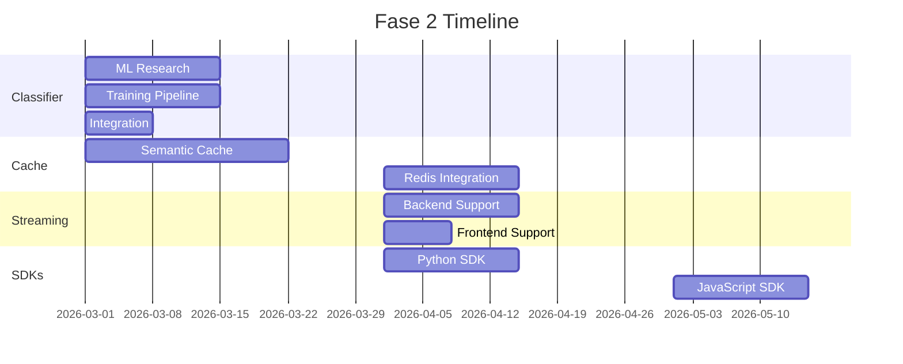
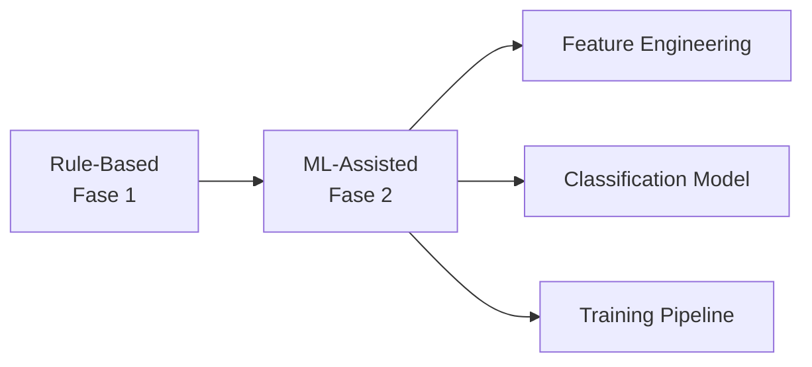
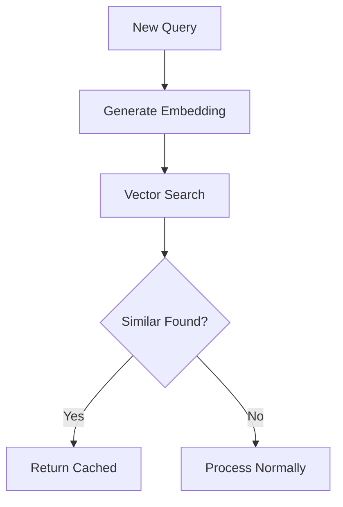
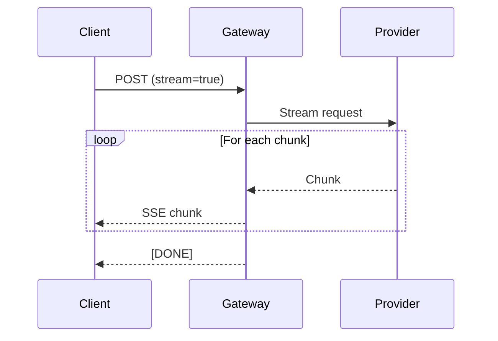

---
tags:
  - roadmap
  - features
  - fase-2
type: roadmap
phase: 2
title: 'Fase 2: Features'
created: '2026-01-11'
---
# 🚀 Fase 2: Features

> Agregar características que diferencien el producto después del MVP.

## Objetivos

1. **Clasificador inteligente** - Mejorar con ML
2. **Cache avanzado** - Semántico y distribuido
3. **Streaming** - Soporte completo
4. **SDKs** - Python y JavaScript

## Timeline

## Entregables

### ML Classifier

### Semantic Cache

### Streaming Support

## Success Criteria

| Feature | Métrica | Target |
|---------|---------|--------|
| ML Classifier | Accuracy | >85% |
| Semantic Cache | Hit rate | >40% |
| Streaming | Latency to first token | <500ms |
| SDKs | Downloads | 1000/mes |

---

*Ver también: [[fase-1-mvp|Fase 1]] | [[fase-3-scale|Fase 3]]*
