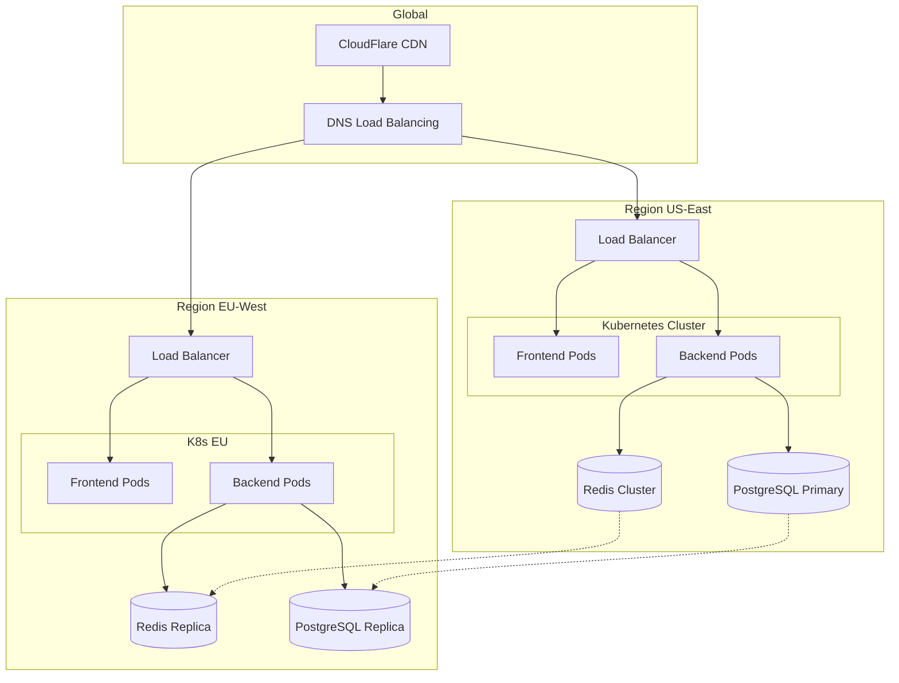
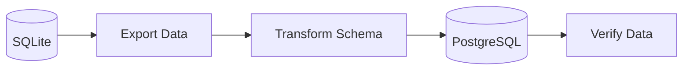
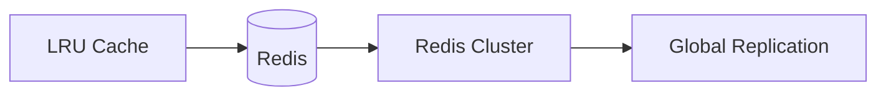
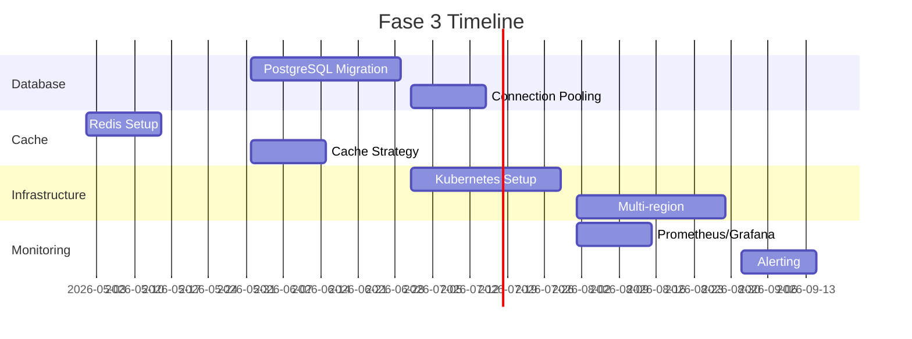

---
tags:
  - roadmap
  - scale
  - fase-3
  - enterprise
type: roadmap
phase: 3
title: 'Fase 3: Scale'
created: '2026-01-11'
---
# 🏢 Fase 3: Scale

> Preparar el sistema para producción enterprise y escala global.

## Objetivos

1. **Infraestructura enterprise** - Alta disponibilidad
2. **Base de datos escalable** - PostgreSQL
3. **Cache distribuido** - Redis cluster
4. **Multi-región** - Latencia global baja

## Arquitectura Target



## Migraciones

### SQLite → PostgreSQL



### In-Memory → Redis



## Kubernetes Deployment

```yaml
# Simplified k8s deployment
apiVersion: apps/v1
kind: Deployment
metadata:
  name: gateway-backend
spec:
  replicas: 3
  selector:
    matchLabels:
      app: gateway-backend
  template:
    spec:
      containers:
      - name: backend
        image: gateway/backend:latest
        resources:
          requests:
            cpu: "500m"
            memory: "512Mi"
          limits:
            cpu: "2000m"
            memory: "2Gi"
```

## SLA Targets

| Métrica | Target |
|---------|--------|
| Uptime | 99.9% |
| Latency P50 | <200ms |
| Latency P99 | <500ms |
| RTO | <15 min |
| RPO | <1 hour |

## Timeline



---

*Ver también: [[fase-2-features|Fase 2]] | [[roadmap-general|Roadmap]]*
