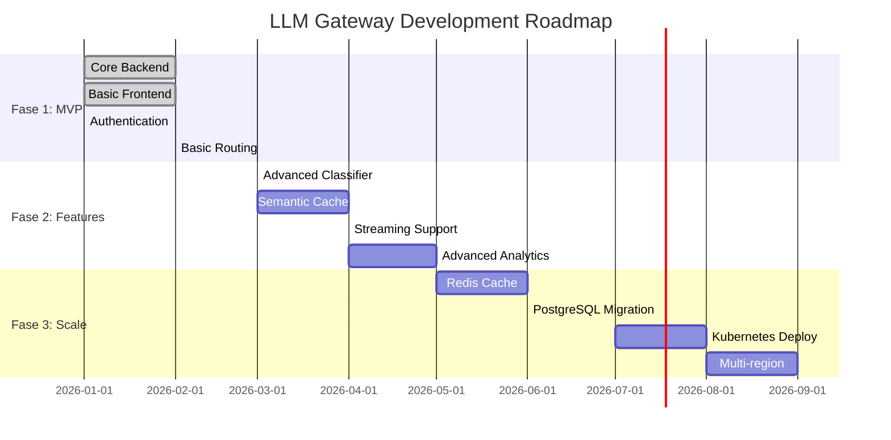
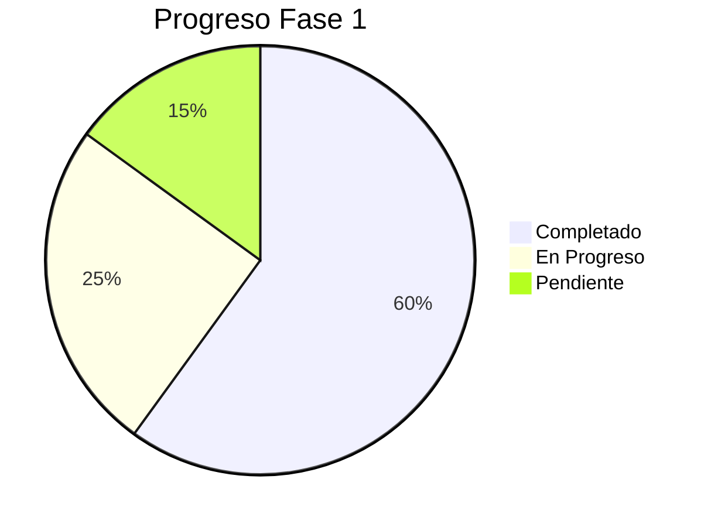
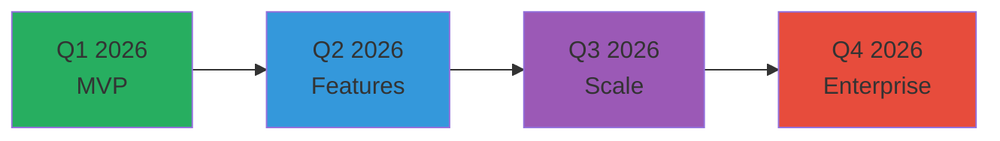
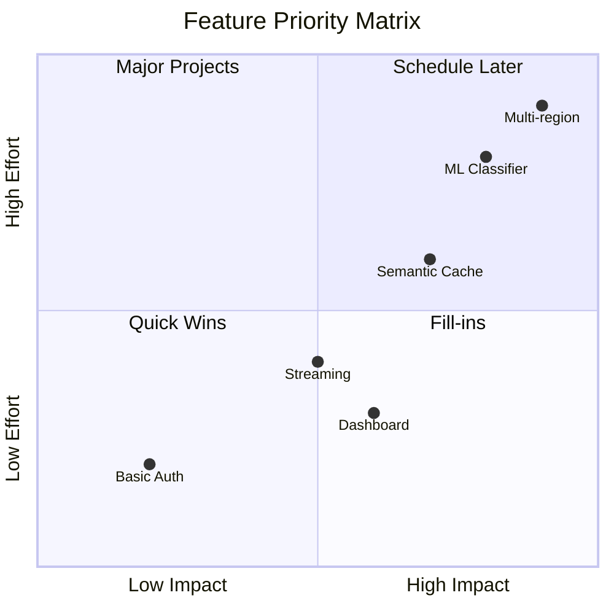

---
tags:
  - roadmap
  - planning
  - strategy
type: roadmap
title: Roadmap General
created: '2026-01-11'
---
# 🗺️ Roadmap General

> Plan de desarrollo del LLM Gateway organizado en fases.

## Visión General

## Fases

### [[fase-1-mvp|Fase 1: MVP]] (Actual)

**Objetivo**: Sistema funcional mínimo que demuestre el concepto.

**Entregables**:
- ✅ Arquitectura definida
- ✅ Backend básico (FastAPI)
- ✅ Frontend básico (Next.js)
- ✅ Autenticación JWT
- 🔄 Clasificador rule-based
- 🔄 Router simple
- ⏳ Dashboard básico
- ⏳ Documentación inicial

### [[fase-2-features|Fase 2: Features]]

**Objetivo**: Agregar características que diferencien el producto.

**Entregables**:
- Clasificador ML-assisted
- Caché semántico
- Streaming support
- Analytics avanzados
- Múltiples providers
- SDK Python/JS

### [[fase-3-scale|Fase 3: Scale]]

**Objetivo**: Preparar para producción y escala.

**Entregables**:
- Migración a PostgreSQL
- Redis para cache distribuido
- Kubernetes deployment
- Multi-región
- SLA monitoring
- Enterprise features

## Métricas de Éxito

| Fase | KPI | Target |
|------|-----|--------|
| MVP | Requests/día | 1,000 |
| Features | Cache hit rate | >30% |
| Scale | Latency P99 | <500ms |
| Scale | Uptime | 99.9% |

## Timeline

## Priorización

---

*Ver también: [[fase-1-mvp|Fase 1]] | [[../tareas/backlog|Backlog]]*
