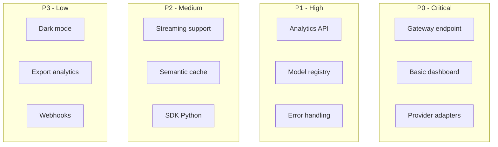
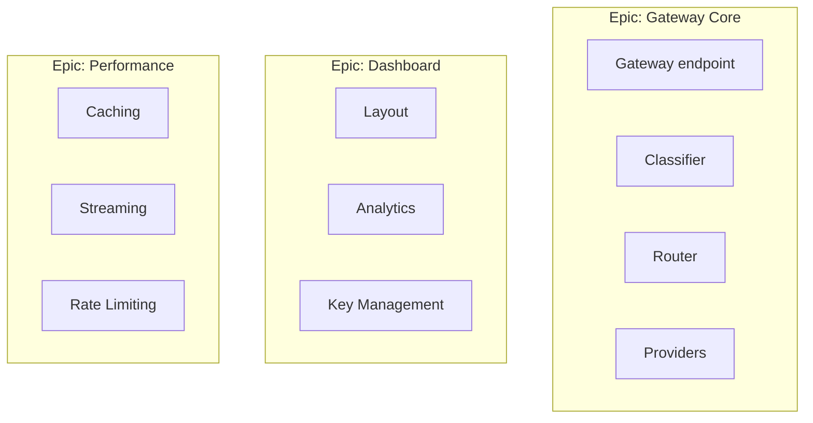

---
tags:
  - tareas
  - backlog
  - planning
type: tasks
title: Backlog
created: '2026-01-11'
---
# 📋 Backlog

> Lista priorizada de todas las tareas pendientes del proyecto.

## Priorización

## Backlog Items

### P0 - Critical (Must Have)

| ID | Título | Estimación | Dependencias |
|----|--------|------------|--------------|
| GATE-15 | Gateway endpoint | 5 pts | - |
| GATE-16 | Rule classifier | 3 pts | - |
| GATE-17 | Simple router | 3 pts | GATE-16 |
| GATE-18 | Dashboard layout | 3 pts | - |
| GATE-19 | OpenAI adapter | 2 pts | - |
| GATE-23 | Anthropic adapter | 2 pts | - |

### P1 - High (Should Have)

| ID | Título | Estimación | Dependencias |
|----|--------|------------|--------------|
| GATE-20 | Analytics API | 5 pts | GATE-15 |
| GATE-21 | Metrics cards | 2 pts | GATE-20 |
| GATE-22 | Cost chart | 3 pts | GATE-20 |
| GATE-24 | Model registry service | 3 pts | - |
| GATE-25 | Provider health check | 2 pts | GATE-19, GATE-23 |
| GATE-26 | Error handling global | 2 pts | - |
| GATE-27 | Rate limiting | 3 pts | - |
| GATE-28 | Request logging | 2 pts | GATE-15 |

### P2 - Medium (Could Have)

| ID | Título | Estimación | Dependencias |
|----|--------|------------|--------------|
| GATE-30 | Streaming support | 5 pts | GATE-15 |
| GATE-31 | LRU cache | 3 pts | - |
| GATE-32 | Semantic cache | 8 pts | GATE-31 |
| GATE-33 | SDK Python | 5 pts | GATE-15 |
| GATE-34 | SDK JavaScript | 5 pts | GATE-15 |
| GATE-35 | Google adapter | 2 pts | - |
| GATE-36 | Groq adapter | 2 pts | - |
| GATE-37 | Model comparison | 3 pts | GATE-24 |

### P3 - Low (Nice to Have)

| ID | Título | Estimación | Dependencias |
|----|--------|------------|--------------|
| GATE-40 | Dark mode | 2 pts | - |
| GATE-41 | Export analytics CSV | 2 pts | GATE-20 |
| GATE-42 | Webhooks | 5 pts | - |
| GATE-43 | Custom routing rules | 5 pts | GATE-17 |
| GATE-44 | Team management | 8 pts | - |
| GATE-45 | Audit logs | 3 pts | - |

## Epic Overview

## Refinement Queue

Items pendientes de refinamiento:

1. **ML-based Classifier** - Requiere investigación
2. **Multi-tenant Architecture** - Evaluar complejidad
3. **Enterprise SSO** - Definir providers soportados
4. **Billing Integration** - Stripe vs alternatives

## Technical Debt

| Item | Severidad | Estimación |
|------|-----------|------------|
| Add comprehensive tests | Alta | 8 pts |
| Improve error messages | Media | 3 pts |
| Refactor provider adapters | Media | 5 pts |
| Documentation updates | Baja | 3 pts |

---

*Ver también: [[sprint-actual|Sprint Actual]] | [[../roadmap/roadmap-general|Roadmap]]*
