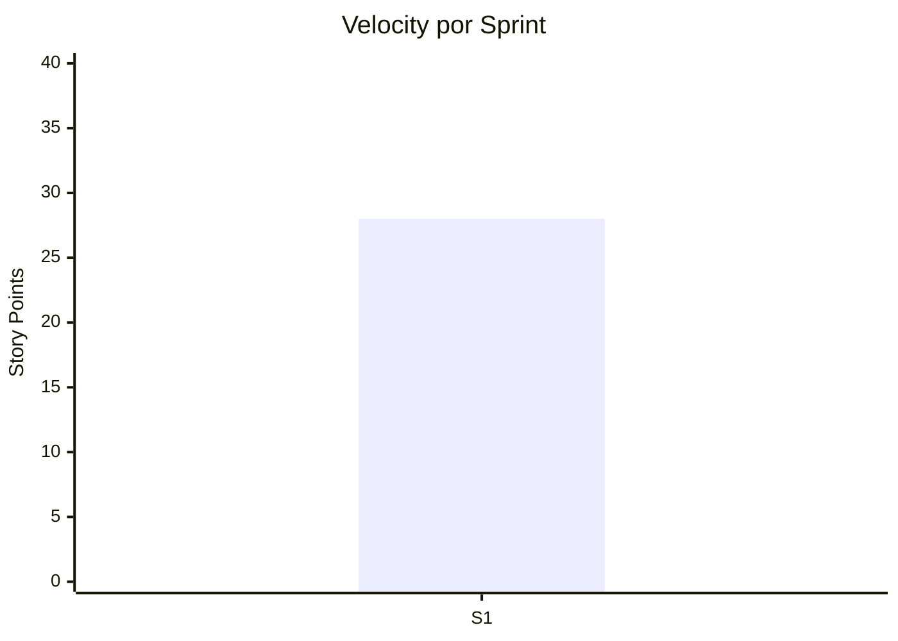

---
tags:
  - tareas
  - completadas
  - historial
type: tasks
title: Tareas Completadas
created: '2026-01-11'
---
# ✅ Tareas Completadas

> Registro de tareas terminadas por sprint.

## Sprint 1 (Dec 23 - Jan 5, 2026)

**Sprint Goal**: Setup inicial y autenticación.

### Completadas

| ID | Título | Puntos | Fecha |
|----|--------|--------|-------|
| GATE-01 | Proyecto setup (monorepo) | 2 | Dec 24 |
| GATE-02 | FastAPI base structure | 3 | Dec 26 |
| GATE-03 | Next.js base structure | 3 | Dec 26 |
| GATE-04 | Docker + Compose setup | 2 | Dec 27 |
| GATE-05 | SQLite schema initial | 3 | Dec 28 |
| GATE-06 | User model + migration | 2 | Dec 29 |
| GATE-07 | Auth endpoints (signup/login) | 5 | Jan 2 |
| GATE-08 | JWT middleware | 3 | Jan 3 |
| GATE-09 | Auth pages (frontend) | 3 | Jan 4 |
| GATE-10 | Protected routes | 2 | Jan 5 |

**Total Completado**: 28 puntos
**Velocity**: 28 pts/sprint

### Notas
- Setup went smoothly
- JWT implementation took longer than expected
- Frontend auth pages reusable

---

## Métricas Acumuladas

| Métrica | Valor |
|---------|-------|
| Total Stories Completadas | 10 |
| Total Story Points | 28 |
| Sprints Completados | 1 |
| Velocity Promedio | 28 |

---

*Ver también: [[sprint-actual|Sprint Actual]] | [[backlog|Backlog]]*
