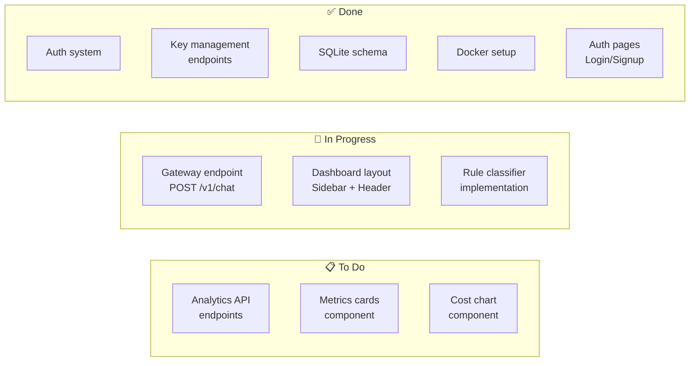
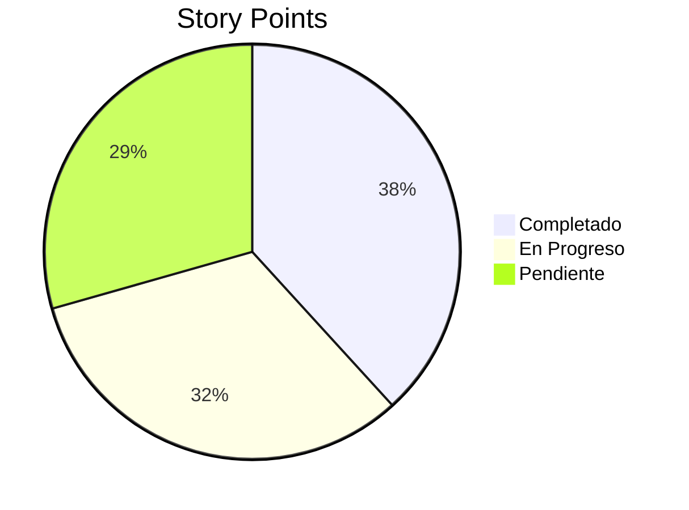
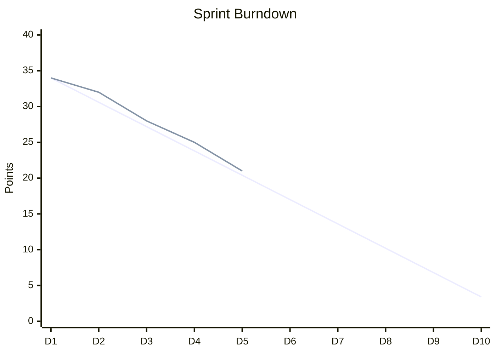

---
tags:
  - tareas
  - sprint
  - kanban
type: tasks
sprint: 2
title: Sprint Actual
created: '2026-01-11'
---
# ✅ Sprint Actual

> Tareas del sprint en curso.

## Sprint 2 (Jan 6 - Jan 19, 2026)

**Goal**: Completar gateway endpoint y dashboard básico.

## Tablero Kanban



## Tareas Detalladas

### 🔄 En Progreso

#### GATE-15: Gateway Endpoint
- **Asignado**: Backend
- **Estimación**: 5 pts
- **Estado**: 60% completado

```
Subtareas:
[x] Estructura del endpoint
[x] Autenticación por gateway key
[ ] Integración con classifier
[ ] Integración con router
[ ] Response formatting
[ ] Tests
```

#### GATE-18: Dashboard Layout
- **Asignado**: Frontend
- **Estimación**: 3 pts
- **Estado**: 40% completado

```
Subtareas:
[x] Sidebar component
[x] Header component
[ ] Responsive behavior
[ ] Navigation active states
[ ] User menu dropdown
```

#### GATE-16: Rule Classifier
- **Asignado**: Backend
- **Estimación**: 3 pts
- **Estado**: 50% completado

```
Subtareas:
[x] Feature extraction
[x] Token counting
[ ] Rule engine
[ ] Complexity levels
[ ] Tests
```

### 📋 Por Hacer

#### GATE-20: Analytics API
- **Asignado**: Backend
- **Estimación**: 5 pts
- **Dependencias**: GATE-15

#### GATE-21: Metrics Cards
- **Asignado**: Frontend
- **Estimación**: 2 pts
- **Dependencias**: GATE-20

#### GATE-22: Cost Chart
- **Asignado**: Frontend
- **Estimación**: 3 pts
- **Dependencias**: GATE-20

## Métricas del Sprint



| Métrica | Valor |
|---------|-------|
| Total Points | 34 |
| Completed | 13 (38%) |
| In Progress | 11 (32%) |
| Remaining | 10 (30%) |
| Days Left | 8 |

## Burndown



## Blockers 🚫

| Issue | Impacto | Acción |
|-------|---------|--------|
| Ninguno actualmente | - | - |

## Notas del Daily

**2026-01-11**
- Gateway endpoint avanzando bien
- Necesita revisar token counting accuracy
- Dashboard layout casi terminado

---

*Ver también: [[backlog|Backlog]] | [[completadas|Completadas]]*
