---
tags:
  - tests
  - quality
  - strategy
type: documentation
title: Testing Strategy
created: '2026-01-11'
---
# 🧪 Testing Strategy

> Estrategia completa de testing para garantizar calidad del LLM Gateway.

## Pirámide de Testing

```mermaid
graph TB
    subgraph "Pirámide"
        E2E[E2E Tests<br/>10%]
        Integration[Integration Tests<br/>30%]
        Unit[Unit Tests<br/>60%]
    end
    
    E2E --> Integration --> Unit
    
    style Unit fill:#27ae60
    style Integration fill:#3498db
    style E2E fill:#9b59b6
```



## Tipos de Tests

### Unit Tests (60%)

Testean funciones y clases de forma aislada.


**Herramientas**:
- Backend: Pytest
- Frontend: Jest, React Testing Library

### Integration Tests (30%)

Testean la interacción entre componentes.


**Herramientas**:
- Backend: Pytest + HTTPX
- Frontend: Jest + MSW

### E2E Tests (10%)

Testean flujos completos de usuario.


**Herramientas**: Playwright

## Cobertura Objetivo

| Componente | Target | Actual |
|------------|--------|--------|
| Backend Core | 80% | TBD |
| API Routes | 90% | TBD |
| Frontend Components | 70% | TBD |
| Utils/Helpers | 95% | TBD |

## Test Cases Principales

### Backend

#### Classifier Tests
```python
def test_classify_simple_request():
    """Requests simples deben clasificarse como SIMPLE"""
    
def test_classify_complex_code():
    """Requests con código complejo → COMPLEX"""
    
def test_classify_long_context():
    """Requests con >10k tokens → EXPERT"""
```

#### Router Tests
```python
def test_select_cheap_model_for_simple():
    """SIMPLE complexity → modelo económico"""
    
def test_fallback_when_provider_unhealthy():
    """Provider caído → usar fallback"""
    
def test_respect_user_preferences():
    """Respetar preferencias de routing del usuario"""
```

#### API Tests
```python
def test_gateway_endpoint_auth():
    """Endpoint requiere autenticación válida"""
    
def test_gateway_endpoint_success():
    """Request válido retorna response correcto"""
    
def test_rate_limiting():
    """Rate limit se aplica correctamente"""
```

### Frontend

#### Component Tests
```typescript
describe('MetricsCard', () => {
  it('renders value correctly');
  it('shows positive trend in green');
  it('shows negative trend in red');
});

describe('Dashboard', () => {
  it('fetches data on mount');
  it('shows loading state');
  it('handles errors gracefully');
});
```

#### Hook Tests
```typescript
describe('useAuth', () => {
  it('returns user when authenticated');
  it('redirects to login when not authenticated');
  it('clears state on logout');
});
```

## Test Environment


## CI/CD Integration


## Mocking Strategy

### Provider Mocks

```python
# Mock OpenAI responses
@pytest.fixture
def mock_openai():
    with respx.mock:
        respx.post("https://api.openai.com/v1/chat/completions").respond(
            json={"choices": [{"message": {"content": "Hello!"}}]}
        )
        yield
```

### API Mocks (Frontend)

```typescript
// MSW handlers
export const handlers = [
  rest.get('/api/analytics/overview', (req, res, ctx) => {
    return res(ctx.json({ totalCost: 100, totalRequests: 500 }));
  }),
];
```

## Running Tests

```bash
# Backend
cd backend
pytest                    # All tests
pytest -v                 # Verbose
pytest --cov             # With coverage
pytest -k "classifier"   # Specific tests

# Frontend
cd frontend
npm test                 # All tests
npm test -- --coverage   # With coverage
npm test -- --watch      # Watch mode

# E2E
npx playwright test      # Run E2E tests
npx playwright test --ui # UI mode
```

---

*Ver también: [[backend-tests|Backend Tests]] | [[frontend-tests|Frontend Tests]] | [[e2e-tests|E2E Tests]]*
